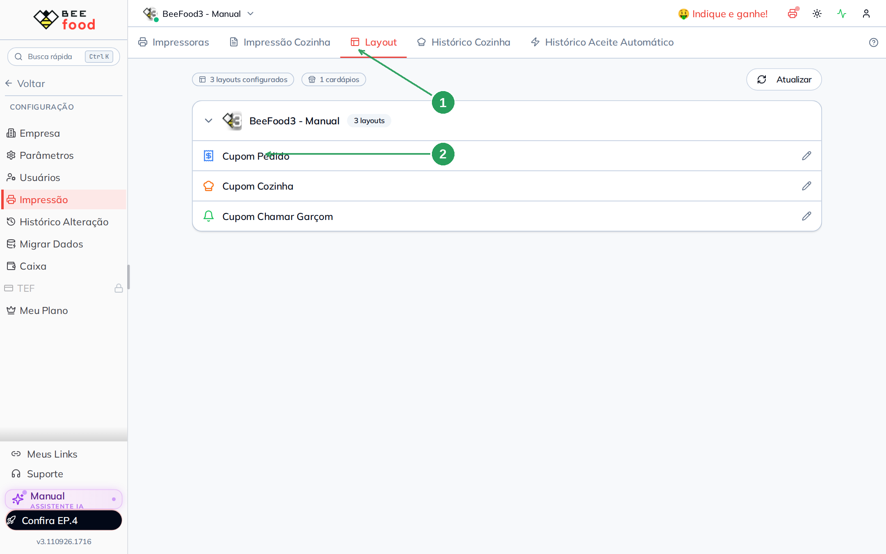
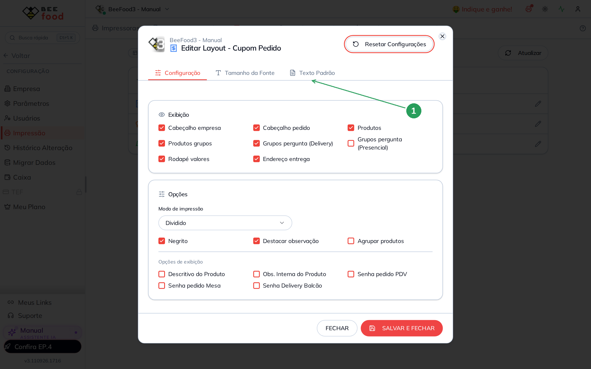
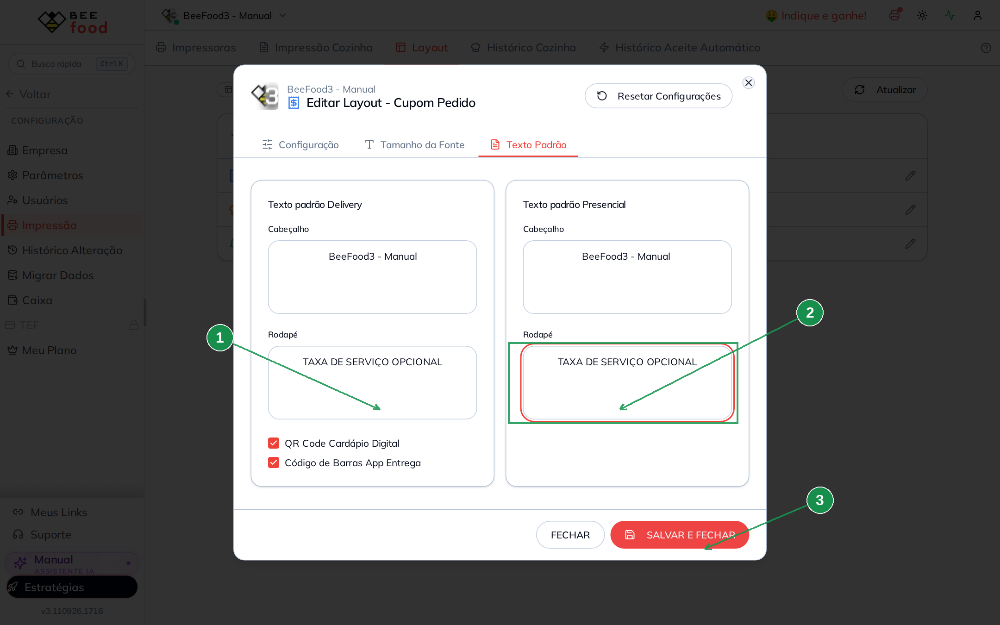
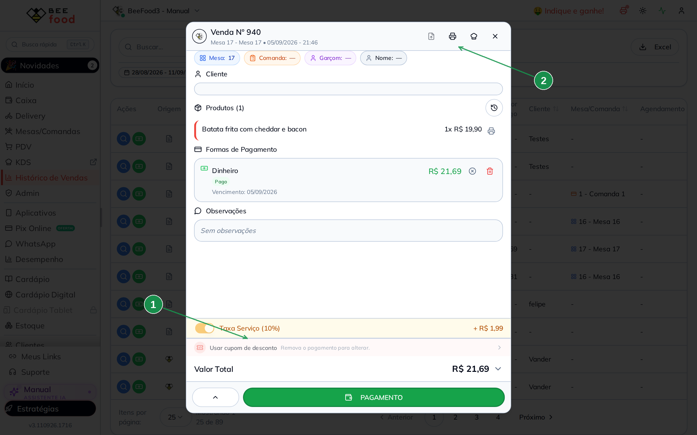
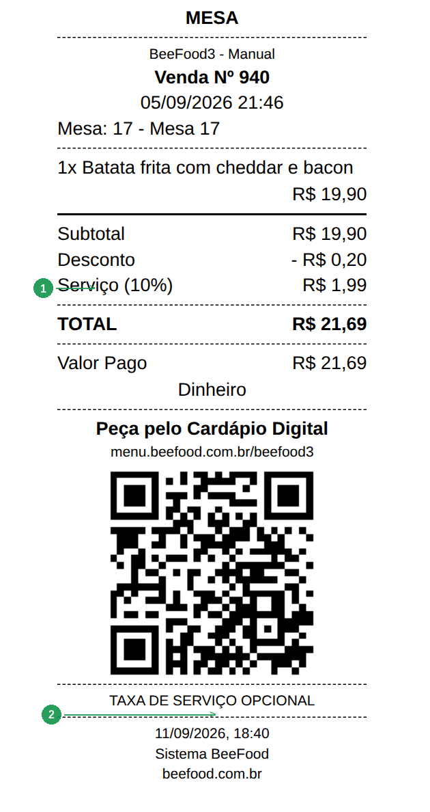

# Como deixar a taxa de serviço opcional no cupom

A taxa de serviço (a gorjeta da mesa) pode estar ligada no pedido — mas o
**cupom do cliente** precisa dizer que ela é opcional.

Isso se faz no **rodapé do Cupom Pedido**. Não é o parâmetro que liga os 10%,
nem o switch do produto.

> As imagens têm **setas numeradas** (1, 2, 3…). Cada número indica o campo ou
> botão correspondente na tela.

---

## O que este texto faz (e o que não faz)

| Onde | O que acontece |
|------|----------------|
| **Rodapé do Cupom Pedido** (este manual) | A frase sai impressa no papel. O pedido **não** muda. |
| [Taxa e obrigatoriedades de mesa](https://ajuda.beefood.com.br/mesas-taxas-obrigatorias) | Liga a taxa no pedido novo e define o %. |
| [Relatório de taxa de serviço](https://ajuda.beefood.com.br/relatorio-taxa-servico) | Lê o resultado e o switch **Sem taxa de serviço** no produto. |

O operador ainda pode desligar a taxa naquele pedido (o interruptor laranja do
detalhe). O rodapé só avisa o cliente.

---

## 1. Abra o Cupom Pedido

**Configuração → Impressão → Layout**.

A lista agrupa os layouts por cardápio. O que interessa é o **Cupom Pedido** —
é o cupom do cliente (mesa, PDV e delivery). Os outros (Cozinha, Chamar Garçom)
não levam este rodapé.



| Nº | Item | O que fazer |
|----|------|-------------|
| 1 | **Layout** | A terceira aba de Impressão. |
| 2 | **Cupom Pedido** | Abre o editor. |

---

## 2. Vá em Texto Padrão

O modal abre na aba **Configuração** (o que aparece ou some no papel). A frase
do rodapé fica na aba **Texto Padrão** (1).



Não use **Resetar Configurações** — esse botão devolve cabeçalho e rodapé ao
texto de fábrica e apaga o que você digitou.

---

## 3. Escreva no Rodapé

São **duas colunas independentes**:

- **Texto padrão Delivery** — pedidos de entrega e retirada.
- **Texto padrão Presencial** — mesa, comanda e PDV.

Se a casa imprime os dois, preencha os **dois** rodapés. Um não copia o outro.

Digite, por exemplo:

```
TAXA DE SERVIÇO OPCIONAL
```

O texto sai **como você digitou**, centralizado e em letra menor. Quebra de
linha (Enter) vira outra linha no papel. Asterisco (`**`) **não** vira negrito
— imprime o caractere.

Clique em **SALVAR E FECHAR**. Esta tela **não** grava sozinha.



| Nº | Item | O que fazer |
|----|------|-------------|
| 1 | **Rodapé** do Delivery | A frase nos cupons de entrega/retirada. |
| 2 | **Rodapé** do Presencial | A frase nos cupons de mesa, comanda e PDV. |
| 3 | **SALVAR E FECHAR** | Grava. Sem este clique, o papel continua sem o texto. |

Os dois checks de baixo (**QR Code Cardápio Digital** e **Código de Barras App
Entrega**) são de outro assunto. Não mexa neles só para colocar a frase.

---

## 4. A taxa continua no pedido

Reimprimir um pedido antigo já usa o rodapé novo — o texto mora no layout, não
na venda.

Neste exemplo: venda **#940**, Mesa 17, Batata frita com cheddar e bacon
R$ 19,90 + taxa 10% (**+ R$ 1,99**), total **R$ 21,69**.



| Nº | Item | O que conferir |
|----|------|----------------|
| 1 | **Taxa Serviço (10%)** | Continua no pedido. O rodapé não desliga isso. |
| 2 | O ícone da impressora | **Imprimir Cupom** (o chapéu ao lado é a ficha da cozinha). |

---

## 5. O que sai no papel

O cupom traz a linha **Serviço (10%)** no total **e** a frase no rodapé, depois
do QR (se ele estiver ligado).



| Nº | Item | O que conferir |
|----|------|----------------|
| 1 | **Serviço (10%)** | O valor da gorjeta daquela conta. |
| 2 | **TAXA DE SERVIÇO OPCIONAL** | O texto do rodapé Presencial. |

Sem BeeImpressão no computador, o BeeFood avisa *Servidor offline. Usando
impressão do navegador* e abre o **mesmo cupom** no preview — só muda a porta
de saída.

---

## Perguntas rápidas

**Preenchi só o Presencial. O delivery sai sem a frase?** Sim. São campos
separados.

**Vale para o Cupom Cozinha?** Não. A aba Texto Padrão do Cupom Pedido é que
manda no papel do cliente.

**Preciso relogar depois de salvar?** Não. O **SALVAR E FECHAR** limpa o cache
do rodapé. A próxima impressão já usa o texto novo.

**Posso colocar mais de uma linha?** Pode. Endereço, agradecimento e a frase da
taxa no mesmo rodapé.

**Isso torna a taxa opcional no sistema?** Não. Só avisa no papel. Para não
cobrar naquele pedido, desligue o interruptor do detalhe. Para não nascer
ligada, veja o manual da taxa padrão. Para um produto ficar de fora da base,
use **Sem taxa de serviço** no cadastro dele.
