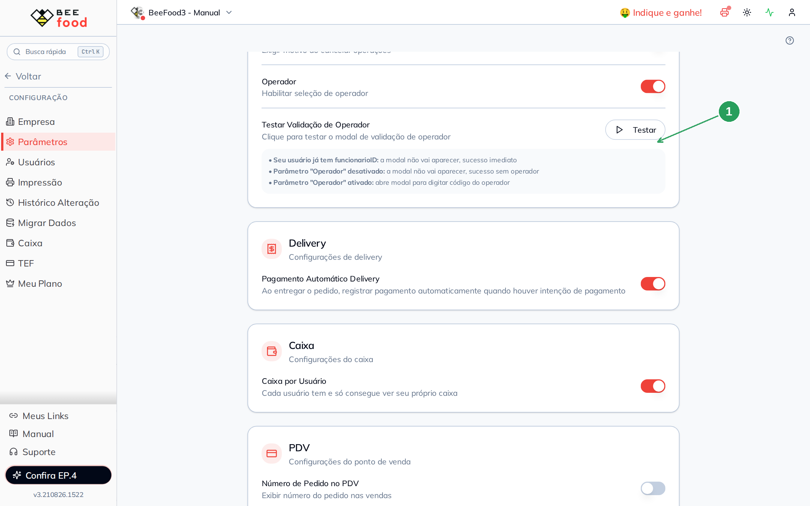
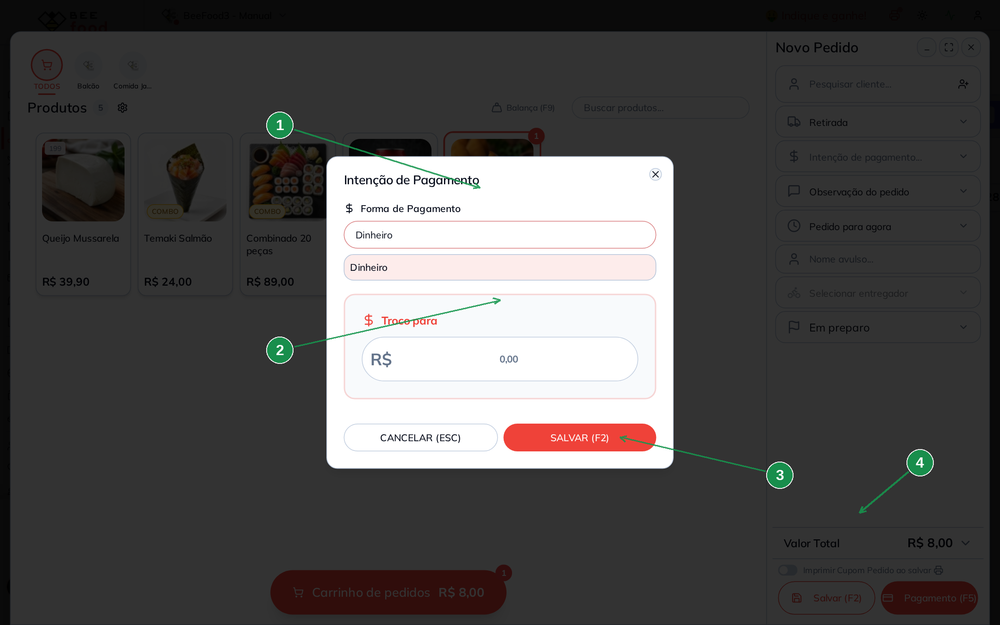
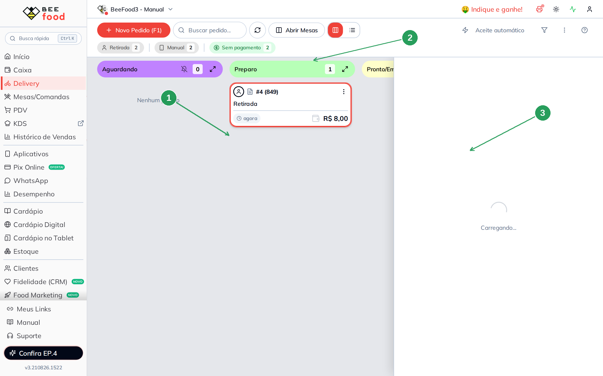

# Manual — Pagamento automático no Delivery

Este manual mostra por que um pedido de delivery **já nasce pago** quando você marca
**Entregue** — e o que precisa estar ligado para isso acontecer.

> As imagens têm **setas numeradas** (1, 2, 3…). Cada número indica o campo ou botão
> correspondente na tela.

---

## A regra em uma frase

Se o parâmetro está ligado **e** o pedido tem **intenção de pagamento** (Dinheiro, cartão,
etc.) **e** ainda não foi pago, ao ir para **ENTREGUE** o BeeFood **registra o pagamento
sozinho**.

Sem intenção de pagamento, o pedido chega em Entregue **ainda sem pagar** — o botão
**PAGAMENTO** continua lá.

---

## Onde fica

**Configuração → Parâmetros**, card **Delivery**.

| Nº | Item | O que fazer |
|----|------|-------------|
| 1 | **Pagamento Automático Delivery** | Ligue. A tela grava sozinha. |

O texto do próprio switch: *“Ao entregar o pedido, registrar pagamento automaticamente
quando houver intenção de pagamento.”*

---

## Passo 1 — criar o pedido com intenção

Em **Delivery → + Novo Pedido (F1)**, lance o produto e abra **Intenção de pagamento**.
Escolha a forma — neste exemplo, **Dinheiro**.

| Nº | Item | O que fazer |
|----|------|-------------|
| 1 | **Forma de Pagamento** | **Dinheiro** (ou a forma combinada com o cliente). |
| 2 | **Troco para** | Opcional, se for dinheiro. |
| 3 | **SALVAR (F2)** | Grava a intenção no pedido. |
| 4 | O total | Confira o valor (aqui: Coxinha R$ 8,00). |

A intenção **não cobra** o cliente agora. Ela só diz *como* ele vai pagar na entrega.

**Salvar (F2)** o pedido. Ele entra no kanban em **Preparo**.

---

## Passo 2 — acompanhar no kanban

O quadro tem as colunas Aguardando → Preparo → Pronto/Em Entrega → Entregue.

| Nº | Item | O que conferir |
|----|------|----------------|
| 1 | **Preparo** | O pedido novo (aqui: #4, R$ 8,00). |
| 2 | **Sem pagamento** | Continua sem pagar — ainda não entregou. |
| 3 | **Entregue** | Pedidos antigos sem intenção ficam pagos só na mão. |

---

## Passo 3 — marcar Entregue

Abra o pedido e avance até **Entregue**. Com o parâmetro ligado e a intenção gravada, o
sistema registra o pagamento no mesmo instante.

O que some: o selo **Sem pagamento** daquele pedido e o botão **PAGAMENTO**. O valor
passa a constar como pago na forma escolhida (Dinheiro, no exemplo).

Se você **não** preencheu a intenção, Entregue **não cobra sozinho**. Foi o caso do
pedido #1 da captura: foi para Entregue e o filtro **Sem pagamento** continuou valendo
para ele.

---

## Contraprova rápida

1. Desligue o parâmetro.
2. Repita um pedido com intenção Dinheiro e marque Entregue.
3. O pagamento **não** entra sozinho — você usa o botão **PAGAMENTO**.

---

## Resumo do caminho

1. Ligue **Pagamento Automático Delivery**.
2. No pedido, grave a **intenção** (Dinheiro, cartão…).
3. Avance até **Entregue**.
4. Confira: o pedido não pede mais PAGAMENTO.

---

## Perguntas frequentes

**Marquei Entregue e não pagou.** Faltou a intenção (`tipoPag` / forma). Abra o pedido e
veja se a forma está preenchida **antes** de entregar.

**Posso usar no cardápio digital?** Sim, se o cliente escolheu “pagar na entrega”. A
intenção já vem no pedido. Este manual prova pelo painel.

**PIX na hora conta?** Se o pedido **já chegou pago**, o automático não lança de novo.
Ele só age quando `valorPago` ainda é zero.

---

## Manuais relacionados

- **PDV — número e cupom** — receber e imprimir no balcão
- **Parâmetros gerais** — motivo e operador, no card ao lado
