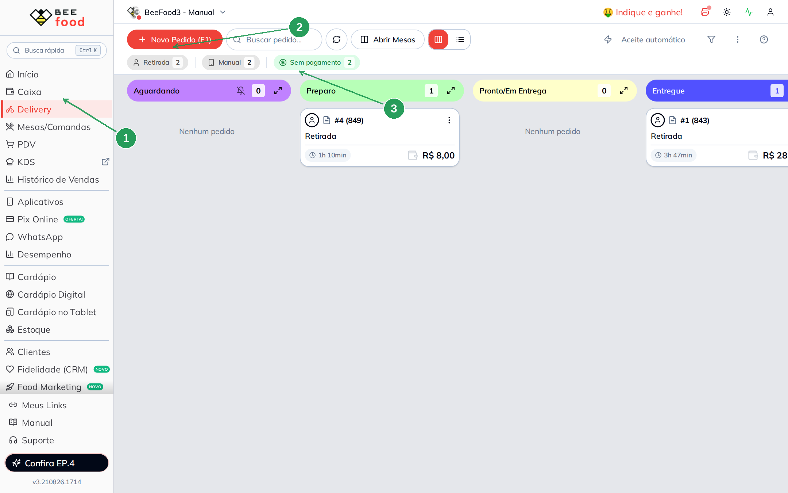
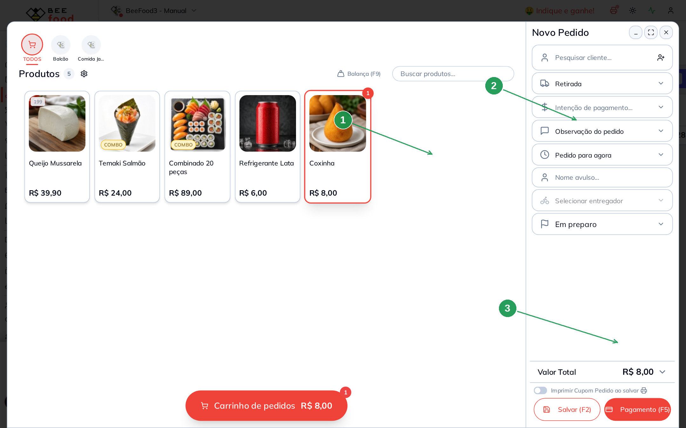
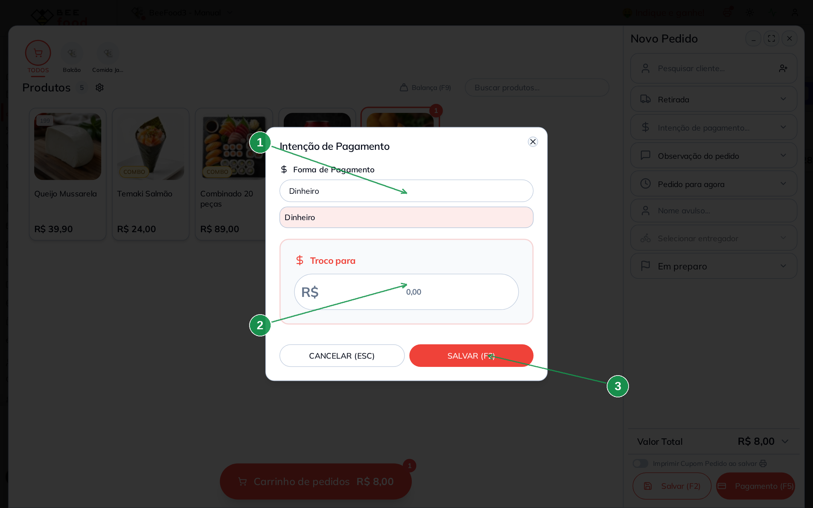
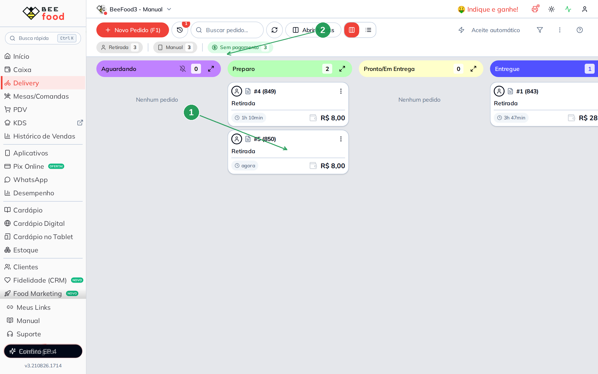
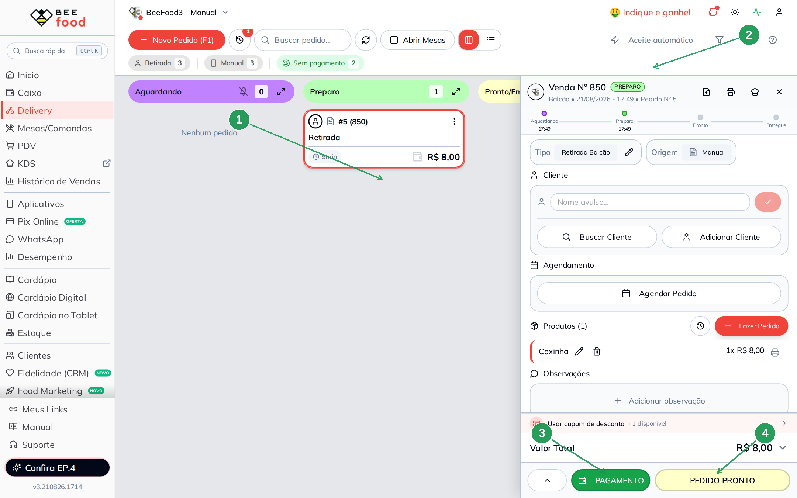
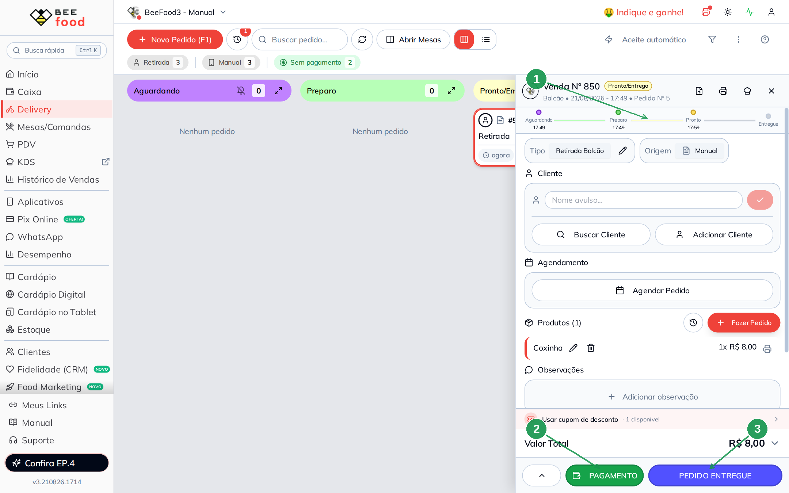
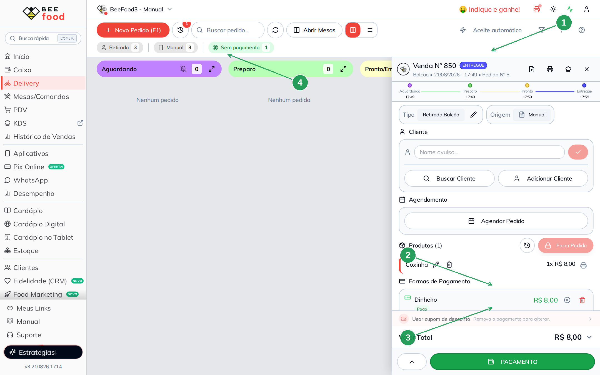

# Manual — Pagamento automático no Delivery

Este manual mostra por que um pedido de delivery **já nasce pago** quando você marca
**Entregue** — e o que precisa estar ligado para isso acontecer.

> As imagens têm **setas numeradas** (1, 2, 3…). Cada número indica o campo ou botão
> correspondente na tela.

---

## A regra em uma frase

Se o parâmetro está ligado **e** o pedido tem **intenção de pagamento** (Dinheiro, cartão,
etc.) **e** ainda não foi pago, ao ir para **ENTREGUE** o BeeFood **registra o pagamento
sozinho**.

Sem intenção, o pedido chega em Entregue **ainda sem pagar**.

---

## Onde fica

**Configuração → Parâmetros**, card **Delivery**. A alteração **grava sozinha**.

| Nº | Item | O que fazer |
|----|------|-------------|
| 1 | **Pagamento Automático Delivery** | Ligue. O texto do switch: *“Ao entregar o pedido, registrar pagamento automaticamente quando houver intenção de pagamento.”* |

---

## O quadro do Delivery

Em **Delivery** o pedido anda nas colunas Aguardando → Preparo → Pronto/Em Entrega →
Entregue. O atalho **+ Novo Pedido (F1)** abre o pedido manual.

| Nº | Item | O que fazer |
|----|------|-------------|
| 1 | **Delivery** | No menu lateral. |
| 2 | **+ Novo Pedido (F1)** | Abre o pedido de retirada/entrega. |
| 3 | **Sem pagamento** | Conta quantos ainda não foram pagos. |

---

## Passo 1 — lançar o item

No **Novo Pedido**, lance o produto (aqui: **Coxinha** R$ 8,00). O total já aparece.
Ainda **não** cobre o cliente — só monta o pedido.

| Nº | Item | O que fazer |
|----|------|-------------|
| 1 | A **Coxinha** | Qualquer item serve. |
| 2 | **Intenção de pagamento...** | É o campo da forma combinada com o cliente. |
| 3 | **Valor Total** | R$ 8,00 neste exemplo. |

---

## Passo 2 — gravar a intenção (Dinheiro)

Toque em **Intenção de pagamento**. Escolha a forma — neste exemplo, **Dinheiro** — e
**SALVAR (F2)**.

| Nº | Item | O que fazer |
|----|------|-------------|
| 1 | **Forma de Pagamento** | **Dinheiro** (ou a forma combinada). |
| 2 | **Troco para** | Opcional, se for dinheiro. |
| 3 | **SALVAR (F2)** | Grava a intenção. Ainda **não** cobra. |

A intenção só diz *como* o cliente vai pagar na entrega. Sem ela, o automático
**não roda**.

Depois, **Salvar (F2)** o pedido. Ele entra no kanban em **Preparo**.

| Nº | Item | O que conferir |
|----|------|----------------|
| 1 | **Preparo** | O pedido de agora (aqui: #5, R$ 8,00). |
| 2 | **Sem pagamento** | Continua valendo — ainda não entregou. |

---

## Passo 3 — conferir o detalhe (ainda sem pagar)

Clique no card. O painel da direita mostra o pedido **inteiro** (espere
`Carregando...` e `Atualizando...` sumirem). Neste exemplo: **Venda Nº 850**,
situação **PREPARO**, Coxinha R$ 8,00 e o botão verde **PAGAMENTO** ainda à
vista. A intenção **Dinheiro** ficou gravada no passo 2 — o automático usa
essa forma no Entregue.

| Nº | Item | O que conferir |
|----|------|----------------|
| 1 | O card no **Preparo** | O pedido selecionado (#5). |
| 2 | **PREPARO** | Ainda não entregou. |
| 3 | **PAGAMENTO** | Ainda precisa — o automático só age no Entregue. |
| 4 | **PEDIDO PRONTO** | Avança para Pronto/Em Entrega. |

---

## Passo 4 — Pronto e depois Entregue

**PEDIDO PRONTO** muda a situação. O botão vira **PEDIDO ENTREGUE**. O
**PAGAMENTO** continua — o automático ainda não rodou.

| Nº | Item | O que conferir |
|----|------|----------------|
| 1 | A linha do tempo | Aguardando → Preparo → **Pronto**. |
| 2 | **PAGAMENTO** | Ainda está lá. |
| 3 | **PEDIDO ENTREGUE** | É este clique que dispara o automático. |

Toque em **PEDIDO ENTREGUE**. O badge vira **ENTREGUE** e o pagamento **Dinheiro**
aparece como **Pago** no mesmo instante.

| Nº | Item | O que conferir |
|----|------|----------------|
| 1 | Badge **ENTREGUE** | A situação final. |
| 2 | **Formas de Pagamento — Dinheiro — Pago** | R$ 8,00 registrado sozinho. |
| 3 | O aviso *Remova o pagamento para alterar* | Não dá mais para trocar a intenção. |
| 4 | **Sem pagamento** | Caiu de 2 para **1** — este pedido saiu da conta. |

Não foi preciso tocar em **PAGAMENTO**. O parâmetro + a intenção + o Entregue
fizeram o lançamento.

---

## Contraprova

O pedido **#1 (843)** desta mesma tela foi para Entregue **sem** intenção de
pagamento. Nele o automático **não** rodou: o filtro Sem pagamento continuou
valendo e o pagamento só entra pelo botão. A prova com intenção é a
**venda 850**.

Para repetir de propósito: desligue o parâmetro, grave outra intenção, marque
Entregue — o **PAGAMENTO** segue pendente.

---

## Resumo do caminho

1. Ligue **Pagamento Automático Delivery**.
2. No pedido, grave a **intenção** (Dinheiro, cartão…).
3. **PEDIDO PRONTO** e depois **PEDIDO ENTREGUE**.
4. Confira **Formas de Pagamento → Pago** e o filtro Sem pagamento diminuindo.

---

## Perguntas frequentes

**Marquei Entregue e não pagou.** Faltou a intenção. Abra o detalhe **antes** de
entregar e veja se a forma está preenchida.

**O painel da direita ficou em Carregando… ou Atualizando…** Espere os dois
sumirem. O clique no card (e o Pronto/Entregue) busca a venda de novo; o badge
e os botões só aparecem depois.

**Posso usar no cardápio digital?** Sim, se o cliente escolheu “pagar na entrega”.
A intenção já vem no pedido. Este manual prova pelo painel.

**PIX na hora conta?** Se o pedido **já chegou pago**, o automático não lança de
novo. Ele só age quando ainda não há valor pago.

---

## Manuais relacionados

- **PDV — número e cupom** — receber e imprimir no balcão
- **Parâmetros gerais** — motivo e operador, no card ao lado
