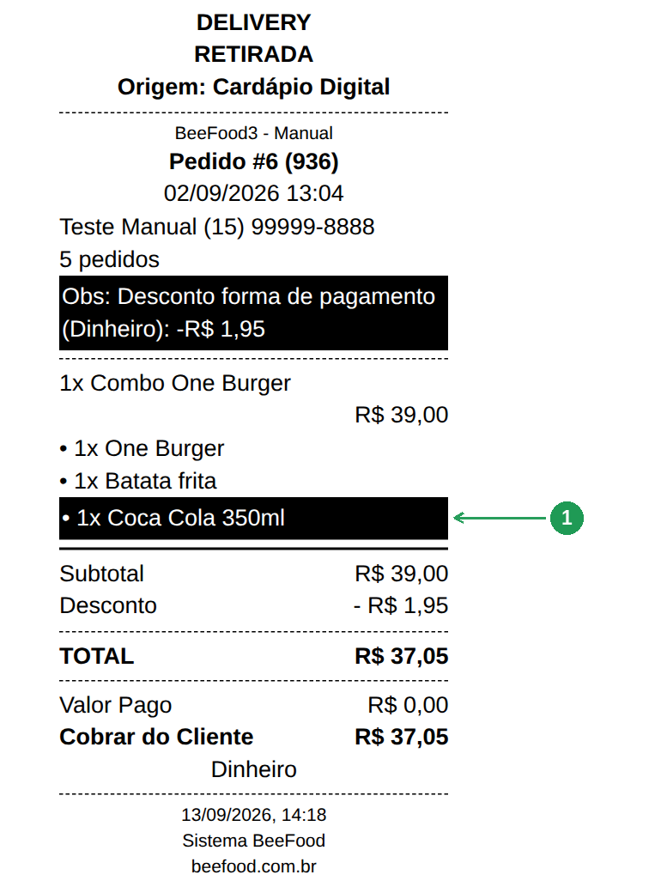

# Destaque na impressão: como destacar bebidas e produtos no cupom

A bebida que fica na sacola. O molho que ninguém separou. A redução
“sem maionese” que passou batido. Muita loja resolve isso com
canetinha vermelha no refrigerante ou durex colorido na comanda.

O BeeFood tem um campo para isso: **Destaque na impressão**. Ligado no
cadastro do produto ou do complemento, a linha daquele item sai com
**fundo escuro e letra clara** — fundo preto no papel térmico, no cupom
do cliente e na ficha da cozinha. É o mesmo fundo que o cupom já usa na
observação: um marca-texto impresso.

Serve para **destacar bebidas**, molhos, brindes, sobremesas, reduções
— qualquer item que a equipe precisa ver de longe na hora de montar a
sacola ou conferir a bandeja. É o que a loja costuma chamar de
**destacar produtos no impresso**.

Não é o selo **Destaque** do cardápio digital (aquele muda a vitrine do
cliente). Este interruptor só mexe no **papel**.

> As imagens têm **setas numeradas** (1, 2, 3…). Cada número indica o
> campo ou botão correspondente na tela.

---

## O que este texto faz (e o que não faz)

| Onde | O que acontece |
|------|----------------|
| **Cadastro do produto ou do complemento** (este manual) | Liga ou desliga o destaque daquele item. |
| **Editar em Lote** (este manual) | Liga ou desliga em vários de uma vez — todas as bebidas, todos os molhos. |
| **Cupom Pedido e ficha da cozinha** (este manual) | A linha marcada sai com fundo escuro, no presencial e no delivery. |
| Destaque do cardápio digital | Outro campo. Só muda a vitrine do cliente, não o papel. |

O interruptor **não** muda preço, estoque, ordem do cardápio nem a
disponibilidade do item. Vale para produto **e** para complemento — a
opção que entra no combo.

---

## 1. Como destacar um produto (bebida, sobremesa, brinde)

**Cardápio → Produtos.** Abra o produto — neste exemplo, a
**Coca Cola 350ml** do setor **Bebidas**.

O campo fica **logo abaixo da Descrição** (1). Não está em Opções
avançadas. Ligado, o texto de apoio vira *Ativo: o item sai em
destaque na impressão do pedido.*

Grave com **SALVAR E SAIR**. Esta tela **não** grava sozinha.

| Nº | Item | O que fazer |
|----|------|-------------|
| 1. | **Destaque na impressão** | Ligue para a linha deste produto sair em destaque no papel. |

---

## 2. Como destacar um complemento (molho, redução, adicional)

O mesmo interruptor existe no complemento. **Cardápio → Complementos**
e abra o item — aqui, o **Molho verde**.

De novo: abaixo da Descrição (1). Isso importa porque, dentro de um
combo, a bebida e a redução entram como **opção**, não como produto.
Quem manda no papel é o complemento marcado.

| Nº | Item | O que fazer |
|----|------|-------------|
| 1. | **Destaque na impressão** | Ligue para a opção sair em destaque debaixo do produto. |

---

## 3. Como destacar todas as bebidas de uma vez

O uso mais comum é o **destaque de bebida** — e marcar refrigerante por
refrigerante é perda de tempo. **Cardápio → Produtos →** filtre o setor
(**Bebidas**, por exemplo) **e só então** clique em **Editar em Lote**.
O assistente já abre com **essa** lista.

Na etapa 2, marque o campo **Destaque na impressão** e deixe **Sim**.
Sem marcar o campo, o lote não mexe nesse valor. O valor nasce em
**Não** — se processar assim, **desliga** o destaque nos itens
escolhidos.

Clique em **PROCESSAR (F2)** só quando for para valer. Esta tela
também **não** grava sozinha.

| Nº | Item | O que fazer |
|----|------|-------------|
| 1. | **Destaque na impressão** | Marque o campo e deixe **Sim** para ligar nos selecionados. |
| 2. | **PROCESSAR (F2)** | Grava o lote. Sem este clique, nada muda. |

O mesmo campo existe no **Editar em Lote** da aba **Complementos** —
é por ali que se marcam todos os molhos e todas as reduções de uma vez.

---

## 4. O pedido de prova

Neste exemplo: venda **#968**, pedido **32**. Um **Combo One
Burger** (R$ 39,00) com **Coca Cola 350ml** e a redução
**Sem Maionese Verde**, mais **Mozza Sticks + Molho** (R$ 35,90)
com **Molho verde**. Total **R$ 74,15**.

São dois produtos e cinco opções. Só três opções têm o destaque
ligado: **Coca Cola 350ml**, **Sem Maionese Verde** e
**Molho verde**. É esse pedido que sai nos papéis a seguir.

---

## 5. O que sai no Cupom Pedido

As linhas marcadas saem com fundo escuro. Neste pedido: a
**Coca Cola**, a **Sem Maionese Verde** e o **Molho verde**.
O combo em si e o acompanhamento continuam em letra normal.

| Nº | Item | O que conferir |
|----|------|----------------|
| 1. | **Coca Cola 350ml** | Bebida do combo, marcada no cadastro do produto. |
| 2. | **Sem Maionese Verde** | Redução (complemento). |
| 3. | **Molho verde** | Complemento do segundo item. |

O valor em reais fica na linha de baixo, sem o fundo escuro.

---

## 6. O que sai na impressão da cozinha

A ficha da cozinha **não traz preço**. O destaque é o mesmo: fundo
escuro nas linhas marcadas, para a produção ver logo a bebida, a
redução e o molho.

| Nº | Item | O que conferir |
|----|------|----------------|
| 1. | **Coca Cola 350ml** | Mesma bebida do cupom do cliente. |
| 2. | **Sem Maionese Verde** | A redução. |
| 3. | **Molho verde** | O molho. |

---

## 7. No pedido do delivery

Vale igual para pedido do **delivery** e do **cardápio digital** — que
é justamente onde a bebida some da sacola que sai com o motoboy.
Abaixo, o pedido **#6 (936)** que entrou pelo cardápio digital: a
**Coca Cola 350ml** do combo sai com fundo escuro (1).

| Nº | Item | O que conferir |
|----|------|----------------|
| 1. | **Coca Cola 350ml** | A bebida do combo, no cupom de um pedido do delivery. |

A linha de **Obs** deste exemplo também aparece com fundo: aquilo é o
destaque da **observação**, que o cupom já fazia antes. O do item é o
da Coca.

---

## Problemas comuns

| Sintoma | O que verificar |
|---------|-----------------|
| Marquei o produto e a linha saiu normal | O cadastro foi gravado com **SALVAR E SAIR**? A tela não salva sozinha |
| A bebida do combo saiu sem destaque | Dentro do combo ela é **opção**. Marque o **complemento** (Cardápio → Complementos), não só o produto solto |
| Passei o lote e nada mudou | Na etapa 2, além de marcar o campo, o interruptor tem de ficar em **Sim** — e o **PROCESSAR (F2)** tem de ser clicado |
| O lote **desligou** o destaque | O valor nasce em **Não**. Marcar o campo e processar sem virar para **Sim** apaga a marcação |
| Um computador imprime com destaque e o outro não | Cada computador guarda a lista de itens marcados por até **12 horas**. Onde você salvou, já está valendo |
| Saiu tudo com fundo escuro | Marcação demais deixa de ser destaque. Deixe ligado só o que a equipe precisa conferir |

---

## Perguntas frequentes

**Como destacar as bebidas na impressão do pedido?**
Abra a bebida em **Cardápio → Produtos**, ligue **Destaque na
impressão** (abaixo da Descrição) e clique em **SALVAR E SAIR**. A
partir da próxima impressão, a linha daquela bebida sai com fundo
escuro no Cupom Pedido e na ficha da cozinha.

**Como destacar todas as bebidas de uma vez?**
Filtre o setor **Bebidas** em Cardápio → Produtos, clique em **Editar
em Lote**, marque **Destaque na impressão** na etapa 2, deixe **Sim** e
clique em **PROCESSAR (F2)**. O mesmo caminho serve para os molhos e as
reduções pela aba **Complementos**.

**Dá para destacar um setor ou uma categoria inteira?**
É exatamente o que o **Editar em Lote** faz: o filtro de setor define a
lista, e o lote aplica o campo em todos. Bebidas, sobremesas, molhos,
brindes — um setor por vez.

**Serve para não esquecer a bebida na sacola do delivery?**
É para isso que ele existe: o esquecimento de bebida cai quando a linha
sai marcada no cupom que vai com o pedido, no lugar de grifar com
canetinha ou colar durex colorido na comanda.

**Sai um aviso “TEM BEBIDA” no rodapé do cupom?**
Não. O destaque é **na linha do item**, não um aviso no rodapé. Se você
quiser uma frase fixa no pé do cupom, ela se escreve no **Texto
Padrão** do Cupom Pedido — mas aí sai em todo pedido, com bebida ou
sem.

**O destaque é igual ao da observação, com fundo?**
Sim, é o mesmo fundo escuro com letra clara que o cupom usa na
observação. Nada de fonte diferente ou asterisco: o papel inverte a
linha inteira.

**Funciona no pedido do delivery e do cardápio digital?**
Sim. O Cupom Pedido é o mesmo no presencial e no delivery — a Parte 7
mostra um pedido do cardápio digital com a bebida destacada.

**A bebida que vem dentro do combo também sai destacada?**
Sim, se o **complemento** estiver marcado. Dentro do combo, a bebida é
uma opção do grupo; é o cadastro do complemento que manda nessa linha.

**Marcar um produto muda o preço, o estoque ou o cardápio digital?**
Não. O campo só muda como a linha é impressa.

**É o mesmo Destaque que aparece na vitrine do cardápio?**
Não. Aquele outro campo marca o produto na loja digital. Este só mexe
no papel.

**Como desligo o destaque de um item?**
Desligue o interruptor no cadastro e salve. Para vários, use o
**Editar em Lote** com o campo marcado e o valor em **Não**.

**Preciso relogar depois de salvar?**
Não. Salvar o produto (ou processar o lote) já libera a impressão nova
no computador onde você fez a alteração. Nos outros, a lista pode levar
até 12 horas para virar.

**Dá para destacar só no delivery e deixar o presencial normal?**
Não. É um interruptor só, por item: quando liga, vale para os dois.

**Aparece no KDS ou nas fichas de consumo do PDV?**
Nesta versão, não. O campo é de impressão: vale para o **Cupom Pedido**
e para a **ficha da cozinha**.

---

## Manuais relacionados

| Manual | O que traz |
|--------|------------|
| **Manual do Cardápio — Fundamentos** | O cadastro de produto e o Editar em Lote em detalhe |
| **Manual de Capas e Destaques** | O outro **Destaque**, o da vitrine do cardápio digital |
| **Como deixar a taxa de serviço opcional no cupom** | O Texto Padrão do Cupom Pedido: cabeçalho e rodapé |
| **Fichas de consumo no PDV** | As fichas que não usam este campo |

---

## Precisa de ajuda?

Fale com o **suporte BeeFood** informando: nome da loja e **CNPJ**.

---

*Última atualização: setembro/2026 — BeeFood · Destaque na impressão*
