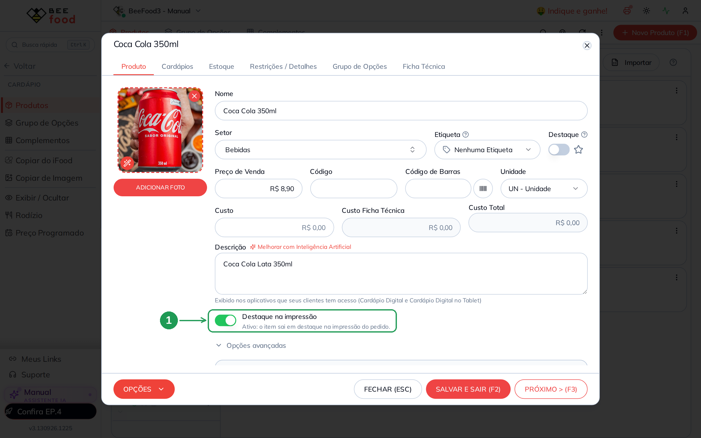
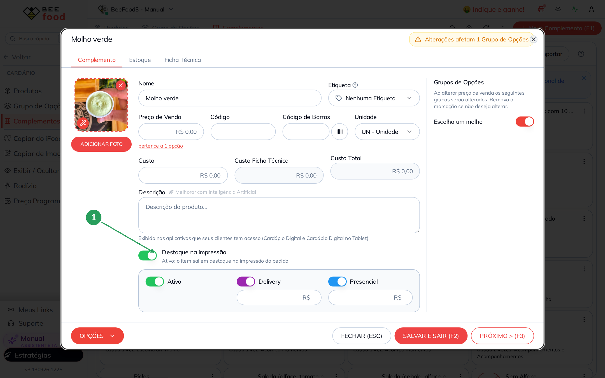
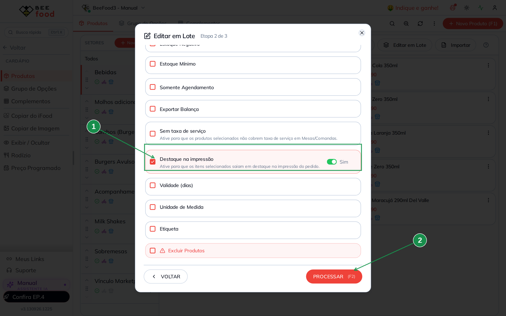
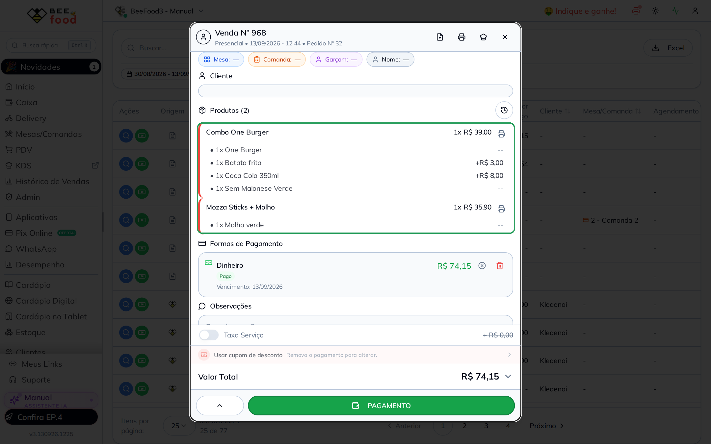
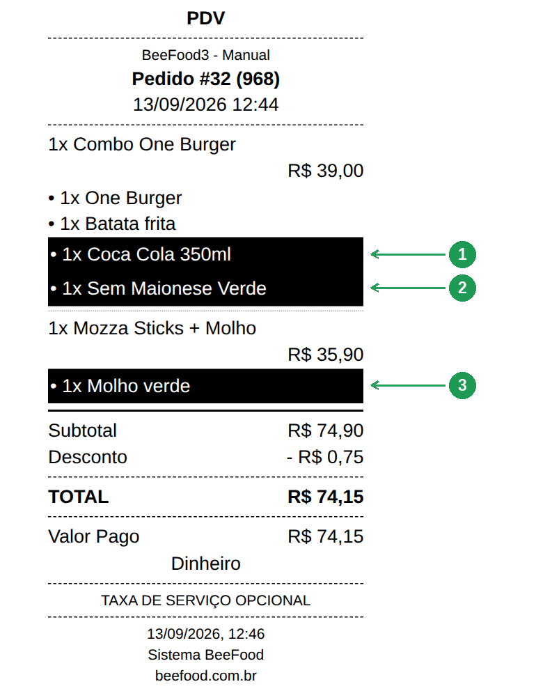
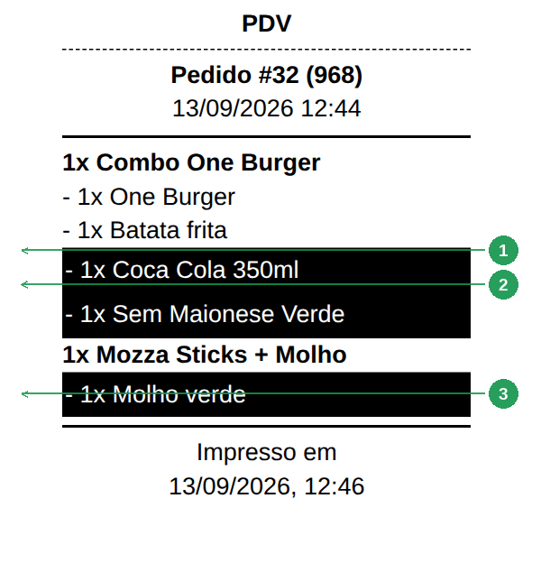

# Destaque na impressão

No cupom do cliente e na ficha da cozinha, alguns itens precisam
**saltar aos olhos** — a bebida do combo, o molho, o “sem maionese”.
Isso não é o selo **Destaque** do cardápio digital. É um interruptor
só da impressão: **Destaque na impressão**.

Ligado, a linha daquele item sai com **fundo escuro e letra clara**.
O resto do cupom continua igual.

> As imagens têm **setas numeradas** (1, 2, 3…). Cada número indica o
> campo ou botão correspondente na tela.

---

## O que este texto faz (e o que não faz)

| Onde | O que acontece |
|------|----------------|
| **Cadastro do produto ou do complemento** (este manual) | Liga ou desliga o destaque daquele item. |
| **Editar em Lote** (este manual) | Liga ou desliga em vários de uma vez. |
| **Cupom Pedido e Cupom Cozinha** (este manual) | A linha marcada sai em destaque. |
| Destaque do cardápio digital | Outro campo. Só muda a vitrine do cliente, não o papel. |

O interruptor **não** muda preço, estoque nem a ordem do cardápio.
Vale para produto **e** para complemento (a opção que entra no combo).

---

## 1. No cadastro do produto

**Cardápio → Produtos.** Abra o produto — neste exemplo, a
**Coca Cola 350ml** do setor **Bebidas**.

O campo fica **logo abaixo da Descrição** (1). Não está em Opções
avançadas. Ligado, o texto de apoio vira *Ativo: o item sai em
destaque na impressão do pedido.*

Grave com **SALVAR E SAIR**. Esta tela **não** grava sozinha.

| Nº | Item | O que fazer |
|----|------|-------------|
| 1. | **Destaque na impressão** | Ligue para a linha deste produto sair em destaque no papel. |

---

## 2. No cadastro do complemento

O mesmo interruptor existe no complemento. **Cardápio → Complementos**
e abra o item — aqui, o **Molho verde**.

De novo: abaixo da Descrição (1). Complemento entra no pedido como
**opção** de um produto (o molho do combo, a redução “Sem maionese”).
Quem manda no papel é o complemento marcado, não só o produto pai.

| Nº | Item | O que fazer |
|----|------|-------------|
| 1. | **Destaque na impressão** | Ligue para a opção sair em destaque debaixo do produto. |

---

## 3. Vários de uma vez

**Cardápio → Produtos →** filtre o setor (1) **e só então**
**Editar em Lote** (2). O assistente já abre com **essa** lista.

Na etapa 2, marque o grupo **Destaque na impressão** e deixe
**Sim**. Sem marcar o grupo, o lote não mexe nesse campo. O valor
nasce em **Não** — se processar assim, **desliga** nos itens
escolhidos.

Clique em **PROCESSAR (F2)** só quando for para valer. Esta tela
também **não** grava sozinha.

| Nº | Item | O que fazer |
|----|------|-------------|
| 1. | **Destaque na impressão** | Marque o campo e deixe **Sim** para ligar nos selecionados. |
| 2. | **PROCESSAR (F2)** | Grava o lote. Sem este clique, nada muda. |

O mesmo campo existe no **Editar em Lote** da aba **Complementos**
(reduções e molhos, por exemplo).

---

## 4. O pedido de prova

Um **Combo One Burger** com **Coca Cola 350ml** e a redução
**Sem Maionese Verde**, mais **Mozza Sticks + Molho** com
**Molho verde**. Bebida, redução e molho já estavam ligados no
cadastro.

No detalhe da venda, a impressora (1) é o **Cupom Pedido**. O
chapéu (2) é a **ficha da cozinha**.

| Nº | Item | O que conferir |
|----|------|----------------|
| 1. | Ícone da impressora | **Imprimir Cupom** — o papel do cliente. |
| 2. | Ícone do chapéu | **Imprimir Cozinha** — a ficha da produção. |

---

## 5. O que sai no Cupom Pedido

As linhas marcadas saem com fundo escuro. Neste pedido: a
**Coca Cola**, a **Sem Maionese Verde** e o **Molho verde**.
O combo em si e o acompanhamento continuam em letra normal.

| Nº | Item | O que conferir |
|----|------|----------------|
| 1. | **Coca Cola 350ml** | Bebida do combo, marcada no cadastro do produto. |
| 2. | **Sem Maionese Verde** | Redução (complemento). |
| 3. | **Molho verde** | Complemento do segundo item. |

O valor em reais fica na linha de baixo, sem o fundo escuro.

---

## 6. O que sai na Cozinha

A ficha da cozinha **não traz preço**. O destaque é o mesmo: fundo
escuro nas linhas marcadas, para a produção ver logo a bebida, a
redução e o molho.

| Nº | Item | O que conferir |
|----|------|----------------|
| 1. | **Coca Cola 350ml** | Mesma bebida do cupom do cliente. |
| 2. | **Sem Maionese Verde** | A redução. |
| 3. | **Molho verde** | O molho. |

Sem o BeeImpressão no computador, o BeeFood avisa *Servidor offline.
Usando impressão do navegador* e mostra o **mesmo papel** no preview.

---

## Perguntas rápidas

**É o mesmo Destaque da vitrine do cardápio?** Não. Aquele outro
campo só marca o produto na loja digital. Este aqui só mexe no
**papel**.

**Produto e complemento usam o mesmo interruptor?** Sim. No produto,
destaca a linha do item. No complemento, destaca a opção embaixo.

**O lote já nasce em Sim?** Não. Marcar o campo e processar com
**Não** desliga o destaque. Confira o interruptor antes do
**PROCESSAR**.

**Preciso relogar depois de salvar?** Não. O salvar (ou o lote)
limpa o cache do destaque. A próxima impressão já usa o valor novo.

**Vale para a ficha de consumo do PDV?** Nesta versão, não. Só
Cupom Pedido e Cozinha.
