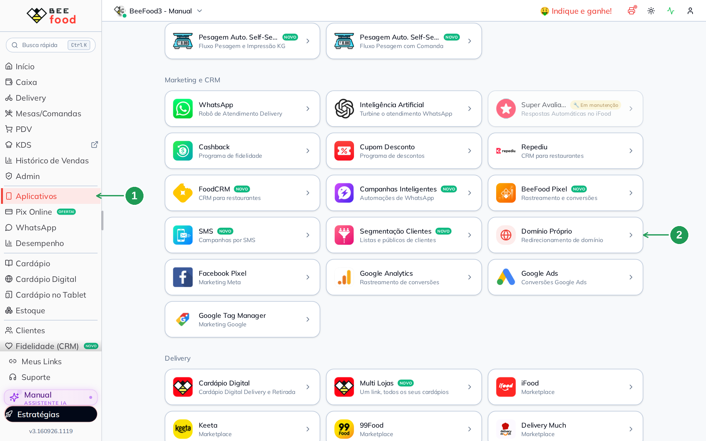
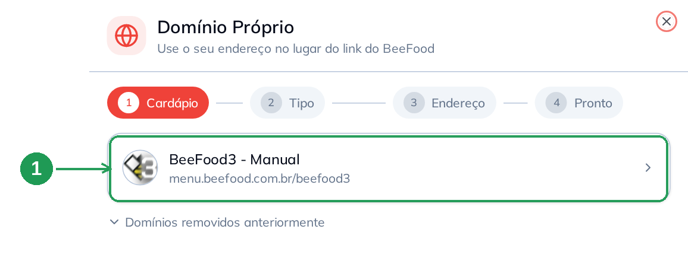
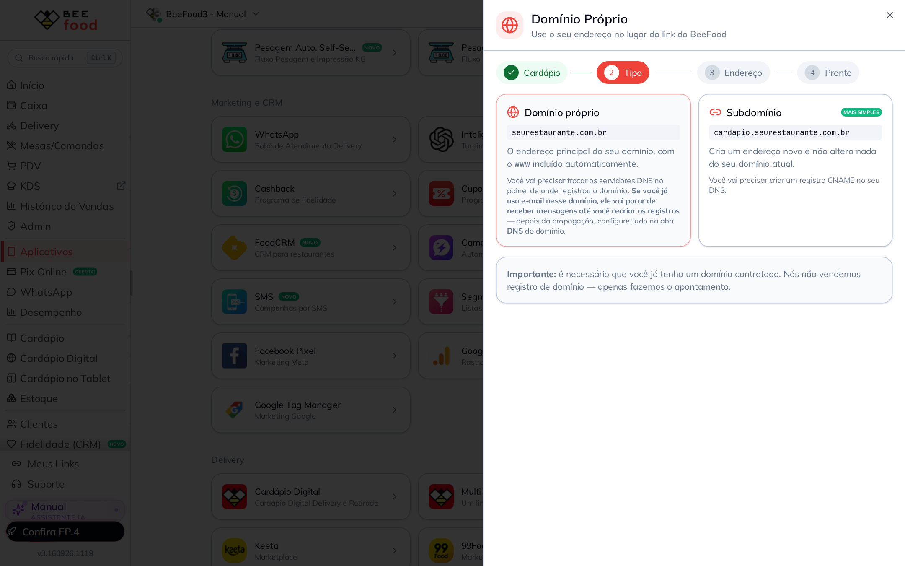
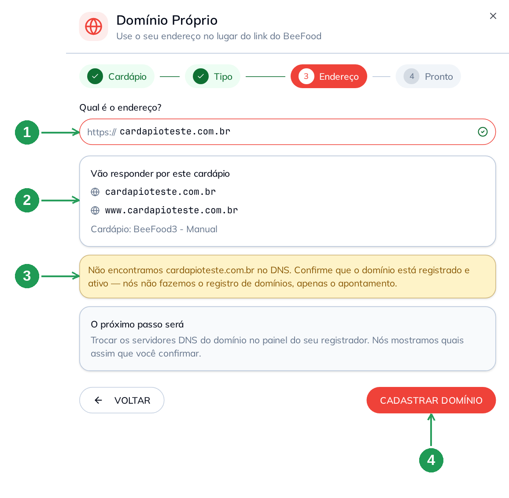
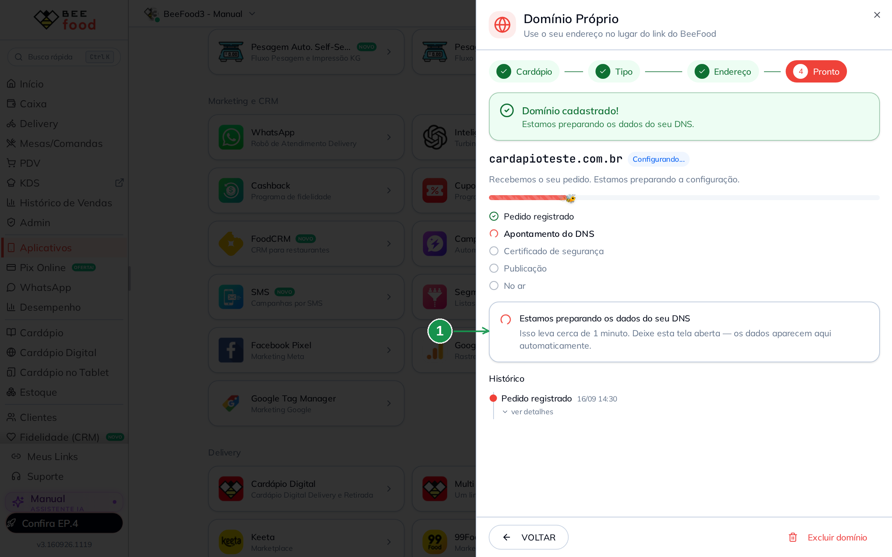
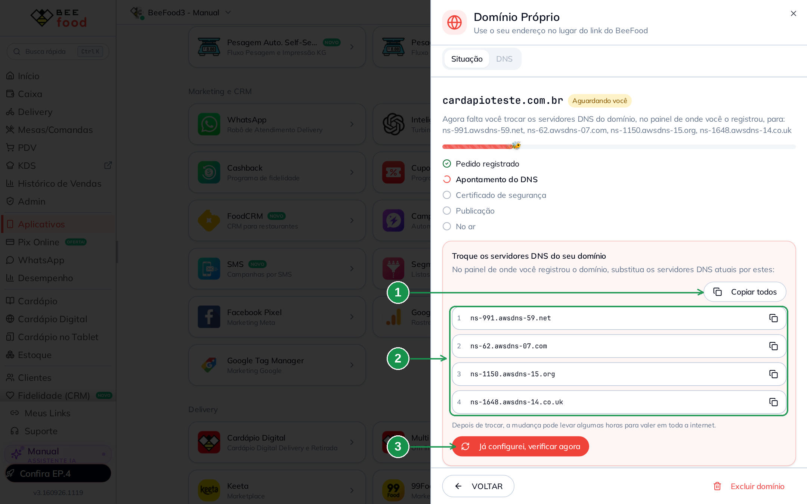
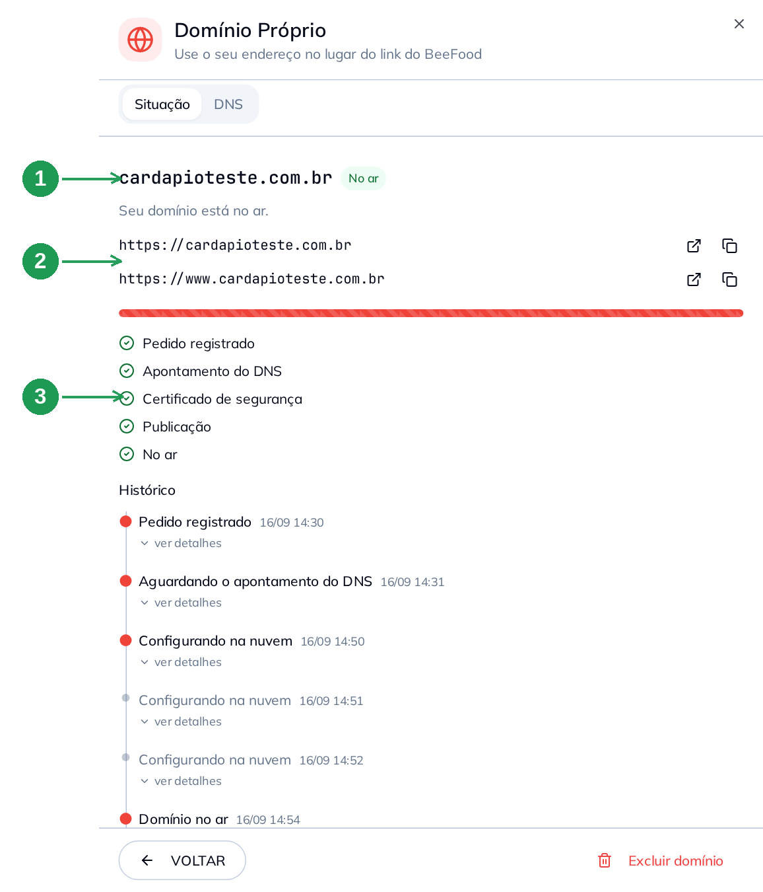
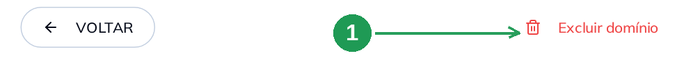
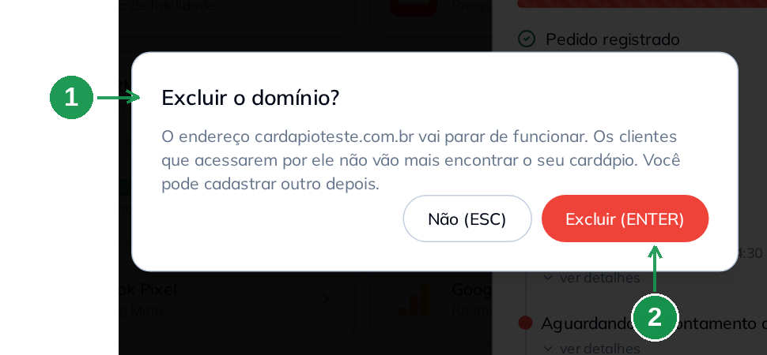

# Domínio próprio no cardápio digital: como configurar o seu endereço, alterar a zona DNS e excluir

Hoje o seu cardápio digital tem um endereço do BeeFood, do tipo
`menu.beefood.com.br/beefood3`. Funciona, mas não é o endereço que está na fachada,
no cartão nem no Instagram. Com o **domínio próprio**, o cliente abre o cardápio em
`www.seurestaurante.com.br` — e é o mesmo cardápio, os mesmos produtos, os mesmos
pedidos.

Antes isso passava pelo suporte. Agora você faz tudo na tela, em
**Aplicativos → Domínio Próprio**: escolhe o cardápio, digita o endereço, o BeeFood
devolve o que você precisa configurar no seu registrador e a própria tela acompanha
o processo até o domínio ficar **No ar**.

> O BeeFood **não vende domínio**. Você precisa já ter um domínio registrado
> (Registro.br, GoDaddy, HostGator, Hostinger, Cloudflare, Locaweb…). O que fazemos
> é o apontamento desse domínio para o seu cardápio.

---

## Antes de começar

1. **Um domínio já registrado** e no ar (pago, sem pendência com o registrador).
2. **Acesso ao painel do registrador**, aquele em que você comprou o domínio. É lá
   que você vai colar o que a tela mostrar.
3. **Decidir o tipo**: usar o domínio principal (`seurestaurante.com.br`) ou criar um
   endereço novo (`cardapio.seurestaurante.com.br`). A diferença está na Parte 2 —
   ela muda o que você precisa fazer no registrador e, no caso do domínio principal,
   mexe no e-mail.
4. Cada cardápio da conta aceita **um** domínio por vez. Para trocar, exclua o atual
   (Parte 6) e cadastre outro.

---

## 1. Abrir a tela do Domínio Próprio

No menu lateral, clique em **Aplicativos** (1). Desça até o grupo **Marketing e CRM**
e abra **Domínio Próprio** (2).

| Nº | Item | O que fazer |
|----|------|-------------|
| 1. | **Aplicativos** | Menu lateral, abre a lista de aplicativos e integrações. |
| 2. | **Domínio Próprio** | Card do grupo *Marketing e CRM*. Abre o painel do domínio. |

O painel abre pela direita e tem quatro passos no topo: **Cardápio → Tipo →
Endereço → Pronto**. Nada é gravado até o botão **CADASTRAR DOMÍNIO** do passo 3.

---

## 2. Passo 1: escolher o cardápio

Clique no cardápio que vai receber o domínio (1). Embaixo do nome aparece o endereço
atual dele, o `menu.beefood.com.br/...`.

| Nº | Item | O que fazer |
|----|------|-------------|
| 1. | **Cartão do cardápio** | Clique nele para seguir. Se a sua conta tem mais de um cardápio (multi lojas), escolha o certo — o domínio vale só para esse. |

Detalhes desta tela:

- Cardápio que **já tem domínio** mostra o endereço e uma etiqueta de situação
  (**No ar**, **Configurando...**, **Aguardando você**). Clicar nele abre a situação
  desse domínio, não um cadastro novo.
- **Domínios removidos anteriormente** é só histórico: lista o que já foi excluído.

---

## 3. Passo 2: domínio próprio ou subdomínio?

Aqui os dois caminhos se separam. Leia com calma, porque a escolha muda o que você
vai fazer no registrador.

| | **Domínio próprio** | **Subdomínio** |
|-|---------------------|----------------|
| Exemplo | `seurestaurante.com.br` | `cardapio.seurestaurante.com.br` |
| Endereço | o principal, já com o `www` incluído | um endereço novo |
| O que você faz no registrador | troca os **servidores DNS** (4 endereços) | cria **um registro CNAME** |
| Mexe no que já existe? | **Sim.** O domínio passa a ser gerenciado pelo BeeFood | **Não.** O site e o e-mail atuais continuam como estão |
| E-mail do domínio | **para de funcionar** até você recriar os registros na aba DNS | não muda nada |
| Indicado para | quem quer o endereço principal no cardápio | quem já tem site ou e-mail no domínio |

> **Se você usa e-mail nesse domínio** (`contato@seurestaurante.com.br`), pense duas
> vezes antes de escolher **Domínio próprio**. Ao trocar os servidores DNS, o e-mail
> deixa de receber mensagens até os registros serem recriados na aba **DNS** (Parte
> 5). Quando o BeeFood detecta servidores de e-mail no domínio, a própria tela
> sugere o subdomínio.

A Parte 4 segue com o **domínio próprio**. Se você escolheu **Subdomínio**, pule para
a Parte 7.

---

## 4. Parte 1 — domínio próprio: digitar e conferir o endereço

Digite o domínio **sem** `https://` e **sem** `www` (o `www` entra sozinho). Enquanto
você digita, o BeeFood confere o endereço e mostra o resultado logo abaixo.

| Nº | Item | O que fazer |
|----|------|-------------|
| 1. | **Qual é o endereço?** * | Digite só o domínio: `cardapioteste.com.br`. O check verde à direita indica que ele foi aprovado. |
| 2. | **Vão responder por este cardápio** | Confira os endereços que vão abrir o cardápio — no domínio próprio são dois: com e sem `www`. |
| 3. | **Aviso amarelo** | Recado, não erro. Aqui ele diz que o domínio ainda não foi encontrado no DNS. Confirme com o seu registrador que o domínio está ativo. |
| 4. | **CADASTRAR DOMÍNIO** | Grava o pedido. Só habilita depois da conferência aprovar o endereço. |

O bloco **O próximo passo será** adianta o que vem depois — no domínio próprio,
trocar os servidores DNS no painel do registrador.

Se o endereço for recusado, a tela explica o motivo e oferece a saída:

| Mensagem | O que significa | O que fazer |
|----------|-----------------|-------------|
| Endereço inválido (em vermelho, no campo) | falta o `.com.br`, sobrou `https://`, tem espaço | corrija o texto |
| O domínio tem e-mail configurado | trocar os DNS derrubaria o e-mail | use o **subdomínio** sugerido no botão |
| Este cardápio já tem um domínio | um cardápio, um domínio | veja o domínio atual ou exclua-o antes |
| Endereço em uso por outra empresa | o domínio está cadastrado em outra conta BeeFood | fale com o suporte pelo link da própria tela |

---

## 5. Parte 1 — domínio próprio: trocar os servidores DNS

Depois de **CADASTRAR DOMÍNIO**, a tela avisa que o pedido foi registrado e passa a
preparar os dados do seu DNS (1). Isso leva cerca de **um minuto**; deixe a tela
aberta, os dados aparecem sozinhos.

| Nº | Item | O que fazer |
|----|------|-------------|
| 1. | **Estamos preparando os dados do seu DNS** | Só esperar. A lista de etapas acima mostra em que ponto o processo está. |

Quando termina, aparece o cartão **Troque os servidores DNS do seu domínio** com os
**quatro servidores** que você precisa levar para o painel do seu registrador.

| Nº | Item | O que fazer |
|----|------|-------------|
| 1. | **Copiar todos** | Copia os quatro servidores de uma vez. Cada linha também tem um botão próprio de copiar. |
| 2. | **Os quatro servidores DNS** | No painel do registrador, **substitua** os servidores atuais por estes quatro. Não some com os antigos: troque. |
| 3. | **Já configurei, verificar agora** | Clique **depois** de gravar no registrador. Assim o BeeFood confere na hora, em vez de esperar a próxima verificação automática. |

No painel do registrador esse campo aparece com nomes diferentes: *Servidores DNS*,
*Alterar servidores DNS*, *Nameservers*, *DNS personalizado* ou *Usar servidores de
outro provedor*. É sempre a mesma coisa: quatro linhas para colar.

Enquanto o domínio espera por você, a etiqueta ao lado do nome fica em **Aguardando
você**, e a tela se atualiza sozinha. A troca de servidores DNS **pode levar algumas
horas** para valer em toda a internet — é normal, e não há nada a fazer nesse tempo
além de esperar.

---

## 6. Parte 1 — domínio próprio: o domínio no ar

Terminada a propagação, o BeeFood cuida do resto sozinho: emite o **certificado de
segurança** (o cadeado do `https`), publica e libera o endereço. As cinco etapas
ficam verdes e a etiqueta muda para **No ar** (1).

No exemplo deste manual, o pedido foi registrado às 14:30, o apontamento do DNS foi
reconhecido às 14:50 e o domínio ficou no ar às **14:54** — quatro minutos entre o
DNS responder e o cardápio abrir no endereço novo.

| Nº | Item | O que fazer |
|----|------|-------------|
| 1. | **Endereço e situação** | A etiqueta **No ar** confirma que está tudo pronto. |
| 2. | **Endereços do cardápio** | Os links que já funcionam. O primeiro ícone abre numa aba nova, o segundo copia — use para colar no Instagram, no Google e no QR Code. |
| 3. | **Etapas concluídas** | Pedido, DNS, certificado, publicação e no ar. Serve para saber onde o processo está quando algo demora. |

O **Histórico**, embaixo, guarda cada passo com data e hora, e cada linha abre em
**ver detalhes** — é o que você mostra ao suporte se precisar de ajuda.

Vale conferir do lado de fora: abra o seu endereço no navegador do celular, fora do
Wi-Fi da loja. O cardápio tem que abrir com o cadeado do `https` e sem aviso de
segurança.

> O endereço antigo (`menu.beefood.com.br/...`) **continua funcionando**. Quem já
> tinha o link salvo ou um QR Code impresso não fica na mão.

---

## 7. Parte 1 — domínio próprio: excluir o domínio

Excluir serve para dois casos: você quer **trocar** o endereço (cadastrar outro no
lugar) ou vai **devolver o domínio** ao seu site antigo. Não é a mesma coisa que
desligar o cardápio: o cardápio continua no ar pelo endereço
`menu.beefood.com.br/...`.

No rodapé do painel, clique em **Excluir domínio** (1).

| Nº | Item | O que fazer |
|----|------|-------------|
| 1. | **Excluir domínio** | Abre a confirmação. Nada é apagado só com esse clique. |

A confirmação (1) diz exatamente o que vai acontecer: o endereço para de funcionar e
quem acessar por ele não encontra mais o cardápio. Para confirmar, clique em
**Excluir (ENTER)** (2) — ou pressione **ENTER**. Para desistir, **Não (ESC)**.

| Nº | Item | O que fazer |
|----|------|-------------|
| 1. | **Aviso da confirmação** | Leia: é o resumo do efeito. Quem estiver com o endereço salvo vai receber erro. |
| 2. | **Excluir (ENTER)** | Confirma. O painel volta para a lista de cardápios e o endereço passa a aparecer em *Domínios removidos anteriormente*. |

Depois de excluir:

- O domínio **volta a ser só seu**. Se ele estava usando os servidores DNS do
  BeeFood, aponte-o para onde você quiser no painel do registrador — enquanto isso
  não for feito, o endereço fica sem resposta.
- O cardápio continua funcionando no endereço `menu.beefood.com.br/...`.
- Você pode cadastrar outro domínio no mesmo cardápio, do zero. O endereço excluído
  fica no histórico apenas como registro.

> Trocar de endereço custa visita: link no Instagram, no Google Meu Negócio, no
> WhatsApp e QR Code impresso apontam para o antigo. Atualize esses lugares no mesmo
> dia da troca.

---

## Problemas comuns

| Sintoma | O que está acontecendo | O que fazer |
|---------|------------------------|-------------|
| Cadastrei e a etiqueta ficou em **Aguardando você** | falta a sua parte: trocar os servidores DNS (domínio próprio) ou criar o CNAME (subdomínio) | faça no painel do registrador e clique em **Já configurei, verificar agora** |
| Troquei os DNS e continua **Aguardando você** | a mudança ainda não propagou | espere; a troca de servidores DNS pode levar algumas horas. A tela se atualiza sozinha |
| O aviso amarelo diz que o domínio não foi encontrado no DNS | o domínio pode estar sem registro ativo, vencido ou recém-comprado | confirme com o registrador se ele está ativo e pago |
| O navegador acusa **erro de certificado** | o certificado é emitido depois do apontamento; se o domínio ainda não está **No ar**, ele não existe | espere o **No ar**. Se persistir, use **Falar com o suporte** no próprio painel |
| O e-mail do domínio parou depois da configuração | você usou **domínio próprio** e trocou os servidores DNS | recrie os registros do seu provedor de e-mail (MX e TXT) na aba **DNS** |
| A tela diz que **este cardápio já tem um domínio** | um cardápio aceita um endereço por vez | exclua o atual antes de cadastrar outro |
| A etiqueta ficou em **Precisa de ajuda** | o processo travou num ponto que a tela não resolve sozinha | use **Falar com o suporte**; o **Histórico** com o **ver detalhes** é o que o time vai pedir |
| Não acho o card **Domínio Próprio** | o card fica em *Aplicativos → Marketing e CRM* | se ao abrir aparecer o modal antigo, pedindo contato com o suporte, a tela nova ainda não foi liberada para a sua conta |

---

## Perguntas frequentes

**O BeeFood vende ou registra domínio?**
Não. Você compra o domínio onde preferir (Registro.br, GoDaddy, HostGator,
Hostinger, Cloudflare…) e o BeeFood faz o apontamento para o seu cardápio.

**Preciso pagar a mais pelo domínio próprio no BeeFood?**
O que você paga é o domínio, no seu registrador. A configuração é feita nesta tela.

**Posso usar o mesmo domínio em dois cardápios?**
Não. Cada cardápio tem um endereço próprio. Com várias lojas, use um subdomínio para
cada uma (`centro.seurestaurante.com.br`, `shopping.seurestaurante.com.br`).

**Meu site fica no ar junto com o cardápio?**
No **subdomínio**, sim: o site continua em `seurestaurante.com.br` e o cardápio
responde em `cardapio.seurestaurante.com.br`. No **domínio próprio**, o endereço
principal passa a abrir o cardápio.

**O link antigo do BeeFood para de funcionar?**
Não. O `menu.beefood.com.br/...` continua valendo, então QR Code impresso e links
salvos não quebram.

**Quanto tempo leva?**
A parte do BeeFood leva minutos. O tempo total depende da propagação do DNS: no
exemplo deste manual o domínio ficou no ar **4 minutos** depois de o DNS responder,
mas a propagação em si pode levar horas.

**O `https` (cadeado) vem incluído?**
Sim. O certificado é emitido automaticamente na etapa **Certificado de segurança** e
renovado sem que você precise fazer nada.

---

*Manual em produção — a parte de alteração da zona DNS (aba **DNS**) e o fluxo do
subdomínio entram na sequência.*
