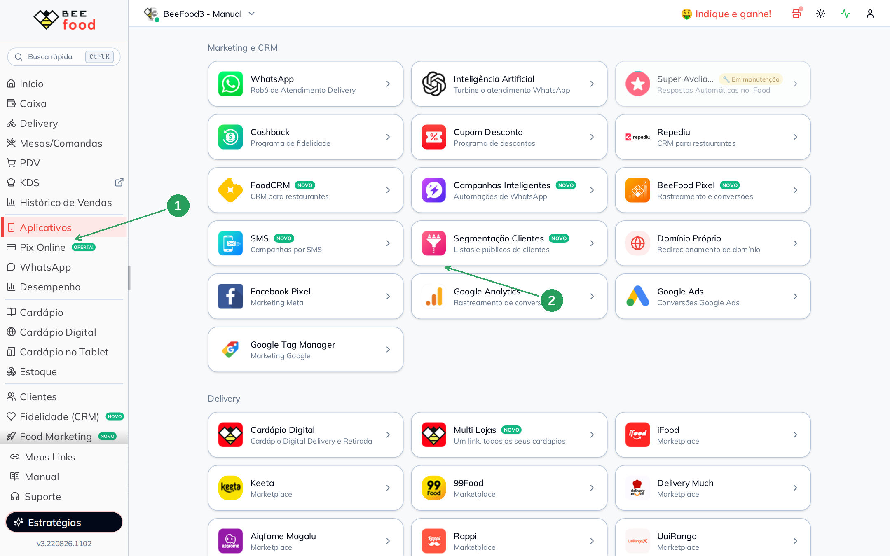
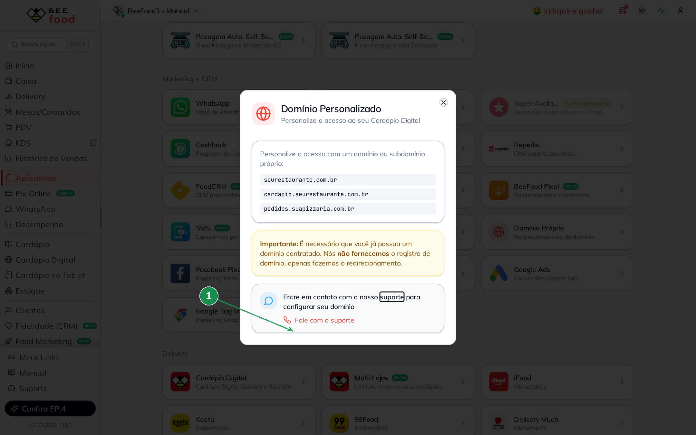
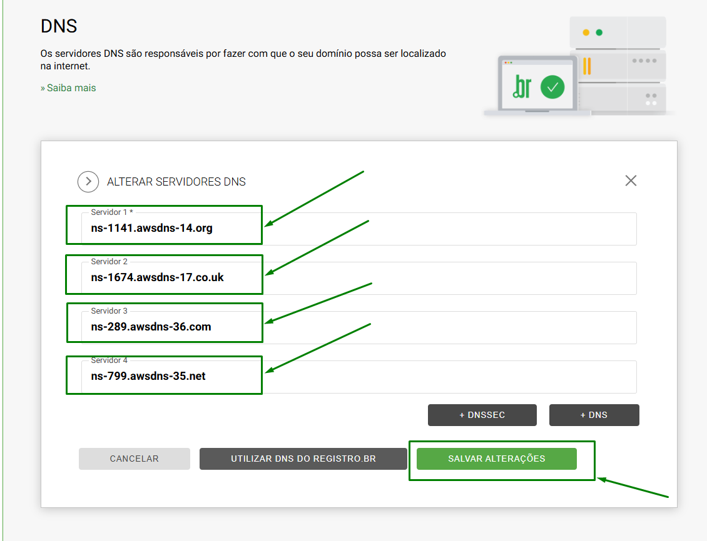
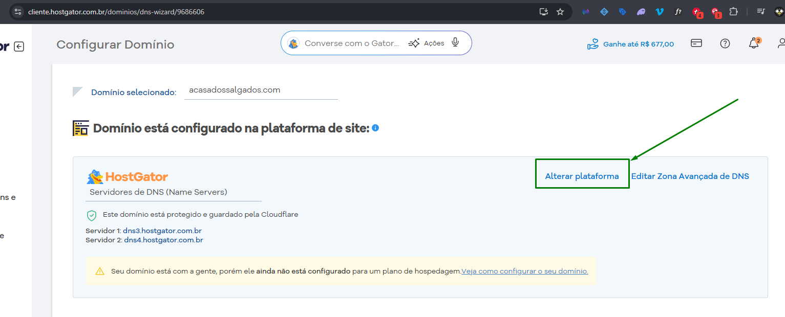
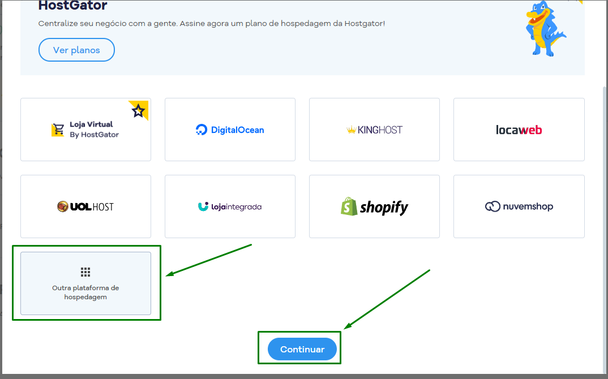
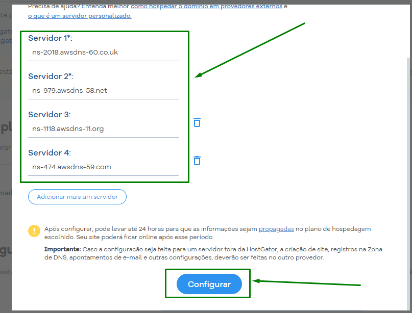

# Domínio próprio no Cardápio Digital (e verificação na Meta)

Aponte um domínio seu — por exemplo `www.seurestaurante.com.br` — para o cardápio digital
BeeFood. O cliente abre o cardápio pelo **seu** endereço, não pelo link padrão.

No BeeFood **não existe campo para colar DNS**. Você configura os servidores no registrador
(Registro.br, HostGator etc.) com os dados que o **suporte BeeFood** envia.

Com o domínio verificado na Meta, os anúncios podem ir direto para o seu endereço e
passam mais confiança.

---

## Antes de começar

1. Ter um **domínio já contratado** (GoDaddy, Registro.br, HostGator ou outro).
   O BeeFood **não registra** domínio — só faz o redirecionamento.
2. Acesso à **zona DNS** do provedor.
3. Conta BeeFood para abrir o pedido de suporte.

---

## Parte 1 — Pedir os DNS ao BeeFood

### Passo 1. Abrir Aplicativos → Domínio Próprio

No BeeFood, clique em **Aplicativos** (1). Em **Marketing e CRM**, abra **Domínio Próprio** (2).

### Passo 2. Falar com o suporte

O modal **Domínio Personalizado** mostra exemplos de domínio e avisa que o registro é seu.
Clique em **Fale com o suporte** (1) (ou no link **suporte**) para o time gerar os
**4 servidores de DNS** que você vai colar no provedor.

Informe o domínio contratado (ex.: `seurestaurante.com.br`). Aguarde o time devolver os
quatro servidores.

---

## Parte 2 — Colar os DNS no provedor

Use os 4 servidores que o suporte enviou. Os prints abaixo são **exemplos** de onde colar
— os nomes dos servidores são os que o BeeFood mandar para a **sua** loja.

### Registro.br

No painel do Registro.br, abra a zona DNS do domínio e preencha os servidores como no exemplo:

### HostGator

No DNS, clique em **Alterar plataforma**:

Depois clique em **Outra Plataforma de Hospedagem → Continuar**.

Preencha os DNS e clique em **Configurar**.

### Propagação

Depois que o time inserir as informações do lado BeeFood **e** você gravar os DNS no
provedor, a configuração pode levar **até 24 horas** para funcionar.

---

## Parte 3 — Verificar o domínio na Meta (Facebook)

Com o domínio próprio verificado, os anúncios podem apontar direto para o seu endereço.

1. Nas **configurações de negócio** da Meta, clique no ícone de **engrenagem**, depois em
   **ADEQUAÇÃO E SEGURANÇA** e em **DOMÍNIOS**.
2. Escolha a terceira opção: **Atualize o registro TXT do DNS com seu registrador de domínio**
   e **copie o TXT** gerado.
3. Envie esse TXT ao **suporte BeeFood** (pelo mesmo canal do Passo 2). O time publica o
   registro no DNS do cardápio.
4. Quando o suporte confirmar, volte na Meta e clique em **VERIFICAR DOMÍNIO**.

---

## Problemas comuns

| Sintoma | O que verificar |
|---------|-----------------|
| O domínio ainda abre a página antiga | Propagação DNS: espere até 24 h e limpe o cache do navegador |
| Não sei quais 4 servidores usar | Só o suporte BeeFood gera os seus. Não copie de outra loja |
| A Meta não verifica o TXT | Confirme com o suporte se o registro TXT já foi publicado |

---

## Precisa de ajuda?

Use **Fale com o suporte** no próprio modal, informando o domínio e, se for o caso, o
valor TXT da Meta.

---

*Última atualização: agosto/2026 — BeeFood · Domínio próprio*
