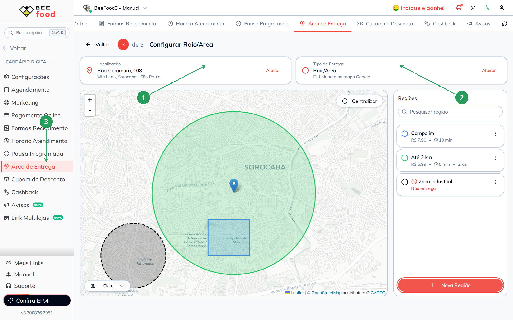
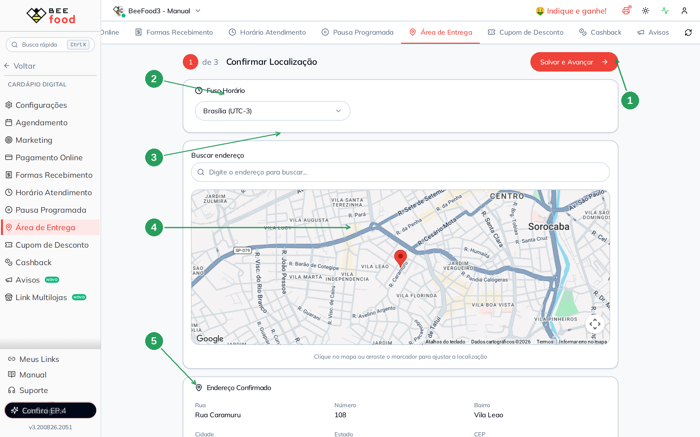
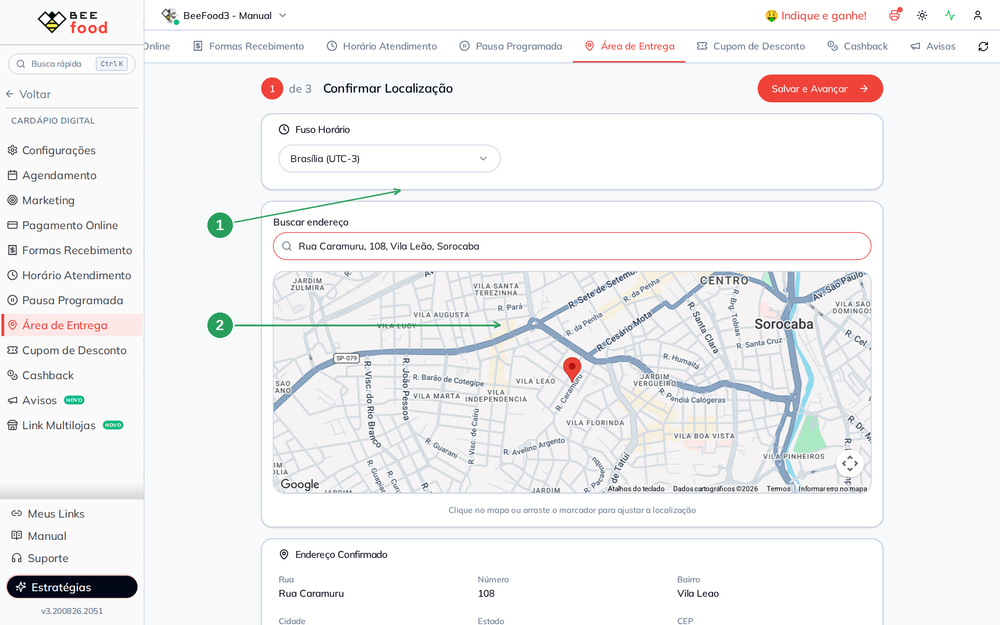
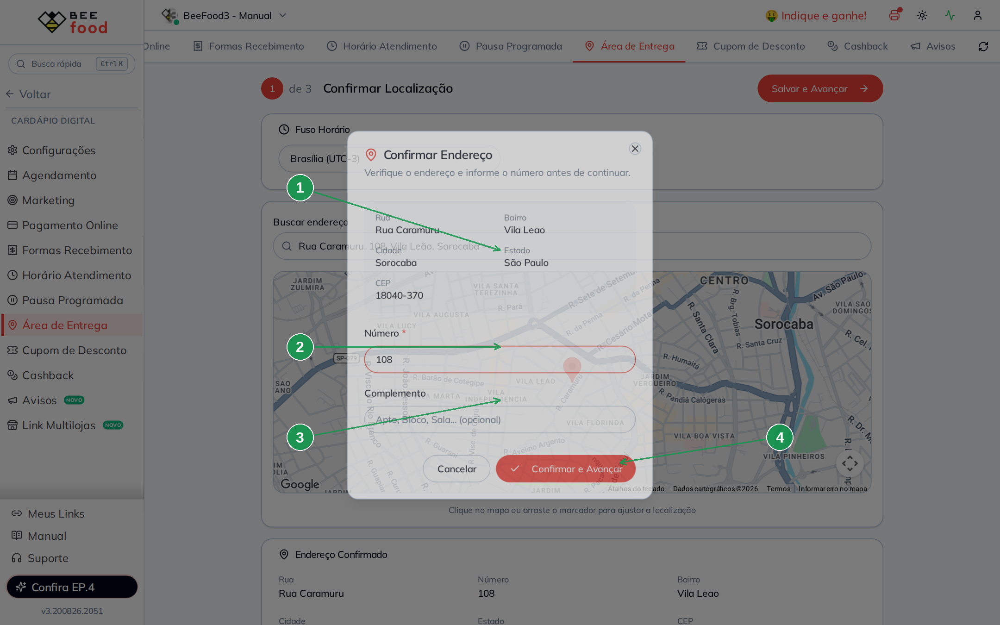
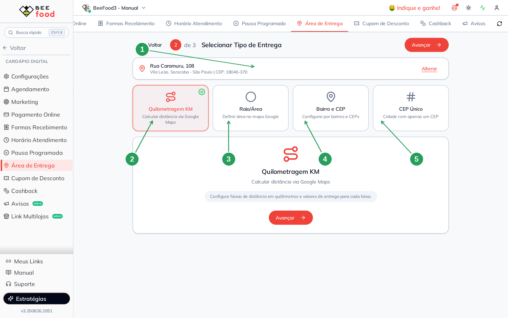

# Manual do Endereço do Restaurante

Este manual ensina a **marcar no mapa o endereço da sua loja**. É o ponto de partida da Área
de Entrega: sem ele, o sistema não sabe de onde calcular distância, desenhar o raio ou
comparar o bairro do cliente.

> Os quatro jeitos de cobrar o frete — **mapa**, **KM**, **bairro** e **CEP Fixo** — estão em
> manuais separados. Cada um começa daqui. Faça este passo **uma vez** e só volte se a loja
> mudar de endereço.

> As imagens têm **setas numeradas** (1, 2, 3…). Cada número indica o campo ou botão
> correspondente na tela.

---

## Duas coisas para saber antes de começar

**1. O endereço é da loja, não do cliente.** Aqui você marca onde a cozinha fica. O endereço
de quem pede aparece depois, no cardápio digital, na hora de calcular o frete.

**2. Só um tipo de entrega fica ativo.** Depois do endereço, o assistente pede para escolher
entre Quilometragem KM, Raio/Área, Bairro e CEP ou CEP Único. Trocar o tipo **não apaga** as
configurações dos outros — só muda qual regra o cardápio usa.

---

## Onde fica

No menu lateral: **Cardápio Digital → Área de Entrega**.

Se a loja já tem endereço e tipo escolhidos, a tela abre direto no **passo 3** — o da
configuração. O endereço aparece no cartão **Localização**, no topo.



| Nº | Item | Para que serve |
|----|------|----------------|
| 1 | **Localização** | O endereço da loja. **Alterar** volta ao mapa (passo 1). |
| 2 | **Tipo de Entrega** | Qual regra está valendo agora. **Alterar** volta aos quatro cards (passo 2). |
| 3 | **Área de Entrega** | A aba no menu. É sempre por aqui. |

No exemplo, a loja está em **R. Caramuru, 108 — Vila Leão, Sorocaba – SP, 18040-370**.

---

## Parte 1 — Confirmar a localização

Clique em **Alterar** no cartão Localização (ou, se for a primeira vez, a tela já abre neste
passo). O título fica **1 de 3 Confirmar Localização**.



| Nº | Item | O que fazer |
|----|------|-------------|
| 1 | **Salvar e Avançar** | Grava o endereço e segue para o tipo de entrega. |
| 2 | **Fuso Horário** | O relógio da loja. No Brasil continental use **Brasília (UTC-3)**. |
| 3 | **Buscar endereço** | Digite rua, número e cidade. Escolha a sugestão da lista. |
| 4 | **Mapa** | Clique ou **arraste o marcador** para acertar o ponto. O número da rua precisa bater com o pin. |
| 5 | **Endereço Confirmado** | Rua, número, bairro, cidade, estado e CEP que o mapa devolveu. Confira antes de avançar. |

O texto embaixo do mapa avisa: *"Clique no mapa ou arraste o marcador para ajustar a
localização"*. Vale seguir — um pin na quadra errada faz o KM e o raio calcularem a partir do
lugar errado.

Digite o endereço completo no campo de busca, no formato rua + número + bairro + cidade.
No exemplo:

**Rua Caramuru, 108, Vila Leão, Sorocaba**



| Nº | Item | O que fazer |
|----|------|-------------|
| 1 | **Buscar endereço** | Digite e espere as sugestões. Escolha a linha certa. |
| 2 | **Pin no mapa** | Tem que cair na porta da loja, não na quadra ao lado. |

---

## Parte 2 — O número é obrigatório

Ao escolher um endereço na busca (ou ao avançar sem número), o sistema abre o modal
**Confirmar Endereço**:



| Nº | Campo | O que fazer |
|----|-------|-------------|
| 1 | **Endereço detectado** | Rua, bairro, cidade, estado e CEP. Confira se é a loja certa. |
| 2 | **Número** | Obrigatório. Sem ele o botão de avançar não segue. No exemplo, **108**. |
| 3 | **Complemento** | Opcional — apto, bloco, sala. |
| 4 | **Confirmar e Avançar** | Fecha o modal e grava. |

O aviso do modal é direto: *"Verifique o endereço e informe o número antes de continuar."*

---

## Parte 3 — Escolher o tipo de entrega

Com o endereço gravado, o assistente vai para **2 de 3 Selecionar Tipo de Entrega**. O
endereço fica no cartão do topo, com **Alterar** se precisar voltar.



| Nº | Item | Quando usar |
|----|------|-------------|
| 1 | **Endereço da loja** | Confira. Se estiver errado, **Alterar** volta ao mapa. |
| 2 | **Quilometragem KM** | Frete por distância (até 3 km, até 6 km…). Manual **Configuração por KM**. |
| 3 | **Raio/Área** | Desenha círculos ou polígonos no mapa. Manual **Configuração por mapa**. |
| 4 | **Bairro e CEP** | Lista de bairros ou CEPs com um valor cada. Manual **Configuração por bairro**. |
| 5 | **CEP Único** | Cidade com um CEP só. Manual **Configuração por CEP Fixo**. |

O card marcado ganha borda vermelha e um visto verde. Embaixo, um texto explica o tipo
escolhido. Clique em **Avançar** para ir ao passo 3 daquele tipo.

---

## O que o cliente vê

O endereço da loja **não aparece** como taxa. Ele só serve de origem. Quem pede informa o
próprio endereço no cardápio digital (CEP + número). Aí o sistema aplica a regra do tipo
ativo — mapa, KM, bairro ou CEP Fixo.

A mudança leva **1 a 2 minutos** para chegar ao cardápio. Se o cliente ainda vir o frete
antigo, espere e peça para **Trocar** o endereço e confirmar de novo.

Para testar no cardápio, use um endereço de cliente — não o da loja. Neste bloco de manuais
o teste é sempre **R. Arthur Gomes, 13 — Centro, Sorocaba – SP, 18035-490**.

---

## Resumo do caminho

```
1. Cardápio Digital → Área de Entrega
2. Alterar em Localização (ou comece no passo 1, se for a primeira vez)
3. Digite rua, número, bairro e cidade → escolha a sugestão → acerte o pin
4. Confira o número no modal → Confirmar e Avançar
5. Escolha um dos quatro tipos e avance para configurá-lo
```

---

## Perguntas frequentes

**Mudei o endereço e o frete continua igual.**
O cardápio digital demora 1 a 2 minutos para atualizar. Peça para o cliente (ou o teste)
trocar o endereço e confirmar de novo — só recarregar a página às vezes não basta.

**Posso ter KM e mapa ao mesmo tempo?**
Não. Só um tipo fica ativo. As faixas de KM e as áreas do mapa continuam salvas; basta
voltar ao passo 2 e trocar o card.

**O fuso horário muda o frete?**
Não. Ele só alinha o relógio da loja (horário de atendimento, pausas). Não entra no cálculo
da taxa.

**Tenho duas lojas.**
O endereço é **por cardápio**. Troque no seletor do topo e marque o ponto de cada uma.

**O mapa não acha minha rua.**
Digite cidade e estado junto. Se a sugestão não aparecer, clique no mapa perto do ponto e
preencha o número no modal.

---

## Manuais relacionados

| Manual | O que traz |
|--------|------------|
| **Configuração por mapa** | Desenhar círculos e polígonos, taxa por região, não entrega |
| **Configuração por KM** | Faixas de distância e valor de cada uma |
| **Configuração por bairro** | Grupos de bairro, CEP e faixa de CEP |
| **Configuração por CEP Fixo** | Um CEP e um valor, para cidade pequena |
| **Horário de atendimento** | Que horas a loja abre e fecha no cardápio |
