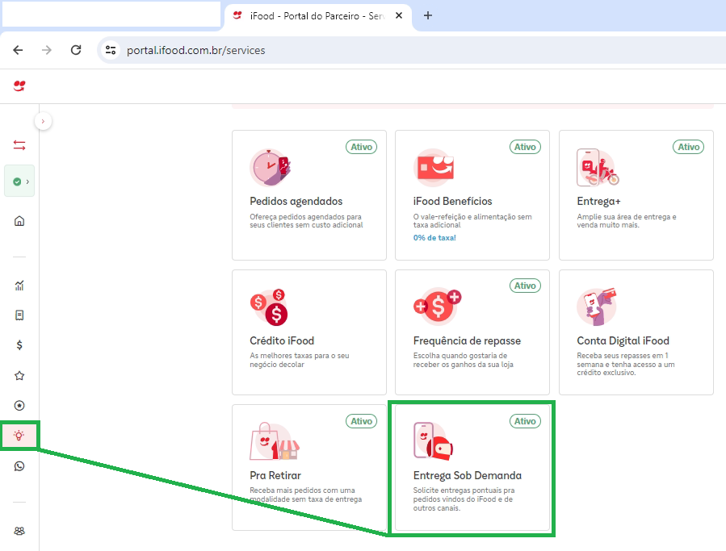
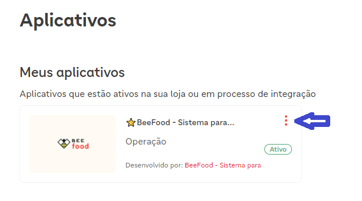
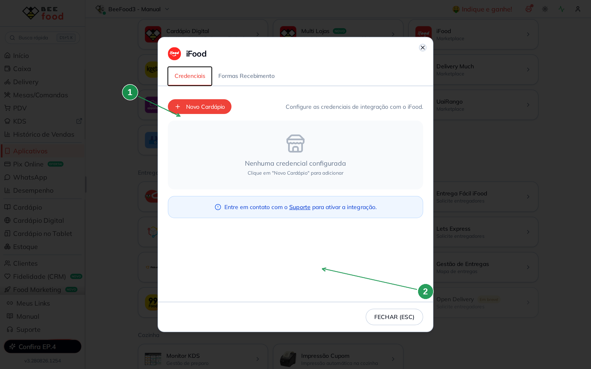
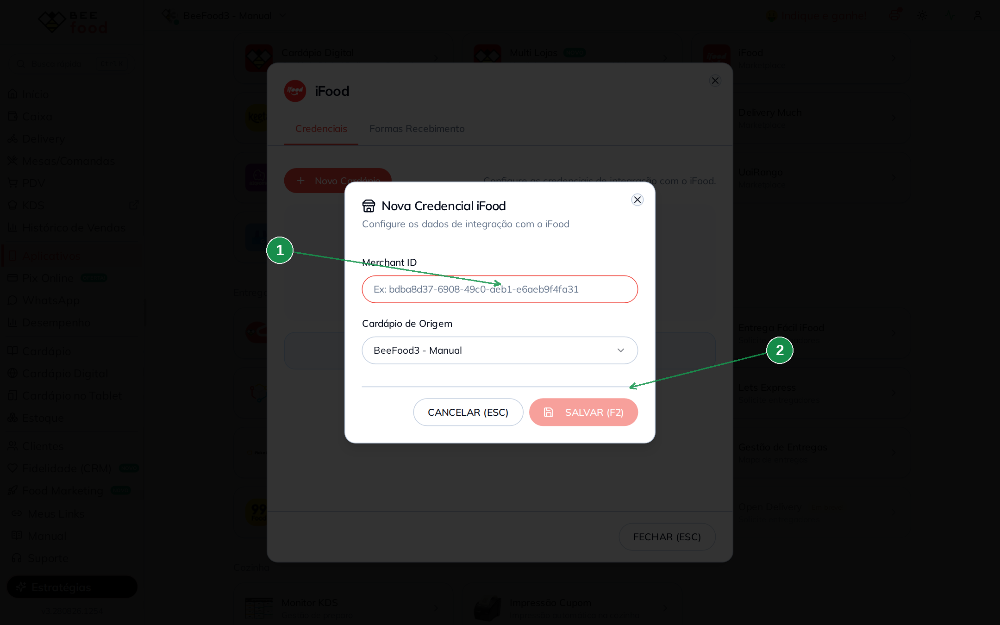
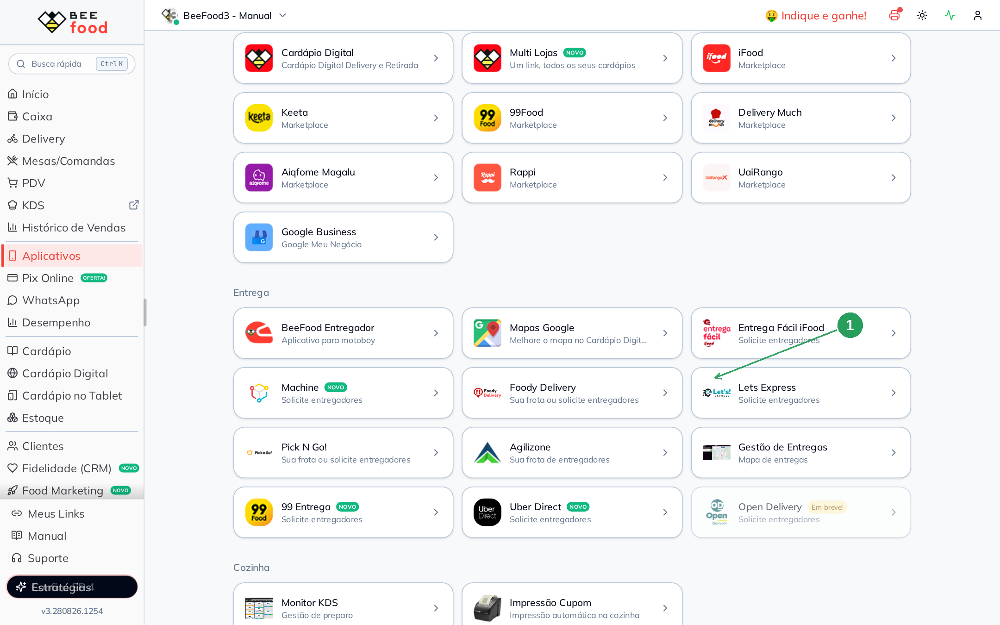
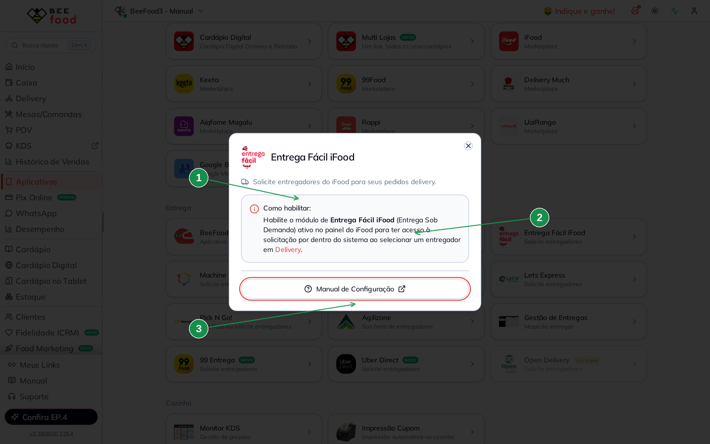
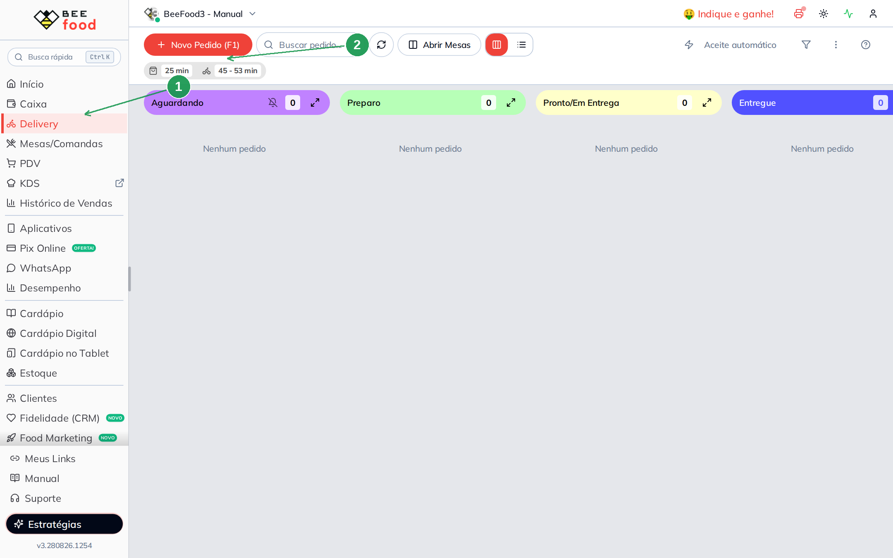
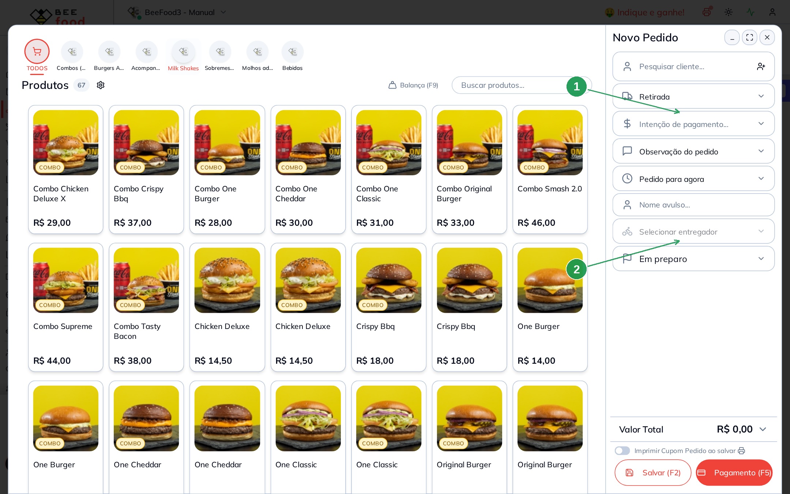
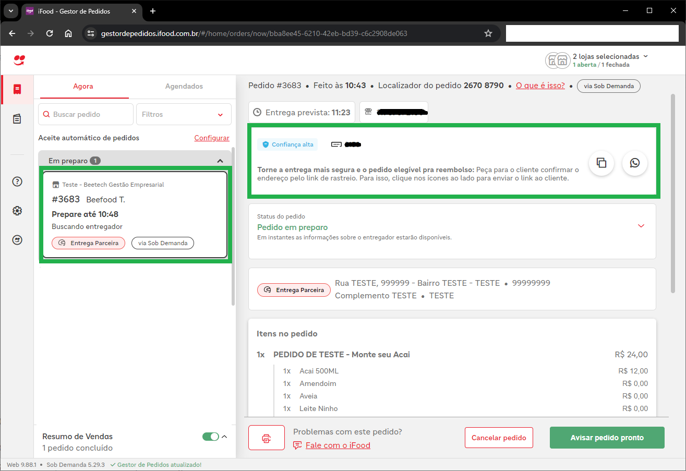
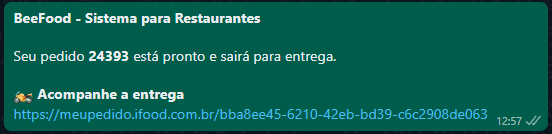

# Entrega Fácil iFood — solicitar entregador no Delivery

Com a **Entrega Fácil iFood** (Entrega Sob Demanda) o BeeFood cotiza, solicita e
acompanha um entregador do iFood para pedido **delivery** — do próprio iFood ou
de outro canal (cardápio, pedido manual).

Você consegue:

- Cotar disponibilidade, tempo e valor do frete
- Solicitar o entregador
- Acompanhar no Gestor do iFood e pelo WhatsApp (BeeBot)
- Pedir o cancelamento, quando o iFood permitir

> As imagens do **BeeFood web** têm **marcações em verde** (setas e números).
> As telas do **portal e do Gestor do iFood** e a mensagem de WhatsApp vêm do
> artigo original.

No BeeFood web **não existe** o botão vermelho *Solicitar Entrega Fácil iFood*
do Windows. O caminho novo é: **Delivery → selecionar o entregador → iFood
Entrega Fácil**.

---

## Antes de começar

1. Integração **iFood** ligada no BeeFood (**Aplicativos → iFood**).
2. Aplicativo **BeeFood** **Ativo** no Portal de Aplicativos do iFood.
3. Módulo **Entrega Fácil iFood** (**Entrega Sob Demanda**) ativo no painel do iFood.
4. Chave do **Google Maps** no BeeFood (Aplicativos → Mapas Google) — o endereço
   precisa ter coordenadas. O passo a passo da chave está no manual de
   **Mapas Google**.
5. Um pedido **Delivery com endereço** (CEP, rua, número e bairro). Sem endereço
   o botão de cotação não aparece / a cotação pede para completar o cadastro.

A Entrega Fácil atende **um pedido por vez**.

---

## Parte 1 — Liberar no iFood

### Passo 1. Ativar Entrega Sob Demanda

No [Portal do Parceiro iFood](https://portal.ifood.com.br/services), abra
**Serviços** (ícone de lâmpada) e deixe **Entrega Sob Demanda** como **Ativo**.

Sem esse módulo, o BeeFood não consegue cotar nem chamar o entregador.

### Passo 2. Confirmar o aplicativo BeeFood ativo

No Portal de Aplicativos do iFood, o card **BeeFood** precisa estar **Ativo**.

Se estiver pendente, fale com o **suporte BeeFood**.

---

## Parte 2 — Conectar o iFood no BeeFood

### Passo 3. Abrir as credenciais

No BeeFood, abra **Aplicativos**. No bloco de marketplaces, clique em **iFood**.
Na aba **Credenciais**, clique em **Novo Cardápio** (1). Se a loja ainda não
tiver integração, o próprio modal pede para falar com o **Suporte** (2).

| Nº | O que fazer |
|----|-------------|
| 1 | **+ Novo Cardápio** — cadastra o Merchant ID da loja. |
| 2 | Link **Suporte** — use se a conexão ainda não foi liberada. |

### Passo 4. Colar o Merchant ID

No modal **Nova Credencial iFood**, cole o **Merchant ID** (1) (o código da loja
no iFood) e clique em **SALVAR (F2)** (2).

| Nº | O que fazer |
|----|-------------|
| 1 | **Merchant ID** \* — cole o identificador da loja no iFood. |
| 2 | **SALVAR (F2)**. A conexão pode levar até **1 hora**. |

A loja precisa aparecer como **Ativo**. Sem isso a Entrega Fácil fica
*Não configurado* na lista de entregadores.

---

## Parte 3 — O card Entrega Fácil iFood

### Passo 5. Abrir Aplicativos → Entrega

Ainda em **Aplicativos**, role até a seção **Entrega** e clique em
**Entrega Fácil iFood** (1).

| Nº | O que fazer |
|----|-------------|
| 1 | Card **Entrega Fácil iFood** — *Solicite entregadores*. |

Este card **não grava credencial**. Ele só lembra como habilitar e aponta o
manual.

### Passo 6. Ler como habilitar

O modal explica: ative **Entrega Fácil iFood (Entrega Sob Demanda)** no painel
do iFood (1). Depois a solicitação aparece ao escolher o entregador em
**Delivery** (2). O botão **Manual de Configuração** (3) abre este artigo.

| Nº | O que fazer |
|----|-------------|
| 1 | Texto **Como habilitar** — módulo Entrega Sob Demanda no iFood. |
| 2 | Atalho **Delivery** — fecha o modal e vai para a tela de pedidos. |
| 3 | **Manual de Configuração** — este passo a passo. |

---

## Parte 4 — Solicitar o entregador

### Passo 7. Abrir o Delivery

No menu, clique em **Delivery** (1). Use um pedido que já esteja no quadro ou
crie um com **+ Novo Pedido (F1)** (2). O pedido precisa ser **entrega** (não
retirada) e ter endereço completo.

| Nº | O que fazer |
|----|-------------|
| 1 | Menu **Delivery**. |
| 2 | **+ Novo Pedido (F1)** — pedido manual. |

### Passo 8. Trocar para Entrega e escolher o entregador

No **Novo Pedido**, mude **Retirada** para **Entrega** (1). Depois clique em
**Selecionar entregador** (2). Num pedido já lançado, o mesmo modal abre pelo
ícone de moto no card ou em **Alterar Entregador** nos detalhes.

| Nº | O que fazer |
|----|-------------|
| 1 | Tipo **Entrega** (não deixe em *Retirada*). |
| 2 | **Selecionar entregador** — abre a lista com **Entrega Terceirizada**. |

Em **Entrega Terceirizada**, clique em **iFood Entrega Fácil**. Se aparecer
*Não configurado*, volte aos Passos 1 a 4. Se aparecer *Selecione apenas uma
venda*, desmarque os outros pedidos.

### Passo 9. Conferir a cotação

O BeeFood busca a cotação sozinho. A tela **Cotação de Entrega** mostra:

- **Previsão de entrega**
- **Distância**
- **Desconto** e **Acréscimo**, se o iFood enviar
- **Frete** (valor líquido)

Se o endereço estiver incompleto (faltando CEP, rua, número ou bairro), o
próprio modal pede para completar e gravar com **SALVAR E BUSCAR COTAÇÃO (F2)**.

- Pedido **do iFood**: clique em **CONFIRMAR**. O iFood já tem o pagamento —
  não pede forma de recebimento.
- Pedido **manual** ou de outro canal: clique em **CONTINUAR**.

### Passo 10. Pedido que não é do iFood — forma de pagamento

Na tela **Dados de Pagamento** escolha:

- **Pedido pago** — o cliente já pagou o restaurante; o iFood não cobra nada
  na porta.
- **Pagamento na entrega** — o iFood cobra o cliente (crédito, débito ou PIX,
  conforme o que o iFood liberar na cotação) e depois repassa ao restaurante.
  Essa opção **nem sempre** aparece.

Depois clique em **CONFIRMAR**.

Ao solicitar uma entrega de pedido manual, o iFood cria um **pedido espelho**
no Gestor. Dá para ver lá o pedido e a corrida.

### Passo 11. Entrega confirmada

Se der certo, o BeeFood mostra **Entrega confirmada!** e vincula o pedido ao
entregador **Entrega Fácil iFood**. O motorista é avisado em seguida.

---

## Parte 5 — Acompanhar e cancelar

### Acompanhar no Gestor do iFood

O pedido (ou o espelho, no caso manual) aparece no
[Gestor de Pedidos](https://gestordepedidos.ifood.com.br/) como **via Sob
Demanda**, com status do tipo *Buscando entregador*.

Use o Gestor para ver o entregador, o rastreio e as opções extras de
cancelamento.

### WhatsApp — link automático

Com o **BeeBot** conectado, quando o pedido sai para entrega o cliente recebe
o recado de *pronto* **mais** o link *Acompanhe a entrega*
(`meupedido.ifood.com.br/...`).

### Cancelar

Uma entrega **nem sempre** pode ser cancelada. No BeeFood web o cancelamento
da Entrega Fácil é feito pelo **Gestor do iFood** (não há lixeira dessa
integração na guia Entregador, diferente de 99 Entrega ou Uber Direct).

No BeeFood, o resultado da tentativa aparece no **Histórico de Alterações**
do pedido, por exemplo:

- Entrega Fácil iFood — Entrega Confirmada
- Entrega Fácil iFood — Cancelamento solicitado
- Entrega Fácil iFood — Cancelamento recusado

Se o iFood recusar, use o Gestor para ver o motivo e as alternativas.

---

## Problemas comuns

| Sintoma | O que verificar |
|---------|-----------------|
| Não aparece **iFood Entrega Fácil** | Módulo Entrega Sob Demanda ativo? BeeFood **Ativo** no portal? |
| Opção *Não configurado* | Credencial iFood **Ativa** em Aplicativos → iFood? |
| Cotação recusa o endereço | CEP, rua, número, bairro e **coordenadas** (Maps Google)? |
| Sem botão de cotação | O pedido é **Delivery com entrega** e tem endereço? |
| *Selecione apenas uma venda* | A Entrega Fácil aceita **um** pedido por vez. |
| Pagamento na entrega some | O iFood é quem libera crédito, débito ou PIX naquela cotação. |
| Cliente sem link no WhatsApp | BeeBot conectado? O recado sai quando o pedido **sai para entrega**. |
| Cancelamento recusado | Normal em alguns status; tente pelo Gestor do iFood. |

---

## Precisa de ajuda?

Fale com o **suporte BeeFood** informando: nome da loja, **CNPJ**, se o pedido
é do iFood ou manual, e um print do erro (se houver).

---

*Última atualização: agosto/2026 — BeeFood · Entrega Fácil iFood*
