# Quanto o entregador recebe: taxa, valor, diária e KM

Existem **dois valores** em cada entrega, e confundir os dois é o erro mais caro desta parte
do sistema:

| Valor | Quem paga | Onde ele vive |
|---|---|---|
| **Taxa de entrega** | o **cliente** paga para você | na área de atendimento, e aparece no pedido |
| **Valor do entregador** | **você** paga para quem entrega | na área de atendimento, no pedido, ou no cadastro do funcionário |

Este manual mostra os três lugares onde se configura o que o entregador recebe e, no fim, o
relatório que fecha a conta: **Entregador (Taxa / KM)**.

> A Gestão de Entregas está em liberação. Se um item não aparecer no seu menu, fale com o
> suporte.

## Para que serve

- Pagar o entregador por entrega, por quilômetro rodado, por diária — ou por uma combinação.
- Saber, no fim do dia ou da semana, quanto pagar a cada um.
- Conferir pedido por pedido, para quando o entregador discordar da conta.

## Antes de começar

- O funcionário precisa estar cadastrado com a função **Entregador**. Veja
  [Liberar o entregador](../gestao-entregas-liberar-entregador/gestao-entregas-liberar-entregador.md).
- O valor do entregador **não aparece para o cliente** em lugar nenhum: é informação interna.
- Nada disso é obrigatório. Se você combina o pagamento por fora, deixe os campos em zero — o
  relatório continua contando entregas e quilômetros.

---

## 1. O valor padrão: na área de atendimento

É o lugar onde o valor nasce. Cada faixa da sua área de entrega tem um valor de entregador
próprio, junto do frete do cliente.

Vá em **Cardápio Digital → Área de Entrega**. A linha de cada grupo já mostra os dois valores.

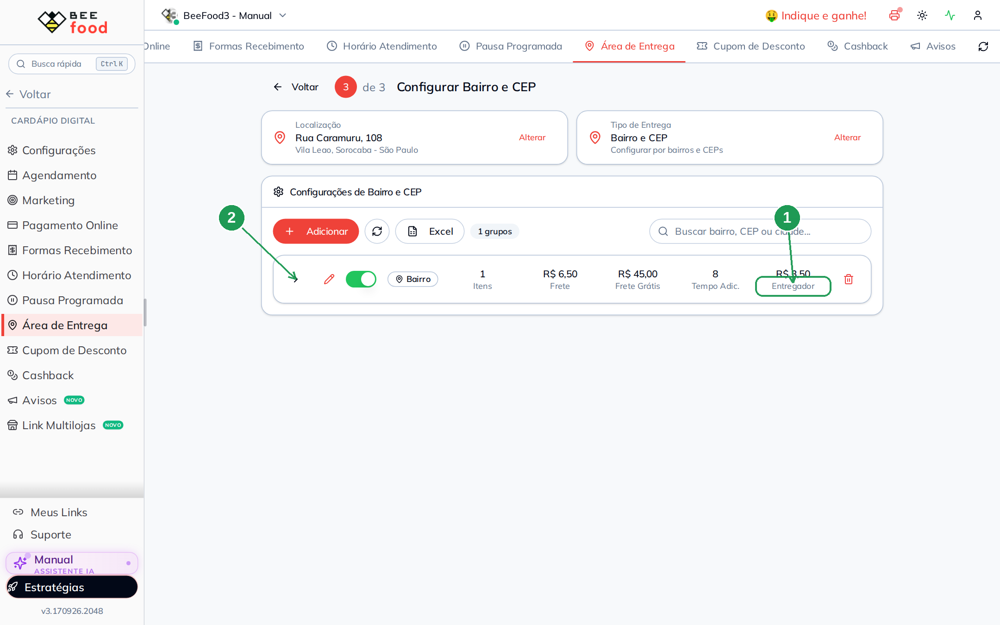

| Nº | Onde | O que é |
|----|------|---------|
| 1. | **Entregador** | O valor que você paga por entrega nesta faixa. Aqui, R$ 3,50. |
| 2. | **Lápis** | Abre a janela para editar os valores da faixa. |

Na janela, os quatro campos ficam lado a lado.

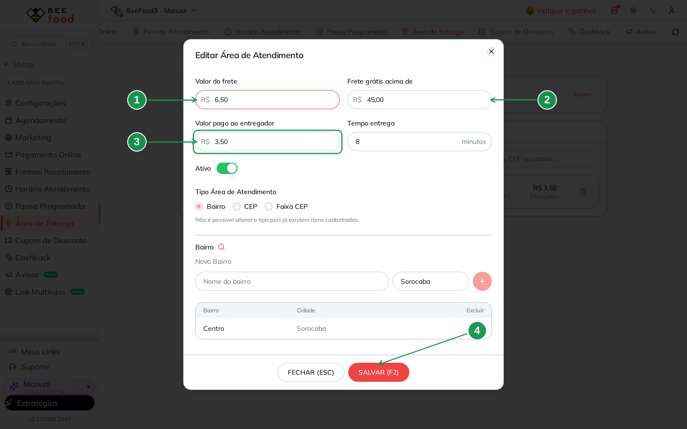

| Nº | Campo | Quem paga |
|----|-------|-----------|
| 1. | **Valor do frete** | O **cliente** paga. É a taxa que ele vê no cardápio. |
| 2. | **Frete grátis acima de** | Regra de isenção do cliente. `0` = não usa. |
| 3. | **Valor pago ao entregador** | **Você** paga. O cliente não vê. |
| 4. | **SALVAR (F2)** | Grava. Sem salvar, nada vale. |

> **O valor entra no pedido no momento em que o endereço é calculado.** Ou seja: ele vale para
> os pedidos **novos**. Mudar aqui hoje não muda o que já foi vendido ontem — e isso é bom, senão
> o histórico de pagamento mudaria sozinho.

A tela é a mesma nas três formas de área (bairro e CEP, quilometragem e mapa). Os manuais de
cada uma estão em *Onde continuar*.

---

## 2. O valor de uma entrega específica: no pedido

Às vezes uma entrega vale mais: chuva, prédio sem elevador, bairro difícil. Dá para mudar o
valor de um pedido só, sem tocar na configuração.

Abra o pedido no **Delivery** e olhe o bloco **Entregador**.

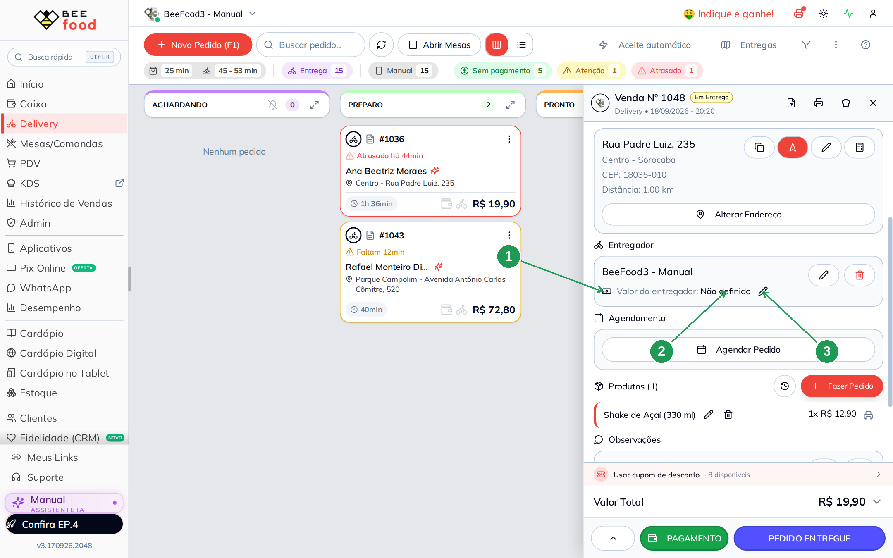

| Nº | Onde | O que lê |
|----|------|----------|
| 1. | **Bloco Entregador** | Quem está levando este pedido. |
| 2. | **Não definido** | Este pedido não tem valor de entregador. Acontece com pedido criado antes de a área ter valor configurado. |
| 3. | **Lápis** | Abre o campo para digitar. |

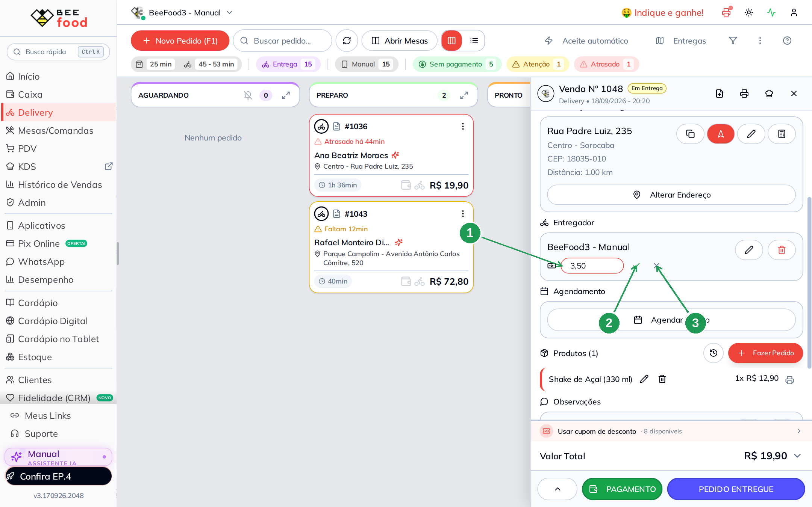

| Nº | Onde | O que faz |
|----|------|-----------|
| 1. | **Campo** | Digite só os números: `350` vira `3,50`. |
| 2. | **Visto verde** | Grava. |
| 3. | **X** | Cancela. |

O valor passa a aparecer no bloco e **entra no relatório na hora**.

> **É o valor do pedido que manda.** O relatório não recalcula pela área de atendimento: ele
> lê o que está gravado em cada pedido. Por isso este lápis existe — e por isso pedido antigo
> continua com *Não definido* até alguém preencher.

---

## 3. Diária e valor por KM: no cadastro do funcionário

O terceiro lugar é o cadastro de quem entrega, e serve para outro modelo de pagamento: por
quilômetro rodado, com ou sem uma diária fixa.

Vá em **Cadastros → Funcionários**, abra o entregador e clique na aba **Função**.

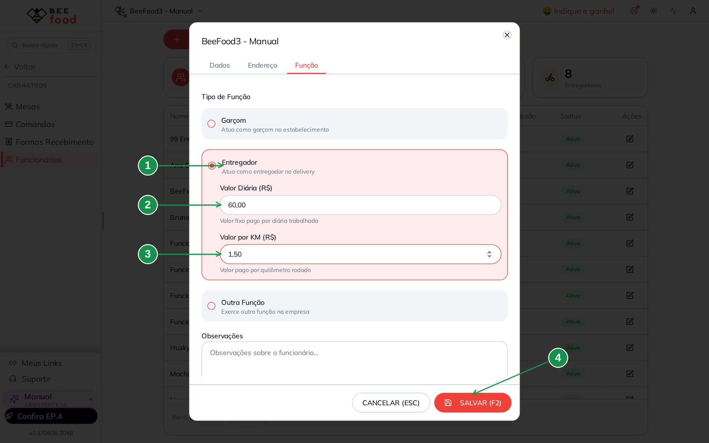

| Nº | Campo | O que é |
|----|-------|---------|
| 1. | **Entregador** | A função precisa estar marcada, senão os campos não aparecem. |
| 2. | **Valor Diária (R$)** | Valor fixo por dia trabalhado. Aqui, R$ 60,00. |
| 3. | **Valor por KM (R$)** | Valor por quilômetro rodado. Aqui, R$ 1,50. |
| 4. | **SALVAR (F2)** | Grava. |

> **Os dois campos não fazem nada sozinhos.** Eles não aparecem no app do entregador nem no
> painel: existem para o relatório da próxima seção calcular. Cada entregador pode ter valores
> diferentes.

A **diária é contada por dia em que ele entregou** — o relatório mostra quantas e o valor de
cada uma.

---

## 4. O relatório: Entregador (Taxa / KM)

Vá em **Desempenho → Delivery → Entregador (Taxa / KM)** e escolha o período (com **Hoje**
você fecha o dia; lembre de clicar em **Confirmar**).

O cabeçalho é a parte mais importante da tela, e a menos óbvia: é aqui que você escolhe **de
onde o relatório lê o valor**.

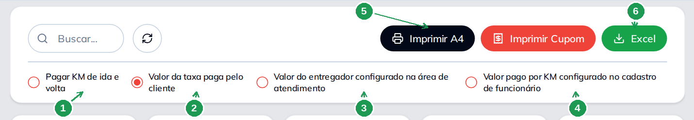

| Nº | Onde | O que faz |
|----|------|-----------|
| 1. | **Pagar KM de ida e volta** | Dobra a quilometragem: conta a volta para a loja. Vale só nos modos com KM. |
| 2. | **Valor da taxa paga pelo cliente** | Paga ao entregador **o mesmo** que o cliente pagou de frete. |
| 3. | **Valor do entregador configurado na área de atendimento** | Paga o valor do entregador gravado em cada pedido. |
| 4. | **Valor pago por KM configurado no cadastro de funcionário** | Paga quilômetro rodado × valor por KM do funcionário. |
| 5. | **Imprimir A4** e **Imprimir Cupom** | O fechamento impresso, um por entregador. |
| 6. | **Excel** | A mesma conta em planilha. |

Os cinco números do topo não mudam quando você troca o modo: eles mostram tudo o que existe no
período.

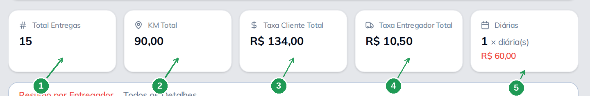

| Nº | Indicador | O que conta |
|----|-----------|-------------|
| 1. | **Total Entregas** | Pedidos de entrega no período, inclusive os que ninguém pegou. |
| 2. | **KM Total** | A soma das distâncias. |
| 3. | **Taxa Cliente Total** | O que os clientes pagaram de frete. |
| 4. | **Taxa Entregador Total** | O que está gravado nos pedidos como valor do entregador. |
| 5. | **Diárias** | Quantas diárias e quanto elas somam. |

### O que muda com o modo de cálculo

A tabela embaixo é a mesma; **a coluna de valor muda de nome e de conta**.

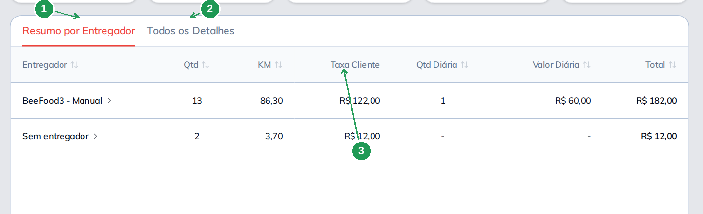

| Nº | Onde | O que lê |
|----|------|----------|
| 1. | **Resumo por Entregador** | Uma linha por pessoa, com o total dela. |
| 2. | **Todos os Detalhes** | Uma linha por entrega. Veja a seção 5. |
| 3. | **Taxa Cliente** | A coluna do primeiro modo: paga-se o frete do cliente. |

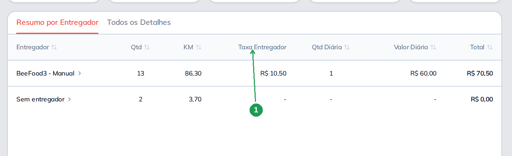

No modo da área de atendimento a coluna vira **Taxa Entregador** — e aqui fica visível uma
coisa importante: só os pedidos **com valor gravado** somam. No nosso dia, três pedidos de treze
tinham valor, e o total foi R$ 10,50.

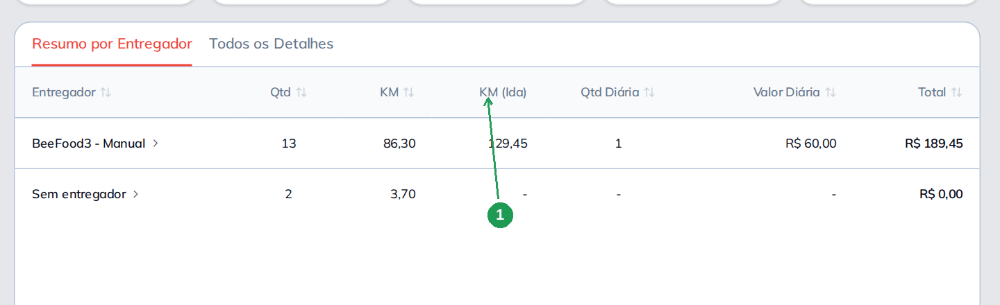

No modo do cadastro do funcionário a coluna vira **KM (Ida)** — e cuidado: o que está ali é
**dinheiro**, não distância. São 86,30 km × R$ 1,50 = R$ 129,45. A coluna **KM** ao lado é que
mostra a distância.

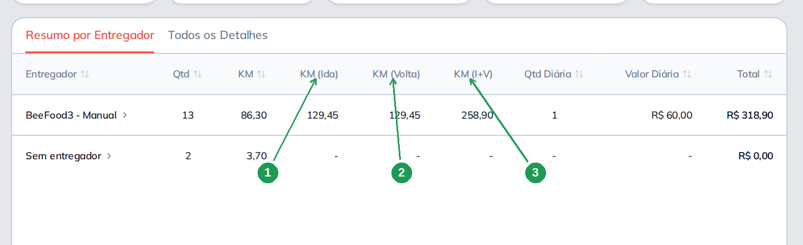

| Nº | Coluna | O que é |
|----|--------|---------|
| 1. | **KM (Ida)** | O valor da ida. |
| 2. | **KM (Volta)** | O mesmo valor, para o caminho de volta. |
| 3. | **KM (I+V)** | A soma — é este que entra no total. |

> **Em todos os modos a diária é somada por cima.** No exemplo: R$ 258,90 de quilometragem +
> R$ 60,00 de diária = R$ 318,90.

---

## 5. Conferir pedido por pedido

Quando o entregador discorda do total, a aba **Todos os Detalhes** resolve a conversa.

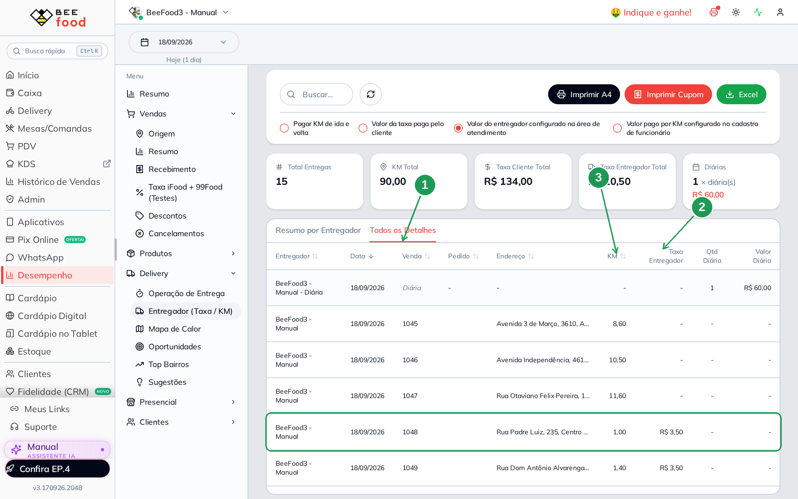

| Nº | Onde | O que tem |
|----|------|-----------|
| 1. | **Todos os Detalhes** | Uma linha por entrega, com data, número do pedido e endereço. |
| 2. | **Taxa Entregador** | O valor daquela entrega. Traço = pedido sem valor gravado. |
| 3. | **KM** | A distância daquela entrega. |

A **diária aparece como uma linha própria**, com o nome do entregador seguido de *Diária*. Ela
não é uma entrega; é o valor fixo do dia.

Clicando no nome do entregador no resumo, você abre a conta dele sozinha.

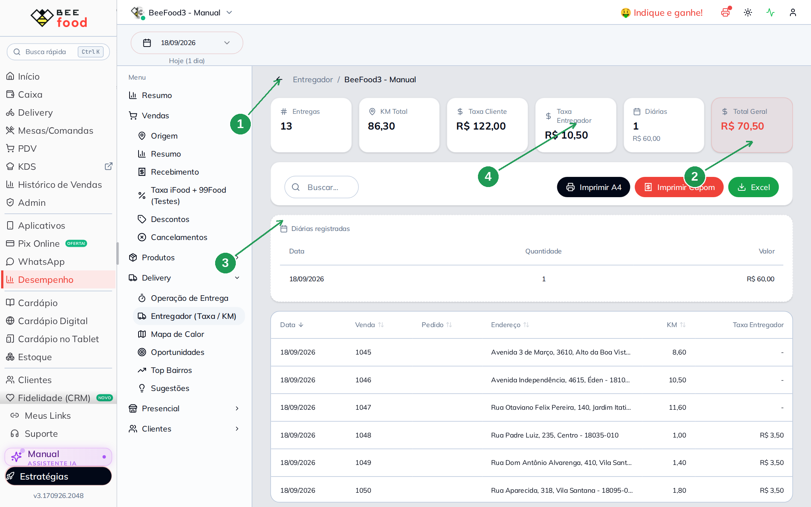

| Nº | Onde | O que é |
|----|------|---------|
| 1. | **Voltar** | Retorna ao resumo de todos. |
| 2. | **Total Geral** | O que pagar a esta pessoa no período, no modo escolhido. |
| 3. | **Diárias registradas** | As diárias dele, com data e valor. |
| 4. | **Taxa Entregador** | O cartão do modo escolhido — muda junto com o modo. |

Desta tela saem o **Imprimir Cupom** (para entregar na mão dele) e o **Excel**.

---

## Dicas

- **Escolha um modelo e fique nele.** Os três modos existem porque cada loja paga de um jeito;
  alternar entre eles no meio do mês faz a conta parecer errada.
- **Se o modo da área de atendimento mostrar pouco**, a causa quase sempre é pedido antigo sem
  valor gravado. Confira na aba de detalhes quais linhas estão com traço.
- **KM só existe com endereço calculado.** Pedido sem coordenada entra com distância vazia e
  não paga nada no modo de quilometragem.
- **A diária é por dia com entrega.** Entregador que não rodou no dia não gera diária.
- **Imprima o cupom do entregador no fechamento.** É o comprovante mais barato de acabar
  discussão: ele leva a lista dos pedidos dele.
- **Pedido sem entregador aparece como *Sem entregador*.** Se aparecer muito, alguém está
  entregando sem se identificar no painel — e essa entrega não entra na conta de ninguém.

---

## Onde continuar

| Manual | O que cobre |
|--------|-------------|
| [Liberar o entregador](../gestao-entregas-liberar-entregador/gestao-entregas-liberar-entregador.md) | Cadastro do funcionário, função *Entregador* e acesso ao app |
| [Relatório Operação de Entrega](../relatorio-operacao-entrega/relatorio-operacao-entrega.md) | Onde o tempo da entrega se perde |
| [Configuração por bairro e CEP](../area-entrega-bairro/area-entrega-bairro.md) | A área de atendimento por bairro, onde o valor do entregador nasce |
| [Configuração por KM](../area-entrega-km/area-entrega-km.md) | A área por distância, com os mesmos campos |
| [Fechar a entrega no painel](../gestao-entregas-fechar-entrega/gestao-entregas-fechar-entrega.md) | A baixa que faz a entrega entrar nesta conta |
