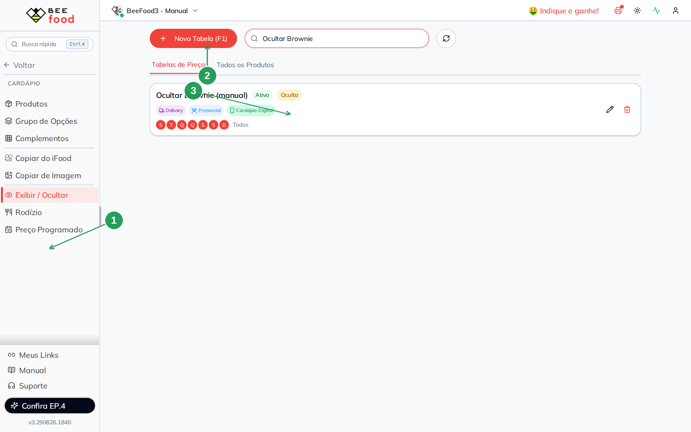
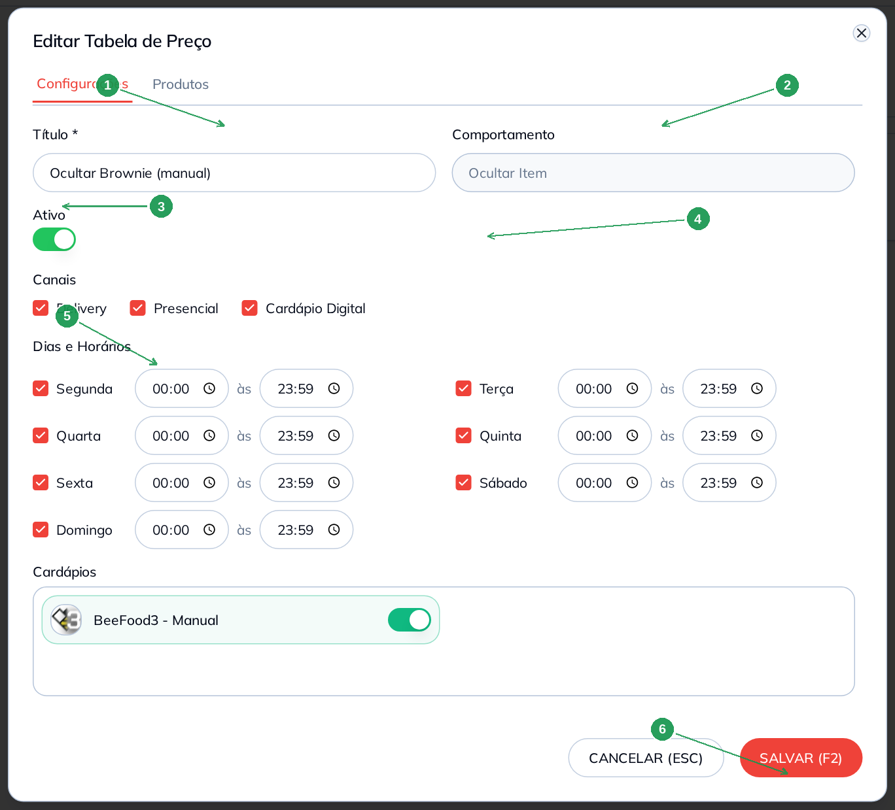
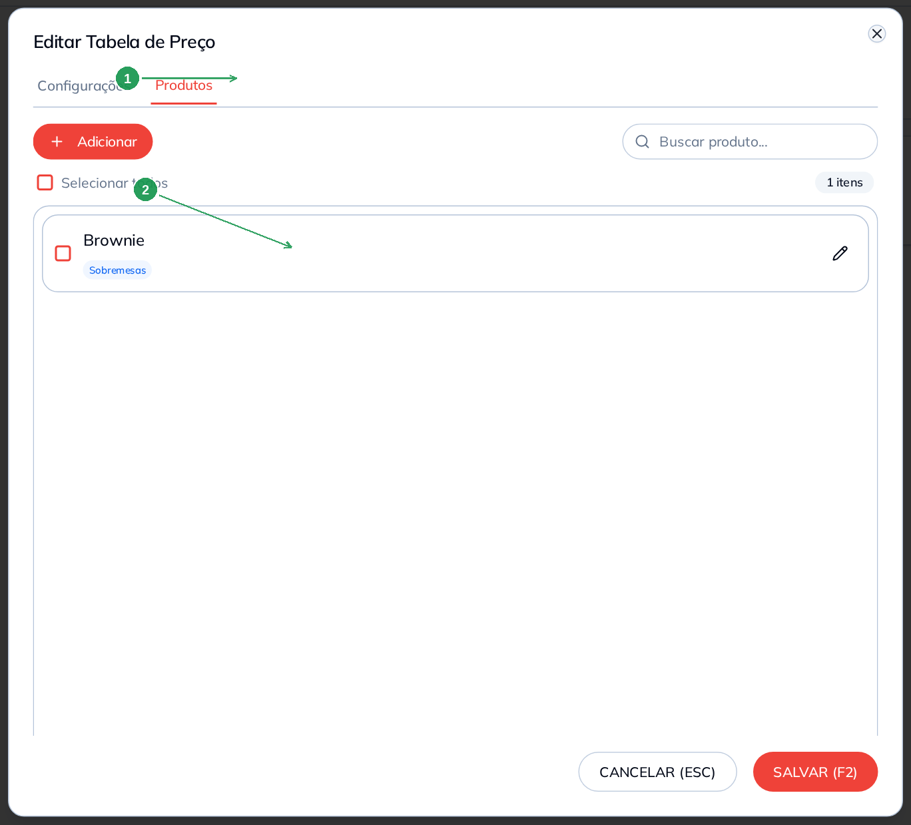
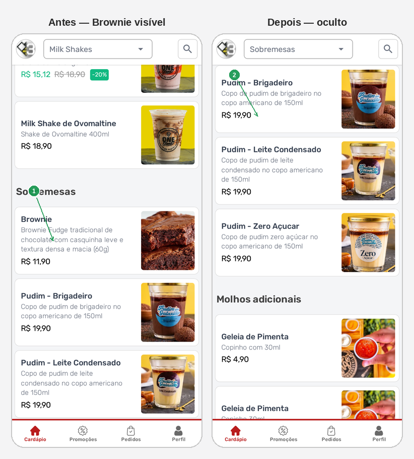

# Exibir e ocultar produtos

Use **Exibir / Ocultar** quando um item precisa **sumir** do cardápio em
certos dias, horários ou canais — sem apagar o cadastro.

O produto continua no estoque, no PDV e no cadastro. A tabela só
esconde. Neste manual: escondemos o **Brownie** no cardápio digital,
todos os dias.

> As imagens têm **setas com números** (1, 2, 3…). No texto, cada número
> indica o campo ou botão correspondente na tela. Campos com **\*** são
> obrigatórios.

---

## Antes de começar

1. Menu **Cardápio → Exibir / Ocultar**.
2. O produto já existe no cardápio (aqui: **Brownie**).
3. Marque **pelo menos um dia**. Tabela sem dia fica `0d` e **não vale**.
4. Para o cliente da loja online ver a mudança, ligue o canal
   **Cardápio Digital**. Sem esse canal, o menu público não muda.

Depois de gravar, o cardápio do cliente pode levar **até 5 minutos**.

Esta tela **só oculta**. Para mudar o preço por horário, use
**Preço Programado**. Rodízio é outra tela.

---

## Parte 1 — Onde fica

No menu: **Cardápio → Exibir / Ocultar** (1). O botão é **Nova Tabela
(F1)** (2) — não procure “Novo”. Cada tabela vira um card: título,
**Ativo**, badge **Oculta**, canais e os dias (3).

A busca (acima da lista) filtra pelo nome da tabela.

| Nº | Campo | O que faz |
|----|--------|-----------|
| 1. | **Exibir / Ocultar** | Abre esta tela |
| 2. | **Nova Tabela (F1)** | Cria uma tabela nova |
| 3. | Card **Ocultar Brownie** | Ativa, **Oculta**, 7 dias (**Todos**) |

O lápis abre a mesma tabela. A lixeira apaga — não tem volta.

Há uma segunda aba, **Todos os Produtos**: lista o que já entrou em
alguma tabela. Serve para achar o item; a configuração continua no
card (ou no lápis).

---

## Parte 2 — Configurar a tabela

Clique em **Nova Tabela (F1)** ou no lápis de uma tabela existente.

**Título \*** (1) — um nome que você reconheça. Exemplo:
`Ocultar Brownie`. Se deixar vazio e for para a aba Produtos, o
sistema completa sozinho (`Tabela dd/mm hh:mm`).

**Comportamento** (2) vem fixo: **Ocultar Item**. Não dá para mudar
nesta tela.

**Ativo** (3) ligado = a tabela vale agora. Desligado = o produto
volta a aparecer (depois do cache).

**Canais** (4): **Delivery**, **Presencial** e **Cardápio Digital**.
No exemplo os três estão ligados. Sem **Cardápio Digital**, a loja
online não esconde o item.

**Dias e Horários** (5): marque o dia. Horário vazio vira **00:00 às
23:59** (o dia inteiro). No exemplo: os **7 dias**, o dia todo.

Grave com **SALVAR (F2)** (6) ou vá para a aba **Produtos** — ao
trocar de aba numa tabela nova, a config **salva sozinha**.

| Nº | Campo | O que faz |
|----|--------|-----------|
| 1. | **Título \*** | Nome da tabela |
| 2. | **Comportamento** | Fixo: **Ocultar Item** |
| 3. | **Ativo** | Liga ou pausa a tabela |
| 4. | **Cardápio Digital** | Sem isto, o menu público não muda |
| 5. | **Dias e Horários** | Sem dia marcado a tabela não vale |
| 6. | **SALVAR (F2)** | Grava. Cancelar descarta o que ainda não salvou |

**Cardápios** (mais abaixo no modal) escolhe a filial. No sandbox há
uma só — deixe marcada.

---

## Parte 3 — Quais produtos somem

Aba **Produtos** (1). **Adicionar** abre a busca. Inclua o item — aqui,
o **Brownie** do setor Sobremesas (2).

Nesta tela **não existe desconto**. O produto na lista = ele some
quando a tabela estiver ativa.

| Nº | Campo | O que faz |
|----|--------|-----------|
| 1. | Aba **Produtos** | Itens que a tabela esconde |
| 2. | **Brownie** | Entra na lista = some do cardápio |

Pode marcar vários e usar **Excluir** para tirar da tabela (o cadastro
do produto continua). **SALVAR (F2)** fecha o modal.

---

## Parte 4 — O que o cliente vê

No cardápio (`menu.beefood.com.br/…`), o Brownie estava na
**Sobremesas** por **R$ 11,90** (1). Com a tabela **ativa**, a
sobremesa some da lista (2).

| Nº | O que o cliente vê |
|----|--------------------|
| 1. | **Antes** — Brownie na Sobremesas, **R$ 11,90** |
| 2. | **Depois** — a tabela ativa; o Brownie não aparece |

Pode levar **até 5 minutos**. Se não mudou, confira: tabela **Ativa**,
pelo menos **um dia** de hoje, canal **Cardápio Digital** ligado.

Para o item voltar, desligue **Ativo** (ou tire o produto da tabela) e
espere o cache de novo. Não precisa apagar o cadastro.

---

## Problemas comuns

| Sintoma | O que verificar |
|---------|-----------------|
| Cliente ainda vê o produto | Esperou **5 minutos**? Tabela **Ativa**? Canal **Cardápio Digital**? |
| Tabela no card com **0d** | Nenhum dia marcado — marque os dias e salve |
| Some no PDV e não na loja | Faltou o canal **Cardápio Digital** |
| “Não acho o botão Novo” | O botão é **Nova Tabela (F1)** |
| Queria só mudar o preço | Isso é **Preço Programado**, não esta tela |
| Queria rodízio | Outra tela: **Cardápio → Rodízio** |

---

## O que esta tela não é

- **Preço Programado:** altera o valor (happy hour). Não esconde.
- **Rodízio:** produto que libera o rodízio no presencial.
- Apagar produto do cadastro: isso é **Cardápio → Produtos**.

---

*Última atualização: agosto/2026 — BeeFood · Exibir / Ocultar*
