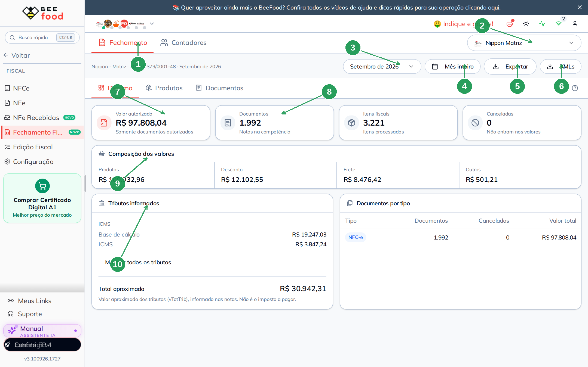
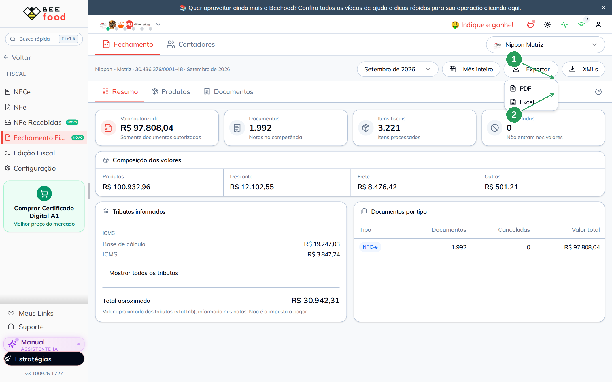
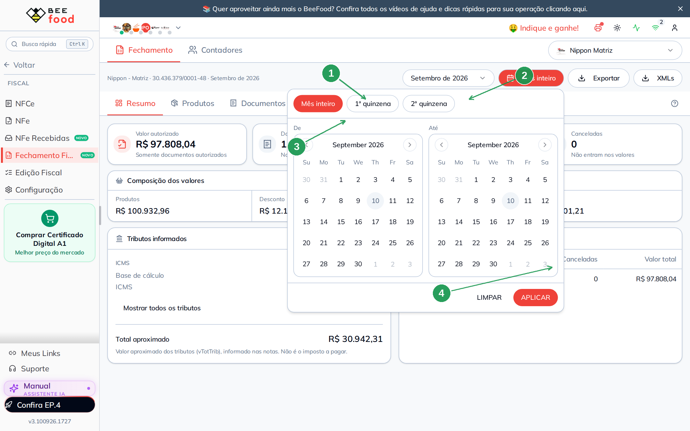
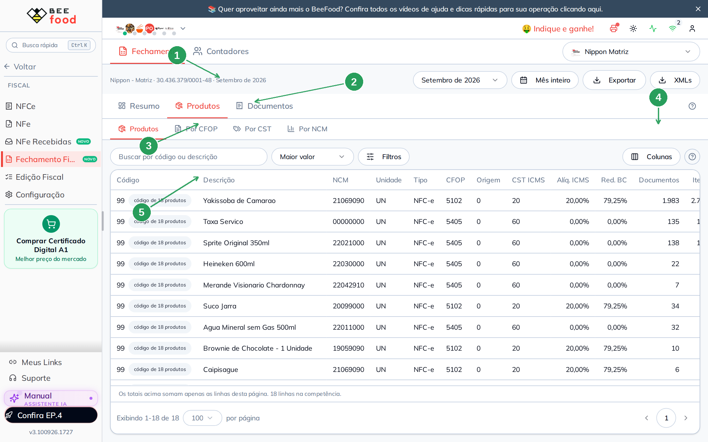
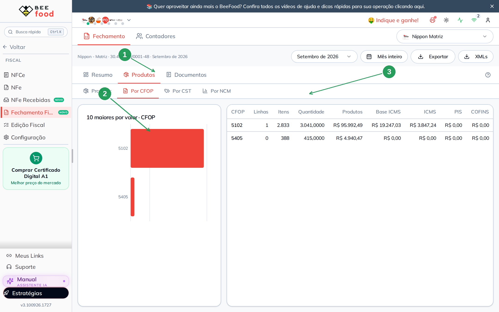
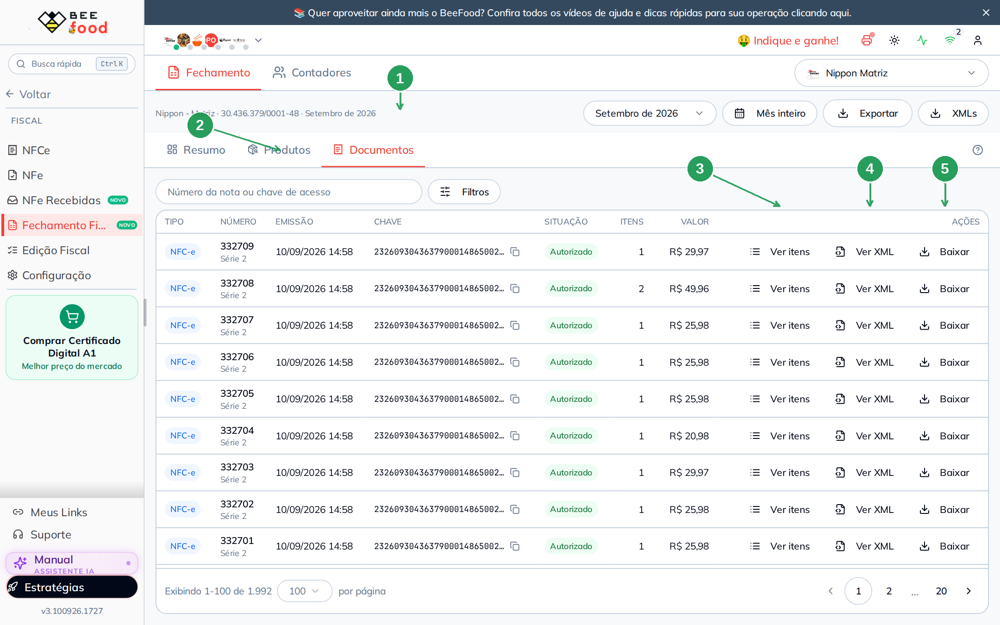
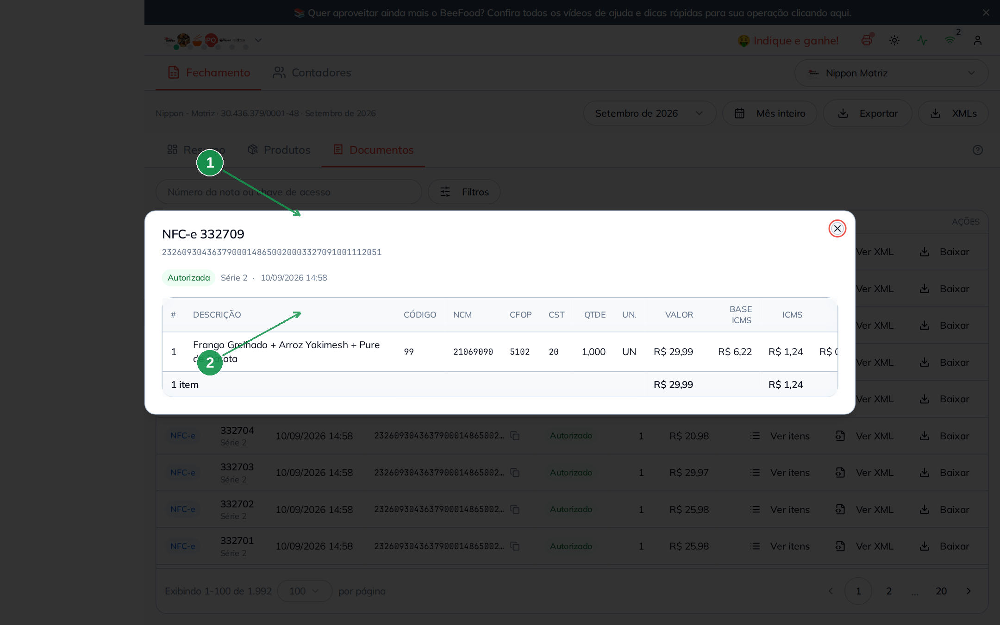
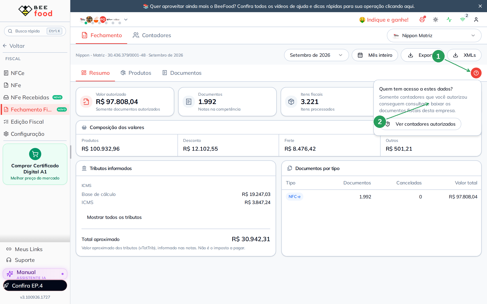
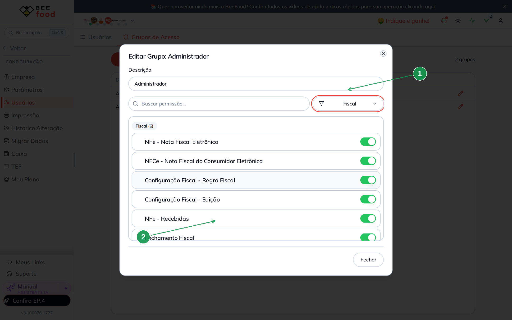

# Fechamento Fiscal

Este manual mostra a tela **Fiscal → Fechamento Fiscal**: como conferir o mês, baixar os
XMLs, gerar PDF ou Excel e ligar a permissão no grupo de acesso.

O BeeFood guarda as notas emitidas (NFC-e e NF-e) e monta o fechamento **na hora**, sempre
com os números atuais. Não existe um botão de “fechar o mês” — o que você vê hoje é o que
vale para a apuração.

> As imagens têm **setas com números** (1, 2, 3...). No texto, cada número indica exatamente o
> campo ou botão correspondente na tela.

---

## Índice

- [1. Onde fica e quem vê](#1-onde-fica-e-quem-vê)
- [2. A tela de resumo](#2-a-tela-de-resumo)
- [3. PDF, Excel e o ZIP dos XMLs](#3-pdf-excel-e-o-zip-dos-xmls)
- [4. Recortar o mês](#4-recortar-o-mês)
- [5. Produtos e impostos](#5-produtos-e-impostos)
- [6. Documentos da competência](#6-documentos-da-competência)
- [7. Quem tem acesso a estes dados](#7-quem-tem-acesso-a-estes-dados)
- [8. A permissão no grupo de acesso](#8-a-permissão-no-grupo-de-acesso)
- [9. Perguntas rápidas](#9-perguntas-rápidas)

---

## 1. Onde fica e quem vê

No menu **Fiscal**, o item **Fechamento Fiscal** aparece com o selo **Novo**, depois de
**NFe Recebidas** e antes de **Edição Fiscal**.

A tela é de **computador**. No celular o item aparece, mas avisa que precisa do computador.

Quem vê o item é o **grupo de acesso**. Uma permissão só — **Fechamento Fiscal** — libera as
duas abas da tela (Fechamento e Contadores). Sem ela, o menu some e a URL digitada à mão
volta para a tela inicial. A seção 8 mostra o switch.

O fechamento é **de um CNPJ por vez**. No canto superior direito, o seletor de cardápio
escolhe a filial. Não existe a opção “Todos”.

---

## 2. A tela de resumo

Abra **Fiscal → Fechamento Fiscal**. A competência já vem no mês mais recente.

| Nº | Item | O que é |
|----|------|---------|
| 1 | Aba **Fechamento** | Os números do mês. A outra aba, **Contadores**, é o próximo manual. |
| 2 | Cardápio / CNPJ | A filial ativa. Trocar recarrega o fechamento daquele CNPJ. |
| 3 | Competência | O mês. Ex.: *Setembro de 2026*. |
| 4 | **Mês inteiro** | Recorte de dias (quinzena, intervalo). Sem recorte, é o mês todo. |
| 5 | **Exportar** | PDF ou Excel do resumo. |
| 6 | **XMLs** | ZIP com os arquivos da competência. Pode demorar alguns segundos. |
| 7 | **Valor autorizado** | Soma das notas autorizadas. Canceladas **não** entram. |
| 8 | **Documentos** e **Itens** | Quantas notas e quantas linhas de produto o mês teve. |
| 9 | **Composição** | Produtos, desconto, frete e outros. |
| 10 | **Tributos** e **por tipo** | Impostos informados nas notas e a quebra NFC-e / NF-e. |

Se a filial não tiver CNPJ, a tela pede para configurar em **Fiscal → Configuração** — não
aparece como erro vermelho.

Competência sem movimento aparece como *nenhum documento nesta competência*, não como falha.

Quando faltar arquivo ou houver buraco na numeração, um aviso âmbar aparece **acima** dos
totais. Confira antes de usar o número na apuração.

Os totais desta tela são os **mesmos** que o contador vê no portal. Se um número divergir,
confira o CNPJ e o recorte de período — não são duas apurações diferentes.

---

## 3. PDF, Excel e o ZIP dos XMLs

Clique em **Exportar**.

| Nº | Item | O que faz |
|----|------|-----------|
| 1 | **PDF** | Gera o fechamento em PDF no navegador. |
| 2 | **Excel** | Gera a planilha, com os produtos quando a aba Produtos já carregou. |

O PDF e o Excel nascem no seu computador. O ZIP dos **XMLs** é montado no servidor: o botão
fica em *Preparando…* e só volta quando o arquivo chega. Com milhares de notas isso leva
alguns segundos — não feche a página e não clique de novo.

O lojista **não** tem limite de downloads por hora. O portal do contador tem (o servidor
protege o arquivo).

---

## 4. Recortar o mês

O fechamento aceita um intervalo de dias **dentro** da competência. Serve para fechar a
primeira quinzena sem esperar o mês acabar.

Clique em **Mês inteiro**.

| Nº | Item | O que fazer |
|----|------|-------------|
| 1 | **Mês inteiro** | Volta ao mês completo (é o padrão). |
| 2 | **1ª quinzena** / **2ª quinzena** | Recortes prontos. |
| 3 | **De** / **Até** | Intervalo livre. Só dias daquele mês. |
| 4 | **APLICAR** | Recarrega o resumo, os produtos e os documentos com o recorte. |

O recorte vai para a URL (`?de=` e `?ate=`). Você pode mandar o link para alguém e a tela
abre igual. O botão **Voltar** do navegador desfaz.

---

## 5. Produtos e impostos

A aba **Produtos** lista o que saiu nas notas, com NCM, CFOP, CST e alíquotas.

| Nº | Item | O que é |
|----|------|---------|
| 1 | Aba **Produtos** | Uma linha por produto × situação fiscal. |
| 2 | **Por CFOP**, **Por CST**, **Por NCM** | Os mesmos itens, agrupados. |
| 3 | Busca e **Filtros** | Código, descrição, tipo de nota. |
| 4 | **Colunas** | Liga grupos de imposto (ICMS, PIS/COFINS, IBS/CBS…). |
| 5 | A tabela | Código, descrição, NCM, CFOP, CST, alíquota, quantidade e valor. |

O mesmo código de produto pode aparecer **mais de uma vez** se a situação fiscal mudou no
mês (CST ou alíquota diferentes). Não é duplicata de cadastro: são duas linhas de apuração.

**Por CFOP** (e o mesmo para CST e NCM) mostra o ranking e a tabela agrupada.

| Nº | Item | O que observar |
|----|------|----------------|
| 1 | **Por CFOP** | A sub-aba ativa. |
| 2 | O gráfico | Os maiores CFOP por valor. |
| 3 | A tabela | Linhas, itens, quantidade, base e imposto por CFOP. |

Isso não altera cadastro. Para corrigir imposto de produto, use **Edição Fiscal** (ou o
portal do contador, se ele tiver a permissão). A correção vale para as **próximas** notas.

---

## 6. Documentos da competência

A aba **Documentos** é a lista das notas do mês.

| Nº | Item | O que é |
|----|------|---------|
| 1 | Aba **Documentos** | Uma linha por nota. |
| 2 | Busca | Número da nota ou chave de acesso. |
| 3 | **Ver itens** | Os produtos daquela nota, sem baixar o XML. |
| 4 | **Ver XML** | O conteúdo do arquivo autorizado. |
| 5 | **Baixar** | O XML daquela nota. Se houver cancelamento, o menu oferece os dois arquivos. |

A paginação começa em 100 por página. No exemplo, setembro tem **1.992** NFC-e.

| Nº | Item | O que observar |
|----|------|----------------|
| 1 | O número da nota | Confere com a linha da lista. |
| 2 | Os itens | Código, descrição, quantidade, valor e a tributação da linha. |

---

## 7. Quem tem acesso a estes dados

No canto da barra de abas há um **?**. Ele explica que só o contador **autorizado** consulta
e baixa os documentos da empresa.

| Nº | Item | O que fazer |
|----|------|-------------|
| 1 | O **?** | Abre o recado. |
| 2 | **Ver contadores autorizados** | Troca para a aba Contadores — o próximo manual. |

---

## 8. A permissão no grupo de acesso

A permissão mora em **Configuração → Usuários → Grupos de Acesso**, categoria **Fiscal**.

Abra o grupo (no exemplo, **Administrador**), filtre por **Fiscal**.

| Nº | Item | O que observar |
|----|------|----------------|
| 1 | Filtro **Fiscal** | Deixa só as permissões fiscais. |
| 2 | **Fechamento Fiscal** | O switch. Ligado, o item aparece no menu. |

São **6** itens fiscais: NF-e, NFC-e, Configuração, Edição Fiscal, NFe Recebidas e
**Fechamento Fiscal**. Uma chave só libera as duas abas da tela (Fechamento e Contadores).

Grupo novo nasce com a permissão **ligada** (é o padrão da casa). Para um caixa ou garçom
não ver o fechamento, desligue neste grupo.

Depois de mexer no switch, espere cerca de **1 minuto** e peça para a pessoa **sair e
entrar de novo**. Recarregar a página não basta.

O estudo completo das permissões continua em
[Grupos de acesso](https://ajuda.beefood.com.br/grupos-acesso).

---

## 9. Perguntas rápidas

**O fechamento substitui o Google Drive?**
Sim, para o dia a dia. O contador deixa de depender de uma pasta compartilhada: ele entra no
portal (manual *Portal do contador*) e baixa o mês.

**Posso corrigir uma nota já emitida por aqui?**
Não. O XML autorizado é assinado e não muda. Edição fiscal altera o cadastro do produto e
vale para as próximas notas.

**No celular não abre.**
É tela de computador, como NFC-e e Edição Fiscal.

**Troquei de filial e os números sumiram.**
Cada CNPJ tem o próprio fechamento. Filial sem módulo fiscal ativo nem entra no seletor
como opção válida.

**O ZIP trava no “Preparando…”.**
Espere. O arquivo é montado nota a nota. Se a conexão cair, a tela volta e você tenta de
novo — ela não fica presa.
