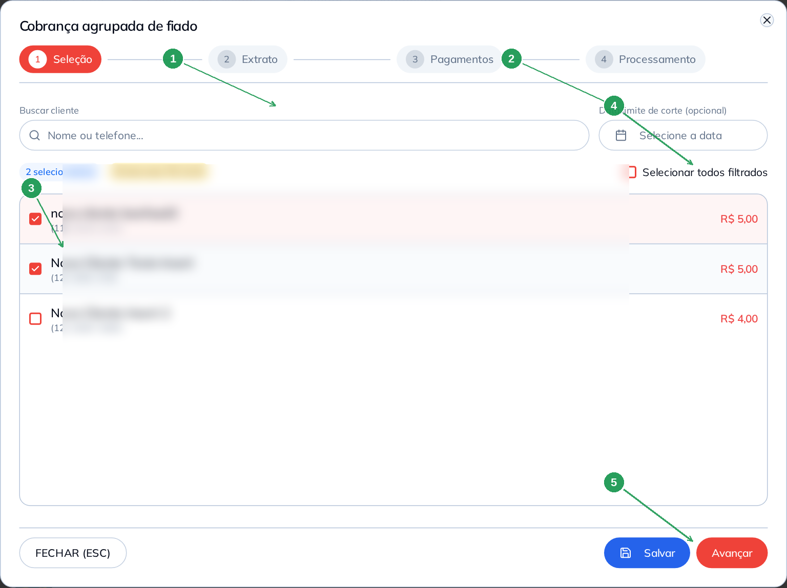
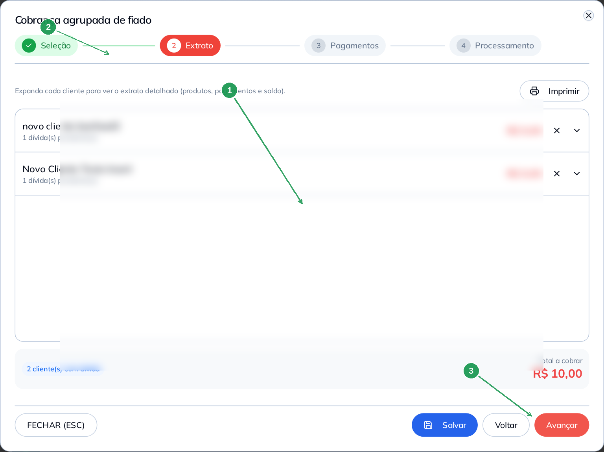
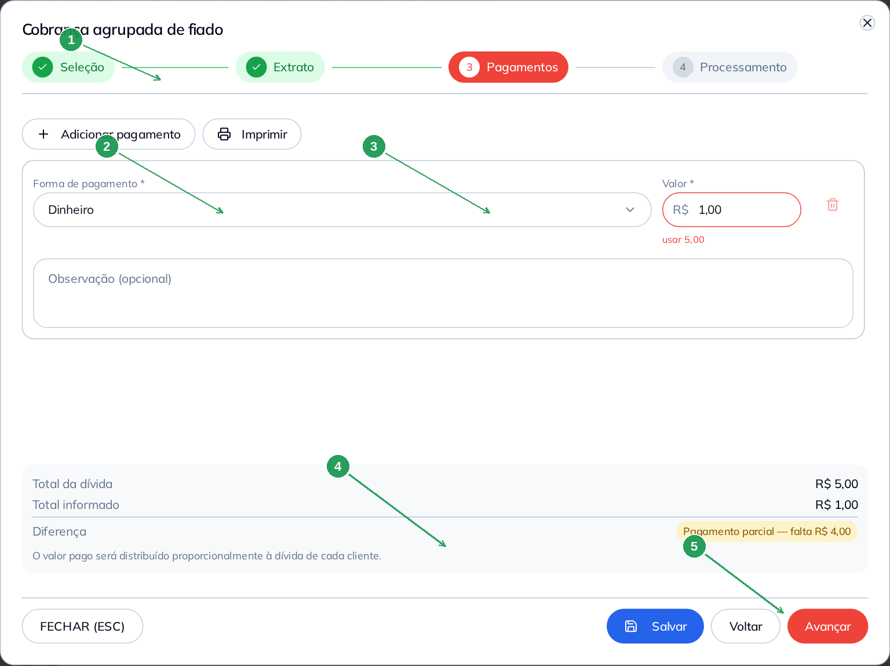
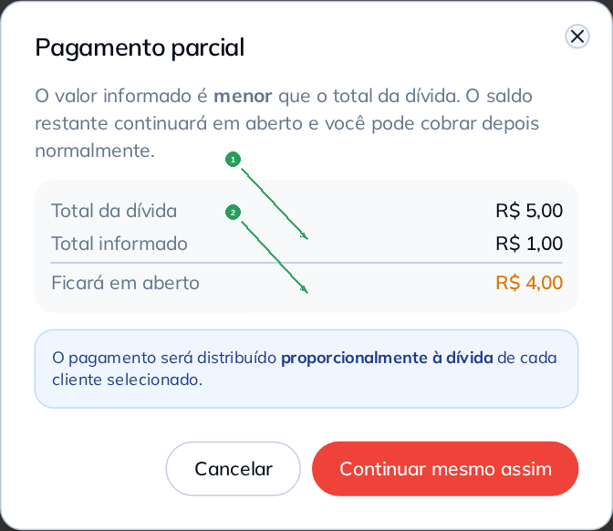
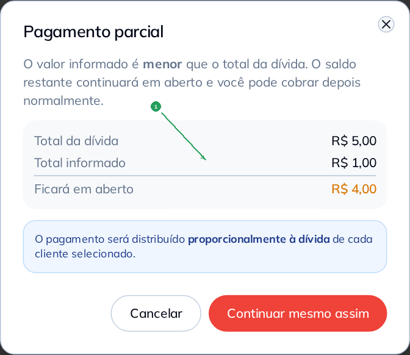

# Manual do Fiado — Cobrança agrupada

Este manual ensina a usar a **Cobrança agrupada**: receber dívidas de **vários clientes**
num único fluxo, com extrato consolidado e um ou mais pagamentos rateados.

> As imagens têm **setas numeradas** (1, 2, 3…). Campos com **\*** são **obrigatórios**.

---

## Pré-requisitos

- Manual **Fiado — Operar no dia a dia** (conceitos de saldo, extrato e caixa aberto).
- Pelo menos **dois clientes com dívida** em aberto.
- **Caixa aberto** para concluir o processamento (fase 4).

---

## Onde fica

1. Menu **Fiado** → aba **Controle de Dívidas**.
2. Clique em **Cobrança agrupada** (badge **NOVO**):

| Nº | Item | Descrição |
|----|------|-----------|
| 1 | **Cobrança agrupada** | Inicia o assistente em quatro fases. A seta ao lado abre **rascunhos salvos** neste computador. |

---

## Visão das quatro fases

| Fase | Nome | Objetivo |
|------|------|----------|
| 1 | **Seleção** | Escolher clientes e, se quiser, data limite de corte |
| 2 | **Extrato** | Revisar extrato consolidado e imprimir PDF/cupom |
| 3 | **Pagamentos** | Informar forma(s) e valor(es) recebidos |
| 4 | **Processamento** | Sistema registra os pagamentos automaticamente |

---

## Fase 1 — Seleção de clientes

| Nº | Item | O que fazer |
|----|------|-------------|
| 1 | **Buscar cliente** | Filtra a lista por nome ou telefone. |
| 2 | **Data limite de corte** | **Opcional.** Sem data, considera todo o histórico ativo; com data, só dívidas até o dia escolhido. |
| 3 | **Checkbox / linha** | Marque os clientes que entrarão nesta cobrança. |
| 4 | **Selecionar todos filtrados** | Atalho para marcar a lista visível. |
| 5 | **Avançar** | Só habilita com pelo menos um cliente selecionado. |

Use **Salvar** a qualquer momento para guardar um **rascunho local** (somente neste navegador).

---

## Fase 2 — Extrato consolidado

| Nº | Item | Descrição |
|----|------|-----------|
| 1 | **Extrato por cliente** | Mesma lógica do extrato individual: timeline e **rateio por produto**. |
| 2 | **Imprimir** | Gera **PDF único** (com índice por cliente) ou **cupom térmico** do lote. |
| 3 | **Avançar** | Segue para pagamentos quando o extrato estiver carregado. |

---

## Fase 3 — Pagamentos

| Nº | Campo | Obrigatório | O que fazer |
|----|-------|:-----------:|-------------|
| 1 | **Adicionar pagamento** | — | Inclui outra linha (ex.: parte em dinheiro, parte em PIX). |
| 2 | **Forma de pagamento \*** | Sim | Fiado e PIX Beetech **não** aparecem — use formas de recebimento normais. |
| 3 | **Valor \*** | Sim | Pode ser **parcial** (menor que a dívida total). |
| 4 | **Total da dívida / Total informado / Diferença** | — | Confira antes de avançar. Pagamento parcial distribui o valor **proporcionalmente** entre os clientes. |
| 5 | **Avançar** | — | Habilita com pagamento válido que **não exceda** a dívida. |

---

## Fase 4 — Processamento

| Nº | Item | Descrição |
|----|------|-----------|
| 1 | **Barra de progresso** | Cada pagamento é registrado no fiado (e no caixa) automaticamente. |
| 2 | **Retentativas** | Em instabilidade, o sistema tenta novamente. |

Ao concluir, os saldos dos clientes são atualizados como em um pagamento manual comum:

---

## Rascunhos e retomada

- **Salvar** — grava clientes, data de corte e pagamentos **neste computador**.
- **Dropdown** ao lado de **Cobrança agrupada** — lista rascunhos para retomar ou excluir.
- Ao fechar com alterações: **Salvar e fechar** ou **Descartar**.
- Rascunhos **não** sincronizam entre aparelhos nem após limpar dados do navegador.

---

## Dicas rápidas

- Use **data de corte** quando quiser cobrar só o período (ex.: fechamento mensal).
- **Pagamento parcial** é útil quando o cliente paga parte do lote — o restante permanece em aberto.
- O PDF consolidado serve como **recibo do lote** para arquivo ou envio ao cliente.
- Para operação diária de um cliente só, use o extrato individual (manual **Operar no dia a dia**).

---

## Referências internas

- Manual **Fiado — Operar no dia a dia** — visão geral, extrato individual e PDV.
- Manual **Fechar caixa** — pagamentos de fiado entram na conferência.
