# Manual do Fiado — Operar no dia a dia

Este manual ensina a usar o **Fiado** no BeeFood: vender a prazo, acompanhar dívidas,
consultar extratos e registrar pagamentos.

> As imagens têm **setas numeradas** (1, 2, 3…). Cada número indica o campo ou botão
> correspondente na tela. Campos com **\*** são **obrigatórios**.

---

## O que é o Fiado

O **Fiado** é o controle de **crédito por cliente**: a venda fica registrada como dívida e o
cliente paga depois. No sistema:

- **Venda a prazo** — forma de pagamento **Fiado** no PDV, Mesas ou Delivery (exige **cliente** na venda).
- **Gestão** — menu **Fiado**, com três abas: **Visão Geral**, **Controle de Dívidas** e **Vendas sem Pagamento**.
- **Caixa** — receber um pagamento de fiado pelo módulo exige **caixa aberto**; o valor entra na conferência de fechamento (coluna **Fiado**). Veja os manuais **Abrir caixa** e **Fechar caixa**.

No extrato, valores **negativos** representam **dívida gerada**; **positivos**, **pagamento recebido**.

---

## Pré-requisitos

- Sessão iniciada em `https://beefood.app`.
- Permissão de menu **Fiado** no seu grupo de acesso.
- Forma de recebimento **Fiado** ativa em **Cadastros → Formas de recebimento**.
- **Caixa aberto** para registrar pagamentos pelo módulo Fiado (não para vender a prazo no PDV).

---

## Parte 1 — Configurar a forma Fiado

Antes de vender a prazo, confira se a forma **Fiado** está cadastrada e ativa:

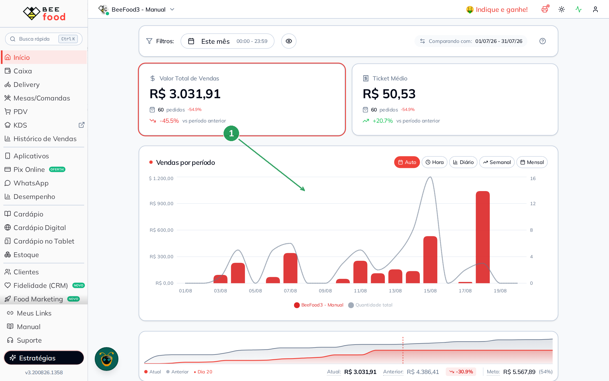

| Nº | Item | O que fazer |
|----|------|-------------|
| 1 | **Fiado** | A forma deve aparecer na lista com tipo **Fiado** e status **Ativo**. Se não existir, cadastre em **Cadastros → Formas de recebimento**. |

---

## Parte 2 — Gerar dívida na venda (PDV)

1. No menu lateral, abra o **PDV**.
2. Adicione produtos ao pedido.
3. Toque no campo **Cliente** (ícone de pessoa) e selecione o cliente — **obrigatório** para fiado.
4. Clique em **Receber (F3)**.
5. Na janela **Conferir e Dividir**, escolha **Fiado**:

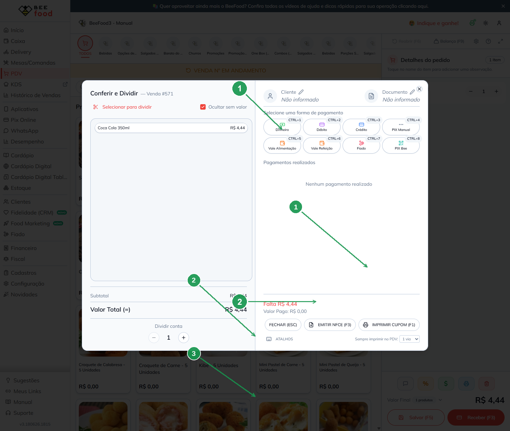

| Nº | Item | O que fazer |
|----|------|-------------|
| 1 | **Fiado** | Clique para registrar a venda a prazo. Sem cliente na venda, o sistema exibe erro e não permite continuar. |
| 2 | **Observação (opcional)** | Aparece ao selecionar Fiado — use para anotar combinação de pagamento, referência etc. |
| 3 | **CONFIRMAR (ENTER/F1)** | Finaliza a venda; a dívida passa a constar no Fiado do cliente. |

> O mesmo fluxo vale em **Mesas/Comandas** e **Delivery**, na tela de pagamento da venda.

---

## Parte 3 — Visão Geral

1. No menu lateral, clique em **Fiado**:

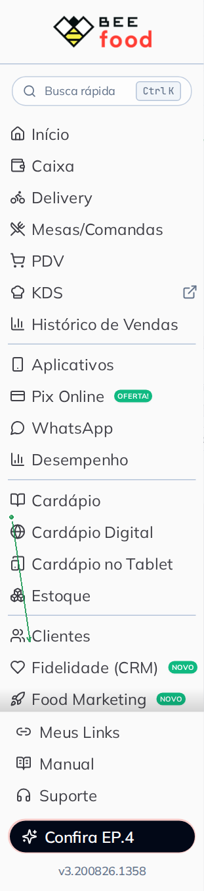

| Nº | Item | O que fazer |
|----|------|-------------|
| 1 | **Fiado** | Abre o módulo de controle de crédito por cliente. |

2. A aba **Visão Geral** abre por padrão.

### Indicadores

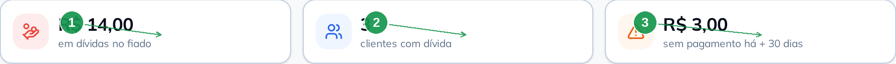

| Nº | Indicador | Significado |
|----|-----------|-------------|
| 1 | **Em dívidas no fiado** | Soma das dívidas em aberto de todos os clientes. |
| 2 | **Clientes com dívida** | Quantidade de clientes que ainda devem. |
| 3 | **Sem pagamento há + 30 dias** | Valor em atraso (clientes sem pagamento há mais de 30 dias). |

### Gráfico e operações

Use o filtro de **período** para ver vendas a prazo e recebimentos no intervalo:

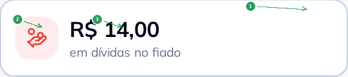

| Nº | Item | O que fazer |
|----|------|-------------|
| 1 | **Período** | Selecione data inicial e final e clique em filtrar. |
| 2 | **Vendas no fiado** (vermelho) | Total de dívidas geradas no período. |
| 3 | **Recebimentos do fiado** (verde) | Total recebido no período. |

A tabela abaixo lista cada operação (venda ou recebimento) com data, cliente e valor.
É possível **exportar para Excel**.

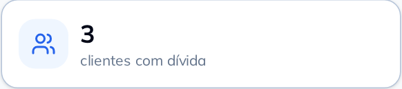

---

## Parte 4 — Controle de Dívidas

1. Na tela **Fiado**, clique na aba **Controle de Dívidas**.

### Filtros e ações

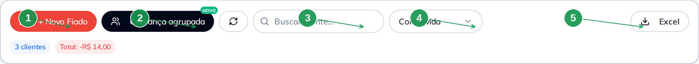

| Nº | Item | O que fazer |
|----|------|-------------|
| 1 | **+ Novo Fiado** | Busca um cliente e abre o extrato para registrar dívida ou pagamento. |
| 2 | **Cobrança agrupada** | Abre o fluxo em lote — detalhado no manual **Fiado — Cobrança agrupada**. |
| 3 | **Buscar cliente** | Filtra por nome ou telefone. |
| 4 | **Com dívida / Sem dívida / Todos** | Restringe a lista. |
| 5 | **Excel** | Exporta a lista filtrada. |

### Lista de clientes

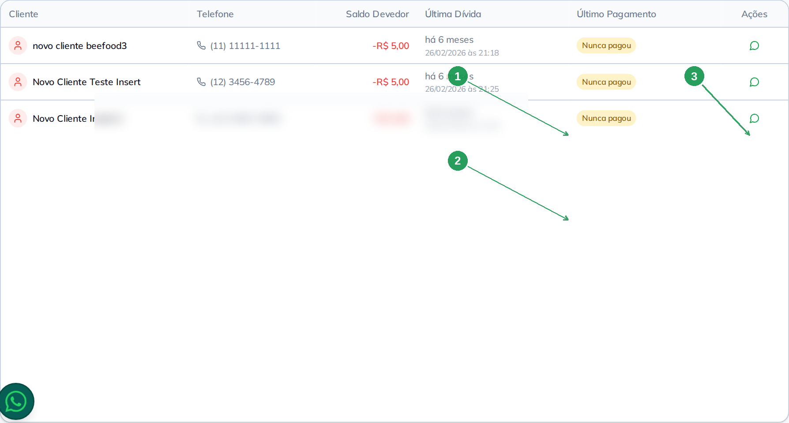

| Nº | Coluna | Descrição |
|----|--------|-----------|
| 1 | **Saldo Devedor** | Valor em aberto (negativo = deve). |
| 2 | **Última Dívida / Último Pagamento** | Referência temporal para cobrança. |
| 3 | **WhatsApp** (ícone verde) | Abre conversa com mensagem sugerida de cobrança (requer telefone cadastrado). |

Clique em uma **linha** para abrir o **extrato do cliente**.

### Extrato do cliente

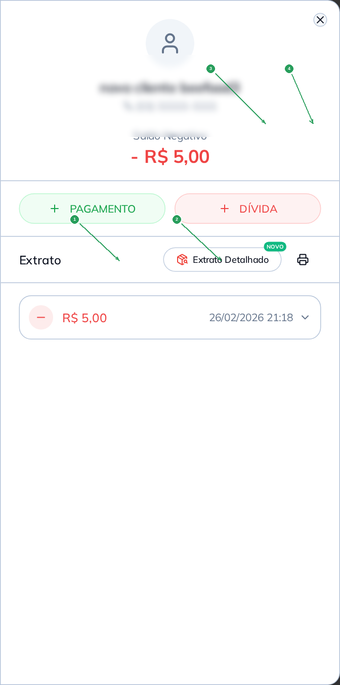

| Nº | Item | O que fazer |
|----|------|-------------|
| 1 | **PAGAMENTO** | Registra recebimento (exige caixa aberto). |
| 2 | **DÍVIDA** | Lança ajuste manual de dívida (observação obrigatória). |
| 3 | **Extrato Detalhado** | Abre visão por produto (rateio proporcional). |
| 4 | **Imprimir** | PDF A4 ou cupom térmico. |

#### Registrar pagamento

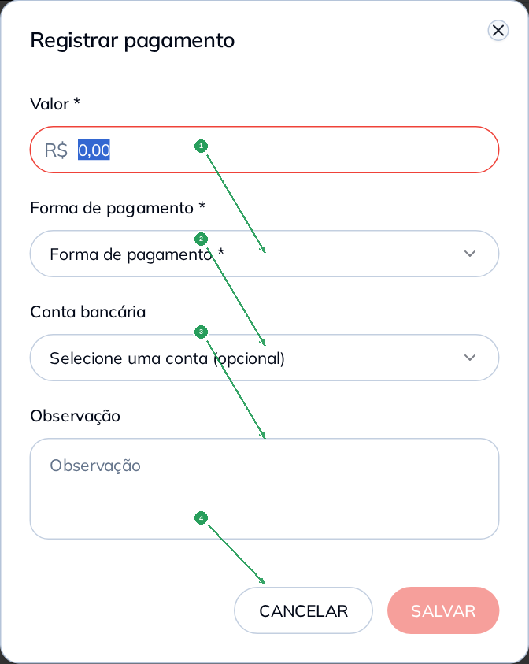

| Nº | Campo | Obrigatório | O que fazer |
|----|-------|:-----------:|-------------|
| 1 | **Valor \*** | Sim | Informe quanto o cliente pagou. |
| 2 | **Forma de pagamento \*** | Sim | Escolha Dinheiro, PIX, cartão etc. (Fiado não aparece aqui). |
| 3 | **Conta bancária** | Conforme forma | Selecione quando aplicável. |
| 4 | **SALVAR** | — | Confirma; o saldo do cliente é atualizado. |

#### Registrar dívida manual

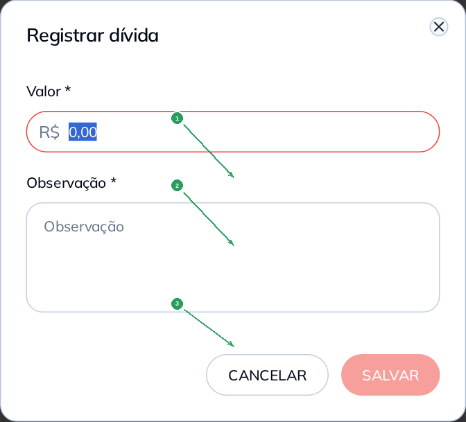

| Nº | Campo | Obrigatório | O que fazer |
|----|-------|:-----------:|-------------|
| 1 | **Valor \*** | Sim | Valor da dívida a acrescentar. |
| 2 | **Observação \*** | Sim | Motivo do lançamento (obrigatório). |
| 3 | **SALVAR** | — | Grava a dívida no extrato. |

#### Extrato detalhado por produto

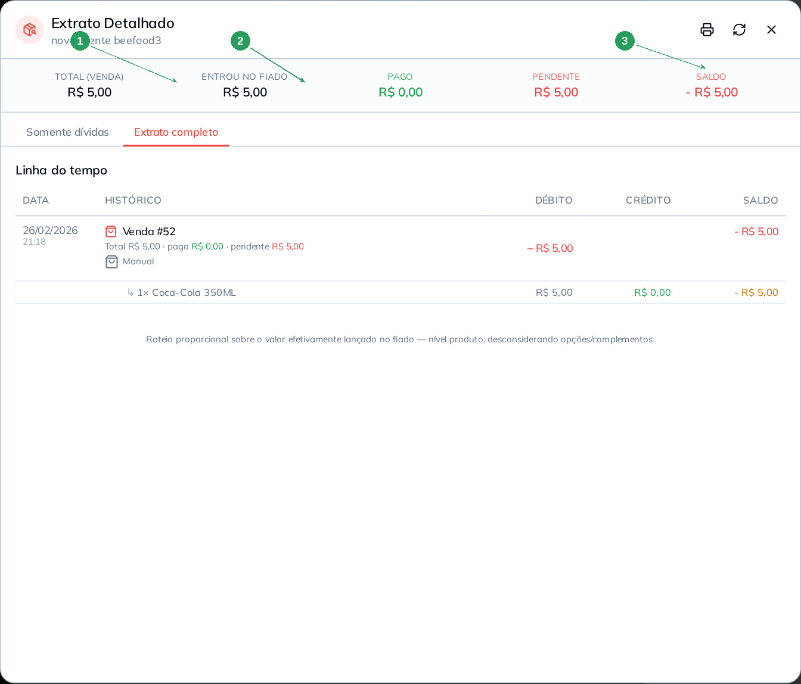

| Nº | Item | Descrição |
|----|------|-----------|
| 1 | **Somente dívida** | Foco no que falta pagar, item a item. |
| 2 | **Extrato completo** | Histórico inteiro de vendas e pagamentos. |
| 3 | **Imprimir / PDF** | Gera comprovante para o cliente. |

> Também é possível ver o fiado do cliente na aba **Fiado** do cadastro em **Clientes**.

---

## Parte 5 — Vendas sem Pagamento (migração)

Esta aba **não** trata vendas pendentes do fechamento de caixa. Ela serve para lojas que
migraram do antigo **Conta Corrente** para o **Fiado**: converte vendas antigas sem vínculo
correto para o novo modelo.

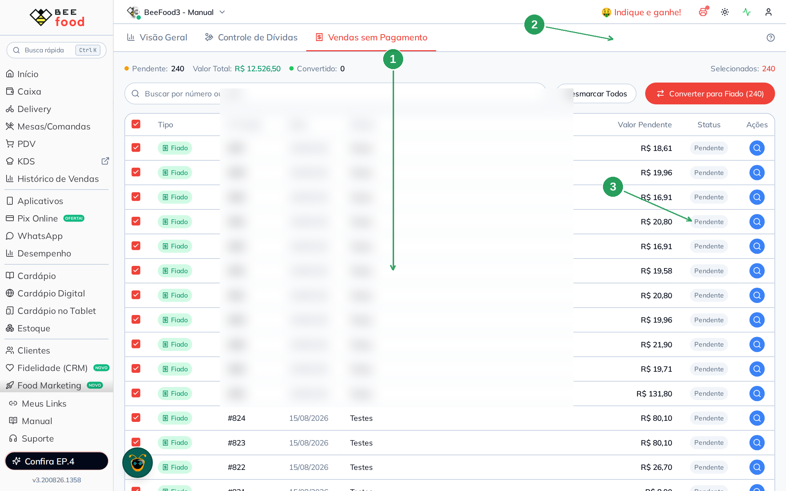

| Nº | Item | O que fazer |
|----|------|-------------|
| 1 | **Lista de vendas** | Vendas elegíveis para conversão. |
| 2 | **Converter para Fiado (N)** | Processa as vendas selecionadas em lote. |
| 3 | **Status** | **Pendente** ou **Convertido** após a migração. |

Se sua loja nunca usou Conta Corrente, esta aba pode ficar **vazia** — isso é normal.

---

## Dicas rápidas

- **Cobrança em lote** — use **Cobrança agrupada** (manual dedicado) para receber vários clientes de uma vez.
- **Caixa** — pagamentos registrados no Fiado entram no caixa aberto; confira a coluna **Fiado** ao fechar.
- **Cancelar pagamento** — no extrato, é possível cancelar um recebimento (motivo + senha de gerente, se configurado).
- **WhatsApp** — o ícone verde na lista envia mensagem sugerida; revise o texto antes de enviar.

---

## Referências internas

- Manual **Abrir caixa** — pré-requisito para receber pagamentos.
- Manual **Fechar caixa** — coluna Fiado na conferência.
- Manual **Fiado — Cobrança agrupada** — fluxo em quatro fases para cobrança em lote.
