# Manual — Cadastrar forma de recebimento (Delivery, Presencial e PDV)

Forma de recebimento é **como o dinheiro entra**: dinheiro, débito, crédito, PIX, vale, fiado. No
BeeFood, cada forma é cadastrada uma vez e depois **ligada aos canais** em que você aceita ela —
Delivery, Presencial (mesa e comanda) e PDV.

Este manual percorre a tela inteira do cadastro, explica as **três telas parecidas** que confundem
todo mundo, e termina com um exemplo completo: cadastrar um vale novo e vê-lo aparecer na hora de
receber.

> As imagens têm **setas numeradas** (1, 2, 3…). Cada número indica o campo correspondente
    10|> na tela.

---

## Antes de começar: três telas parecidas

O BeeFood tem três lugares que falam de "forma de pagamento". Saber qual é qual economiza muito
tempo:

| Tela | Onde fica | Para que serve |
|------|-----------|----------------|
    20|| **Formas de Recebimento** | **Cadastros → Formas Recebimento** | **É esta que este manual explica.** Define as formas usadas nas **vendas**: PDV, mesa, comanda e Delivery |
| **Formas Recebimento** do cardápio | **Cardápio Digital → Formas Recebimento** | Define o que o **cliente vê na sacola** do cardápio digital. É uma lista separada, que pode apontar para a forma do cadastro |
| **Formas Pagamento** do financeiro | **Financeiro → Formas Pagamento** | Formas usadas para **lançar contas a pagar e a receber** (boleto do fornecedor, por exemplo). Não muda nada na venda |

Regra prática: **quem recebe é o cadastro; quem o cliente escolhe é o cardápio digital; quem paga
conta é o financeiro.**

---

## Onde fica

    30|No menu lateral, clique em **Cadastros** e depois em **Formas Recebimento** (1).

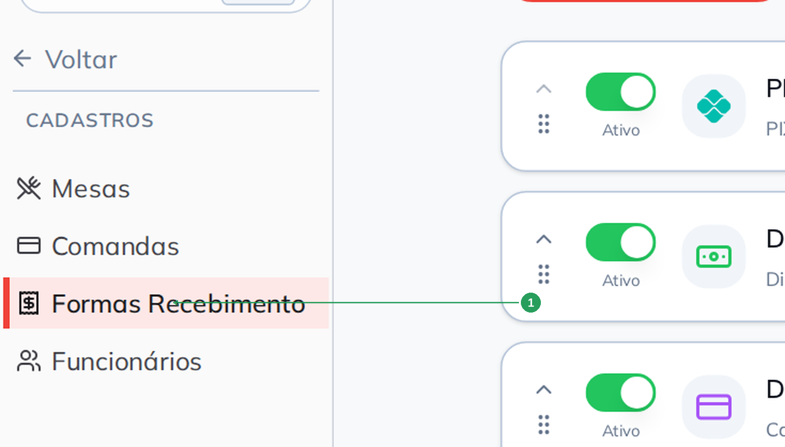

---

## A tela: é aqui que se liga o canal

Cada forma é uma linha, e a linha já traz os interruptores que decidem onde ela aparece. Não é
preciso abrir o cadastro para ligar ou desligar um canal.

    40|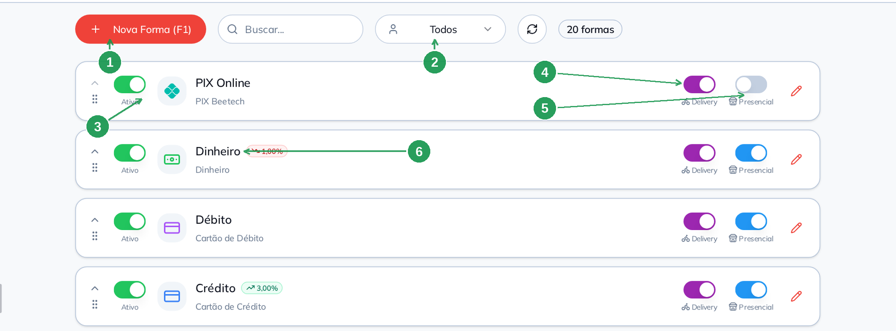

| Nº | Item | O que faz |
|----|------|-----------|
| 1 | **Nova Forma (F1)** | Cadastra uma forma nova. |
| 2 | Filtro de usuário | Mostra **Todos**, **Sem usuário** ou as formas amarradas a um usuário específico (veja *Usuário Vinculado*). |
| 3 | **Ativo** | Desligado, a forma desaparece de todos os canais — é o jeito de aposentar uma forma sem apagá-la. |
| 4 | **Delivery** | Ligado, a forma aparece quando você recebe um **pedido de delivery** no painel. |
| 5 | **Presencial** | Ligado, a forma aparece no **PDV**, na **mesa** e na **comanda**. |
| 6 | Etiqueta de ajuste | Quando a forma tem desconto ou acréscimo, o valor aparece aqui (ex.: `1,00%` de desconto no dinheiro). |

    50|**Não existe um interruptor "PDV" separado.** PDV, mesa e comanda são o mesmo canal para o
sistema: o switch **Presencial** cobre os três.

| Onde você quer receber | Switch que precisa estar ligado |
|------------------------|---------------------------------|
| PDV (balcão) | **Presencial** |
| Mesa e comanda | **Presencial** |
| Pedido de delivery (painel) | **Delivery** |
| Sacola do cardápio digital (o cliente escolhendo) | Cadastro na tela **Cardápio Digital → Formas Recebimento** |

Cada linha tem ainda o **lápis** (abre o cadastro) e, à esquerda, a **alça de arrastar**, que
    60|muda a ordem em que as formas aparecem na hora de receber.

> Algumas formas vêm com a etiqueta **BeeFood** ou **Mercado Pago** e não podem ser editadas: são
> as formas das integrações (PIX Online, pagamento online do marketplace). O sistema cuida delas.

---

## Cadastrar uma forma

Clique em **Nova Forma (F1)**. O cadastro tem **três abas**, e a primeira já resolve o essencial.

    70|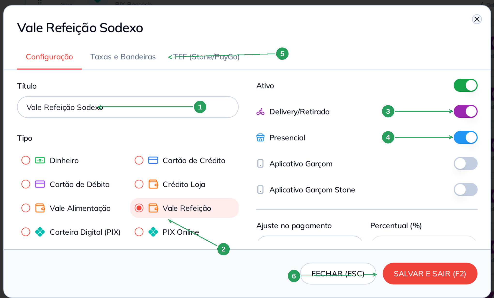

| Nº | Campo | O que fazer |
|----|-------|-------------|
| 1 | **Título*** | O nome que o operador vê na hora de receber. Seja específico: *Vale Refeição Sodexo* é melhor que *Vale*. |
| 2 | **Tipo** | O que essa forma é de verdade (lista completa abaixo). Ele decide, entre outras coisas, se a aba de taxas fica disponível. |
| 3 | **Delivery/Retirada** | Liga o canal Delivery. |
| 4 | **Presencial** | Liga PDV, mesa e comanda. |
| 5 | As três abas | **Configuração**, **Taxas e Bandeiras** e **TEF (Stone/PayGo)**. Trocar de aba já **salva** o que você preencheu. |
| 6 | **SALVAR E SAIR (F2)** | Grava e fecha. O **FECHAR (ESC)**, ao lado, sai sem gravar o que ainda não foi salvo. |

    80|Na mesma aba ficam mais quatro campos:

| Campo | Para que serve |
|-------|----------------|
| **Ativo** | Nasce ligado. Desligue para aposentar a forma. |
| **Aplicativo Garçom** e **Aplicativo Garçom Stone** | Marcam a forma como sendo do app do garçom. Ao ligar, o desconto/acréscimo é zerado — o app não aplica ajuste. |
| **Ordem** | Posição da forma na tela de recebimento. Número menor aparece primeiro. |
| **Usuário Vinculado** | Amarra a forma a **um** usuário: só ele vê essa forma ao receber. Serve para separar caixas ou uma maquininha por operador. Deixe em **Nenhum** para todo mundo ver. |

### Os tipos disponíveis

    90|| Tipo | Quando usar | Tem aba de taxas? |
|------|-------------|-------------------|
| **Dinheiro** | Espécie | Não |
| **Cartão de Crédito** | Crédito na maquininha | Sim |
| **Cartão de Débito** | Débito na maquininha | Sim |
| **Crédito Loja** | Crédito da própria casa | Sim |
| **Vale Alimentação** | VA | Sim |
| **Vale Refeição** | VR | Sim |
| **Carteira Digital (PIX)** | PIX na maquininha, PicPay, carteira | Sim |
| **PIX Online** | O PIX integrado do BeeFood (não se cria à mão) | Não |
   100|| **Fiado** | Venda a prazo, para o controle de dívidas | Não |
| **Outros** | O que não se encaixa acima | Sim |

O tipo **muda o formulário**: em Dinheiro, Fiado e PIX Online a aba **Taxas e Bandeiras** aparece
apagada, com o aviso *"Não disponível para este tipo de pagamento"* — não existe taxa de
adquirente para cobrar nesses casos.

### Desconto ou acréscimo na forma

O campo **Ajuste no pagamento** é o que faz "5% de desconto no PIX" ou "3% de acréscimo no
crédito".
   110|
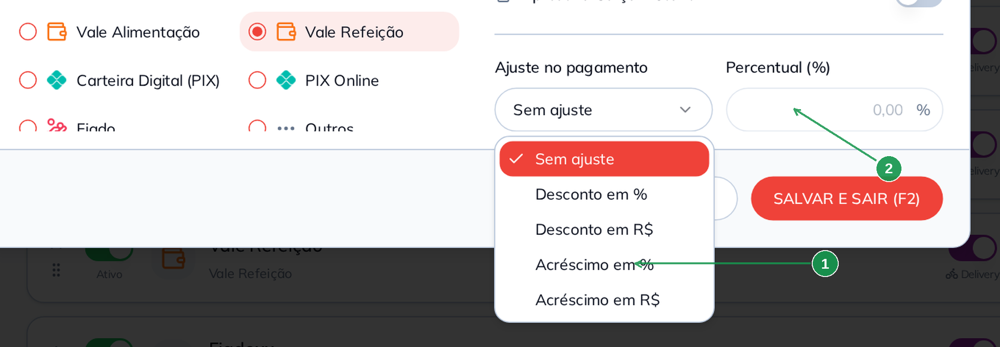

| Nº | Item | O que fazer |
|----|------|-------------|
| 1 | As cinco opções | **Sem ajuste**, **Desconto em %**, **Desconto em R$**, **Acréscimo em %** e **Acréscimo em R$**. |
| 2 | O campo do valor | Muda de rótulo conforme a escolha: **Percentual (%)** (de 0,01 a 100) ou **Valor (R$)**. |

O ajuste **incide sobre o subtotal dos produtos** e, na hora de receber, o operador confirma se
aplica ou não. O valor escolhido vira a etiqueta que aparece na listagem.

   120|---

## Aba Taxas e Bandeiras

É aqui que entram os números do seu contrato com a adquirente: **quanto ela desconta** e **em
quantos dias o dinheiro cai**. Isso não muda o que o cliente paga — muda o que você recebe.

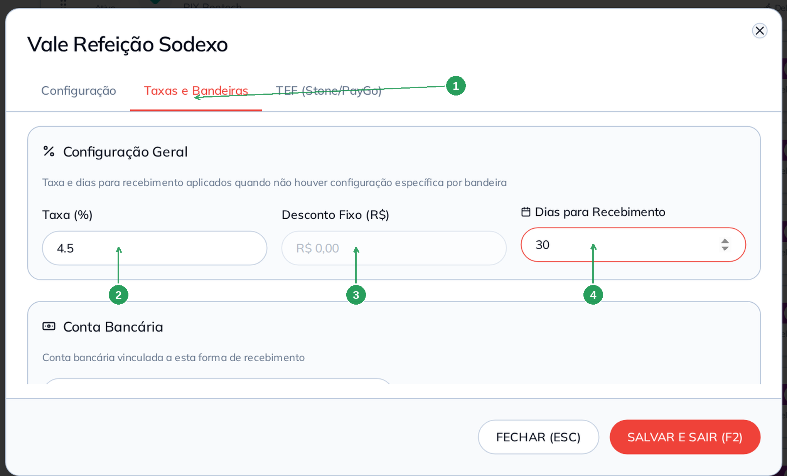

| Nº | Campo | O que fazer |
|----|-------|-------------|
   130|| 1 | A aba **Taxas e Bandeiras** | Fica apagada para Dinheiro, Fiado e PIX Online. |
| 2 | **Taxa (%)** | O percentual que a adquirente desconta. Ex.: `4.5` para 4,5%. |
| 3 | **Desconto Fixo (R$)** | Alternativa à taxa: um valor fixo por venda. Preencher um **desabilita** o outro — é um ou outro. |
| 4 | **Dias para Recebimento** | Em quantos dias o valor cai na conta. `0` = no mesmo dia; `30` = em 30 dias. |

Abaixo ainda existem:

- **Conta Bancária** — amarra a forma a uma conta cadastrada, para o financeiro saber onde o
  dinheiro entra.
- **Bandeiras de Cartão** — uma linha por bandeira (Visa, Mastercard, Elo, Sodexo, Alelo…), cada
   140|  uma com **Ativo**, **Taxa (%)**, **Desc. Fixo** e **Dias Receb.** próprios. Use quando o
  contrato cobra diferente por bandeira; o que está em **Configuração Geral** vale para as
  bandeiras que você não configurar.

> Os valores desta aba alimentam o **faturado × realizado** dos relatórios de vendas. O manual
> *Taxas das formas de recebimento* mostra o efeito no Desempenho.

---

## Aba TEF (Stone/PayGo)

   150|Só interessa a quem usa maquininha integrada (TEF). Aqui você amarra a forma a uma TEF cadastrada
na loja.

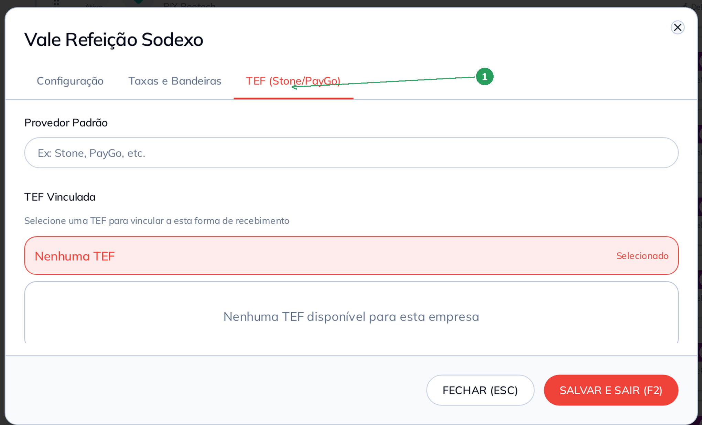

| Nº | Item | O que fazer |
|----|------|-------------|
| 1 | A aba **TEF (Stone/PayGo)** | Tem o **Provedor Padrão** (texto livre: Stone, PayGo…) e a lista **TEF Vinculada**. |

Sem TEF cadastrada, a lista mostra *"Nenhuma TEF disponível para esta empresa"* — e não há nada a
fazer aqui. O vínculo exige que a forma **já esteja salva**.
   160|
---

## Conferindo o resultado

Salva, a forma entra na listagem com o tipo embaixo do título e os canais ligados:

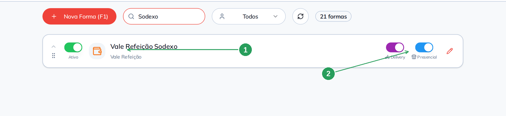

| Nº | Item | O que conferir |
   170||----|------|----------------|
| 1 | A forma nova | Título e tipo. Use a busca para achar rápido. |
| 2 | Os dois canais | **Delivery** e **Presencial** ligados: a forma vale para o painel de delivery e para PDV/mesa/comanda. |

E, na hora de receber uma mesa, uma comanda ou uma venda no PDV, ela já aparece entre as opções
(1) — com o atalho de teclado que o operador pode usar:

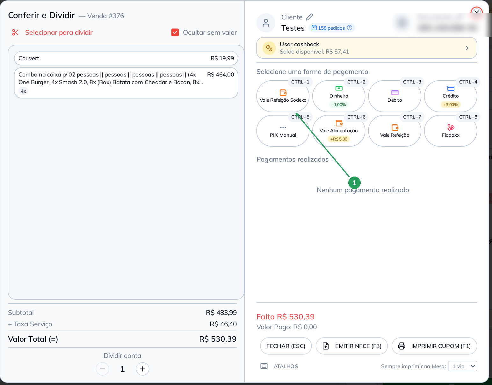

| Nº | Item | O que observar |
   180||----|------|----------------|
| 1 | **Vale Refeição Sodexo** | A forma nova, na primeira posição porque a **Ordem** dela é 1. Cada forma ganha um atalho (**CTRL+1**, **CTRL+2**…) na ordem em que aparece. |

Repare que as formas com ajuste mostram o valor embaixo do nome (`-1,00%` no dinheiro,
`+3,00%` no crédito): é o operador vendo, na hora, o que aquela escolha faz no total.

---

## Para o cliente ver na sacola: a outra tela

O que o **cliente** escolhe no cardápio digital vem de **outra lista**, em
   190|**Cardápio Digital → Formas Recebimento**. Uma forma cadastrada só em Cadastros **não** aparece
para o cliente.

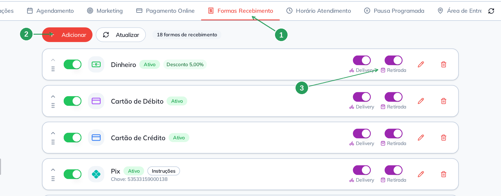

| Nº | Item | O que faz |
|----|------|-----------|
| 1 | Aba **Formas Recebimento** | Dentro de Cardápio Digital. É a lista que o cliente vê. |
| 2 | **Adicionar** | Cadastra uma forma para o cardápio. |
| 3 | **Delivery** e **Retirada** | Aqui os canais são outros: o cliente pagando em **entrega** e em **retirada no balcão**. |

   200|O modal é parecido, com dois campos que só existem aqui:

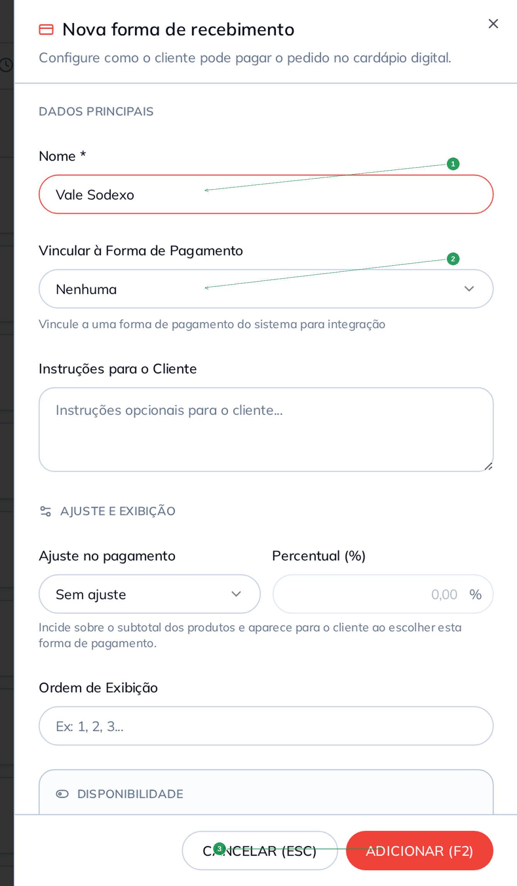

| Nº | Campo | O que fazer |
|----|-------|-------------|
| 1 | **Nome*** | Como o cliente lê na sacola. |
| 2 | **Vincular à Forma de Pagamento** | Aponta para a forma do **cadastro** (a do começo deste manual). É isso que amarra o que o cliente escolheu ao que entra no seu caixa. Formas de integração não aparecem nesta lista. |
| 3 | **ADICIONAR (F2)** | Grava. |

   210|Ainda no mesmo modal: **Instruções para o Cliente** (e, em forma de PIX, a **Chave PIX** e o
favorecido), **Ajuste no pagamento** — que aqui **aparece para o cliente** —, **Ordem de
Exibição** e os três switches **Ativo**, **Disponível para Delivery** e **Disponível para
Retirada**.

> **O vínculo é opcional, mas faça.** Sem ele, o pedido chega com uma forma que o seu cadastro não
> conhece, e a conciliação do caixa fica manual.

### E a terceira tela?

   220|**Financeiro → Formas Pagamento** tem duas seções: em cima, as formas de **contas a pagar e a
receber** (boleto, transferência…); embaixo, uma lista **somente leitura** das formas de venda,
com as taxas e os dias — útil para conferir tudo de uma vez.

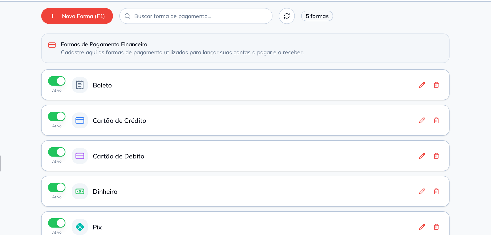

A própria tela avisa: *"Para acessar as configurações completas acesse o menu Cadastros → Formas
de Recebimento"*.

---
   230|
## Exemplo prático: aceitar um vale novo

O restaurante fechou com o **Sodexo**: 4,5% de taxa e recebimento em 30 dias. O vale vale para o
salão e para o delivery.

1. **Cadastros → Formas Recebimento → Nova Forma (F1)**.
2. **Título:** `Vale Refeição Sodexo`. **Tipo:** `Vale Refeição`.
3. Deixe **Ativo**, **Delivery/Retirada** e **Presencial** ligados. Sem ajuste de preço — o vale
   não dá desconto nem cobra a mais do cliente.
4. Clique na aba **Taxas e Bandeiras** e preencha **Taxa (%)** = `4.5` e
   240|   **Dias para Recebimento** = `30`. Se o contrato tiver taxa diferente por bandeira, ligue a
   bandeira **Sodexo** na grade e coloque o número dela ali.
5. **SALVAR E SAIR (F2)**.
6. **Confira na listagem:** a forma aparece com o tipo *Vale Refeição* e os switches **Delivery** e
   **Presencial** ligados.
7. **Teste no recebimento:** abra uma mesa ocupada e clique em **PAGAMENTO**. O
   *Vale Refeição Sodexo* já está entre as opções, com atalho de teclado.
8. **Para o cliente pagar com ele no cardápio digital**, vá em
   **Cardápio Digital → Formas Recebimento → Adicionar**, dê o nome que o cliente lê
   (`Vale Sodexo`), **vincule** à forma que você acabou de criar e ligue **Disponível para
   250|   Delivery** e **Disponível para Retirada**.

Pronto: o operador recebe pelo vale no salão, o cliente escolhe o vale no cardápio, e o
financeiro sabe que aquele dinheiro entra em 30 dias com 4,5% de taxa.

---

## Resumo

1. **Cadastros → Formas Recebimento** é o cadastro que vale para as **vendas**.
   260|2. **Presencial** = PDV + mesa + comanda. **Delivery** = painel de delivery. Não existe switch de PDV.
3. O **Tipo** decide se existe aba de taxas — Dinheiro, Fiado e PIX Online não têm.
4. **Taxa** e **Dias para Recebimento** são o seu contrato com a adquirente, não o preço do cliente.
5. **Ajuste no pagamento** é o desconto/acréscimo por forma, sobre o subtotal.
6. Para o **cliente** ver a forma na sacola, cadastre também em **Cardápio Digital → Formas
   Recebimento** e **vincule** à forma do sistema.
7. **Financeiro → Formas Pagamento** é outra coisa: contas a pagar e a receber.

---

   270|## Perguntas frequentes

**Cadastrei a forma e ela não aparece no PDV.**
Confira três coisas, nesta ordem: o switch **Ativo**, o switch **Presencial** e o campo **Usuário
Vinculado** (se estiver amarrada a outro usuário, você não vê).

**Liguei Delivery, mas o cliente não vê a forma no cardápio digital.**
São listas diferentes. O switch **Delivery** do cadastro serve para **você** receber um pedido de
delivery no painel. Para o **cliente escolher**, cadastre em **Cardápio Digital → Formas
Recebimento**.

   280|**Qual a diferença entre Delivery/Retirada do cadastro e Disponível para Delivery/Retirada do
cardápio?**
O primeiro é um switch só, do canal delivery inteiro, na tela do operador. O segundo são dois
switches, na tela do cliente, que separam **entrega** de **retirada no balcão**.

**Não consigo abrir a aba Taxas e Bandeiras.**
O tipo da forma não tem taxa: Dinheiro, Fiado e PIX Online. Mude o tipo se for o caso.

**Preenchi Taxa (%) e o Desconto Fixo ficou bloqueado.**
É proposital: são alternativas. Zere um para liberar o outro.

   290|**Como faço 5% de desconto no PIX?**
No cadastro da forma, **Ajuste no pagamento** = *Desconto em %* e valor `5`. Para o cliente ver
esse desconto na sacola, repita o ajuste na forma correspondente do **Cardápio Digital**.

**Não consigo editar o PIX Online / a forma do marketplace.**
São formas de integração (etiqueta **BeeFood** ou **Mercado Pago**). O sistema mantém elas
sozinho.

**Como mudo a ordem das formas na tela de recebimento?**
Arraste a linha pela alça (à esquerda) na listagem, ou preencha o campo **Ordem** no cadastro.
   300|
**Para que serve o Usuário Vinculado?**
Para separar recebimentos por operador ou por caixa — por exemplo, uma maquininha TEF por
atendente. Só o usuário amarrado vê aquela forma.

**Posso excluir uma forma?**
A tela de Cadastros não tem exclusão — e é melhor assim, porque as vendas antigas apontam para
ela. Desligue o **Ativo**: a forma sai de todos os canais e o histórico continua íntegro.

---
   310|
## Manuais relacionados

- **Taxas das formas de recebimento** — o efeito da taxa e dos dias no faturado × realizado
- **Desconto e acréscimo nas formas de recebimento** — o que o cliente vê no cardápio digital
- **Cadastrar mesas** e **Cadastrar comandas** — os canais presenciais que usam estas formas
- **TEF Stone** e **TEF PayGo** — o cadastro da maquininha que a aba TEF procura
