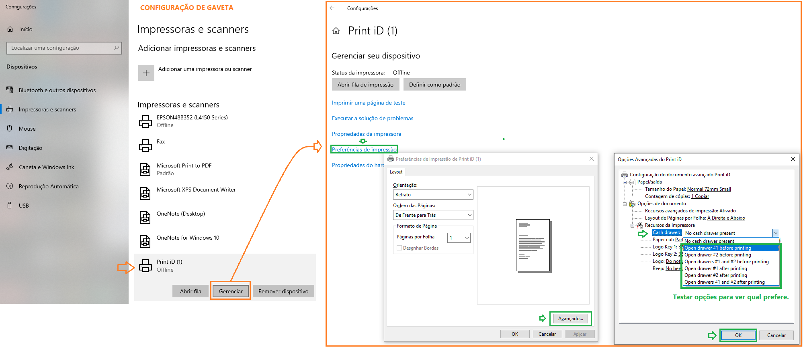

# Gaveta de dinheiro — configuração pela impressora

A gaveta de dinheiro **não tem tela própria** no BeeFood. Ela abre pelo **comando da
impressora térmica**: o sistema imprime o cupom e a impressora manda o pulso que destrava
a gaveta (cabo RJ-11 na porta de periféricos da impressora).

Este manual mostra a configuração no painel da impressora **Control iD** (Print iD),
que é o exemplo do artigo original. Em outras marcas o caminho é o mesmo tipo de
ajuste — “abertura de gaveta” / “cash drawer” no driver ou no menu da impressora.

---

## O que você precisa

1. Impressora térmica com **porta de gaveta** (RJ-11 / RJ-12).
2. Gaveta compatível ligada nessa porta — **não** na USB do computador.
3. Impressora já cadastrada no Windows (ou em conexão direta) e usada no caixa.

A gaveta só abre quando a impressora **imprime** (cupom de venda, sangria etc.).
Sem impressão, não há pulso.

---

## Control iD — abertura de gaveta

No utilitário / painel da impressora Control iD, ative a **abertura de gaveta**
no momento da impressão (o print abaixo é o do fabricante):

Confira no painel da Control iD:

- Gaveta habilitada
- Pulso / tempo de abertura no valor recomendado do fabricante
- Porta da gaveta selecionada (a da própria impressora)

Salve no utilitário da impressora — **não** existe campo “gaveta” em
Configuração do BeeFood web.

---

## Relação com a impressora no BeeFood

A gaveta segue a **impressora do caixa**. Se o cupom não sai, a gaveta também não abre.

Para o modelo **Print iD – Control iD** na conexão direta, o artigo de impressoras
homologadas usa:

- **Modelo:** EscPosEpson
- **Página de código:** 850
- **Colunas:** 48
- **Espaço entre linhas:** 0
- **Linhas entre cupons:** 0

A conexão direta só funciona com o **caixa aberto**.

---

## Problemas comuns

| Sintoma | O que verificar |
|---------|-----------------|
| Gaveta não abre | Cabo na porta da **impressora** (não no PC)? Abertura de gaveta ligada no painel da Control iD? |
| Abre só às vezes | Cupom está imprimindo? Caixa aberto? |
| Não acho a tela no BeeFood | Não existe. O ajuste é no **utilitário da impressora** |

---

## Precisa de ajuda?

Fale com o **suporte BeeFood** informando: marca/modelo da impressora e da gaveta,
e um print do painel da impressora (como o da Control iD).

---

*Última atualização: agosto/2026 — BeeFood · Gaveta de dinheiro*
