# Uma entrega do começo ao fim: painel e aplicativo lado a lado

Os outros manuais da Gestão de Entregas ensinam uma tela cada. Este conta **uma história**: três
pedidos prontos no balcão, um entregador na porta, e o que acontece nas duas telas — a do operador e
a do celular — de um lado ao outro do percurso.

Serve para duas pessoas diferentes lerem a mesma coisa. O operador descobre o que o entregador vê
quando ele clica; o entregador descobre de onde vem o que aparece no celular dele. É a conversa que
normalmente acontece por telefone, no meio do turno.

> **As duas metades deste manual são a mesma viagem.** As imagens do painel e as do celular foram
> feitas no mesmo turno, com os mesmos três pedidos — **#1105**, **#1106** e **#1107**, na rota
> **A**. Os endereços, os valores e as horas conferem de uma tela para a outra porque são os mesmos.

> **Não é um manual de primeira leitura.** Se você nunca montou uma rota, comece em
> [Montar a rota](../gestao-entregas-montar-rota/gestao-entregas-montar-rota.md). Aqui cada passo
> aponta o manual que o explica em detalhe.

> As imagens têm **setas numeradas** (1, 2, 3…). Cada número indica o campo correspondente na
> tela.

## Para que serve

- Entender o ciclo inteiro numa leitura, sem pular entre sete manuais.
- Saber, em cada clique do painel, o que muda no celular do entregador — e quando **não** muda nada.
- Treinar operador novo: é o roteiro de um turno, na ordem em que ele acontece.

## Antes de começar

- Um entregador cadastrado, com acesso ao aplicativo — veja
  [Liberar o entregador](../gestao-entregas-liberar-entregador/gestao-entregas-liberar-entregador.md).
- O entregador **online** no aplicativo. Todo o resto funciona sem isso, menos o pino no mapa.
- Pedidos com endereço e coordenada, ou seja, área de entrega configurada.
- **Caixa aberto** na filial, se a cobrança for na porta.

---

## O ciclo, em sete momentos

| Momento | O operador faz | O entregador vê |
|---|---|---|
| 1. Os pedidos prontos | a fila de quem espera entrega | **nada** |
| 2. A rota montada | agrupa e escolhe quem leva | a rota chega na lista |
| 3. O despacho | um clique que avisa o mundo | a rota vira **em rota** |
| 4. A rua | o pino andando no mapa | o Maps aberto |
| 5. A porta do cliente | a parada mudando de estado | cobra e dá baixa |
| 6. O fim da viagem | a rota sai da tela sozinha | a lista esvazia |
| 7. O dia seguinte | o relatório soma | o histórico guarda |

A linha mais importante da tabela é a primeira: **no momento 1 o celular do entregador está vazio**.
Pedido pronto não é pedido atribuído, e é a confusão número um da operação — o operador jura que
"mandou", o entregador jura que "não chegou", e os dois estão certos.

---

## 1. Os pedidos prontos, e o celular vazio

O ciclo começa na fila. Três pedidos saíram da cozinha, estão com endereço reconhecido e esperam
alguém para levar.

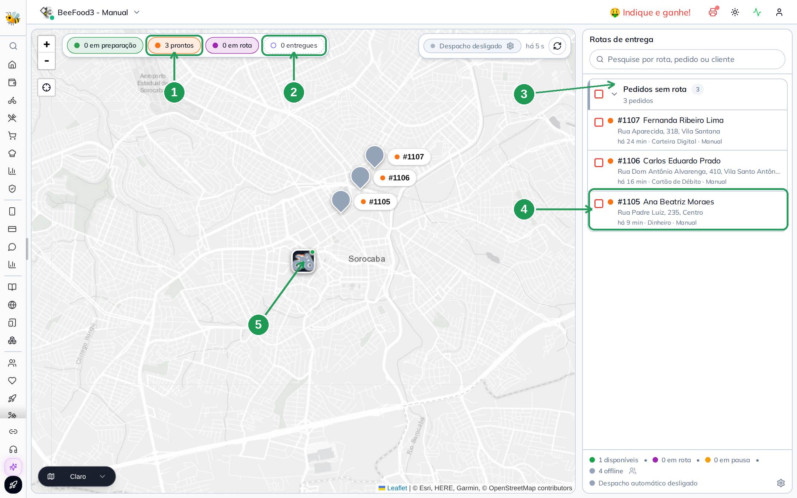

| Nº | Onde | O que é |
|----|------|---------|
| 1. | **3 prontos** | Quantos pedidos saíram da cozinha e esperam entrega. |
| 2. | **0 entregues** | O contador do dia. Nada saiu ainda. |
| 3. | **Pedidos sem rota (3)** | O grupo de quem não tem rota **nem entregador**. |
| 4. | **O cartão do pedido** | Número, cliente, endereço, há quanto tempo espera e a forma de pagamento **combinada** no pedido. |
| 5. | **O pino na loja** | O entregador, online, parado no restaurante. |

O entregador já está online — o pino dele aparece no mapa, na loja. Mas a lista no celular dele está
**vazia**, e vai continuar vazia até alguém decidir quem leva o quê.

> É a primeira coisa a saber sobre o módulo: o que põe um pedido na tela do entregador é **ter
> entregador atribuído**, não estar pronto. Pedido pronto sem atribuição é pedido que ninguém viu.

Quem quer o vocabulário desta tela — os selos, os contadores, as cores do pino — tem o manual
[Ler o mapa e o painel de entregas](../gestao-entregas-mapa-painel/gestao-entregas-mapa-painel.md).

---

## 2. A rota montada, e a rota que chega

O operador marca os três pedidos, agrupa numa rota e escolhe o entregador.

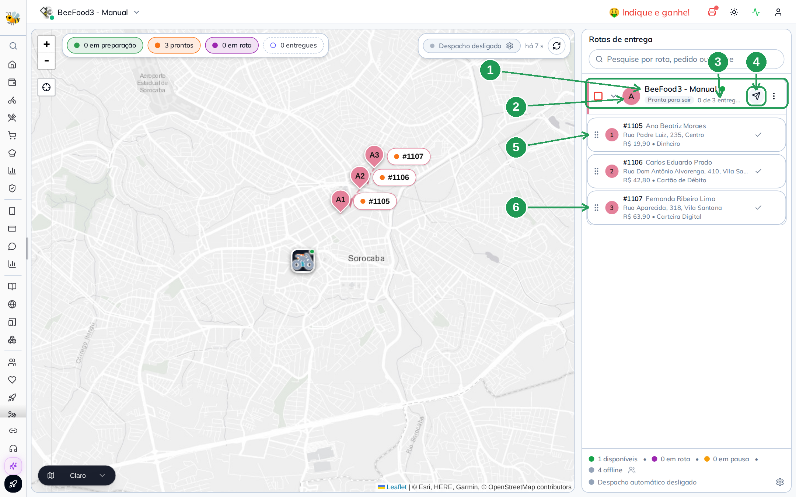

| Nº | Onde | O que é |
|----|------|---------|
| 1. | **O nome do entregador** | Quem vai levar. É **este** campo que faz a rota aparecer no celular. |
| 2. | **A bolinha com a letra** | A letra da rota — A, B, C… No telefone, é por ela que os dois se entendem. |
| 3. | **Pronta para sair · 0 de 3 entregues** | A situação da viagem e o andamento. Antes de despachar é sempre *0 de N*. |
| 4. | **O avião** | O despacho. **Ainda não foi clicado** — e a rota já está no celular. |
| 5. | **Parada 1** | A primeira, na ordem que o operador montou. Valor e forma de pagamento na terceira linha. |
| 6. | **Parada 3** | A última. O visto à direita de cada linha é a baixa manual pelo painel. |

Neste instante, e antes de qualquer despacho, **a rota já aparece no celular**. É o detalhe que
surpreende quem vem de outro sistema: atribuir é o suficiente.

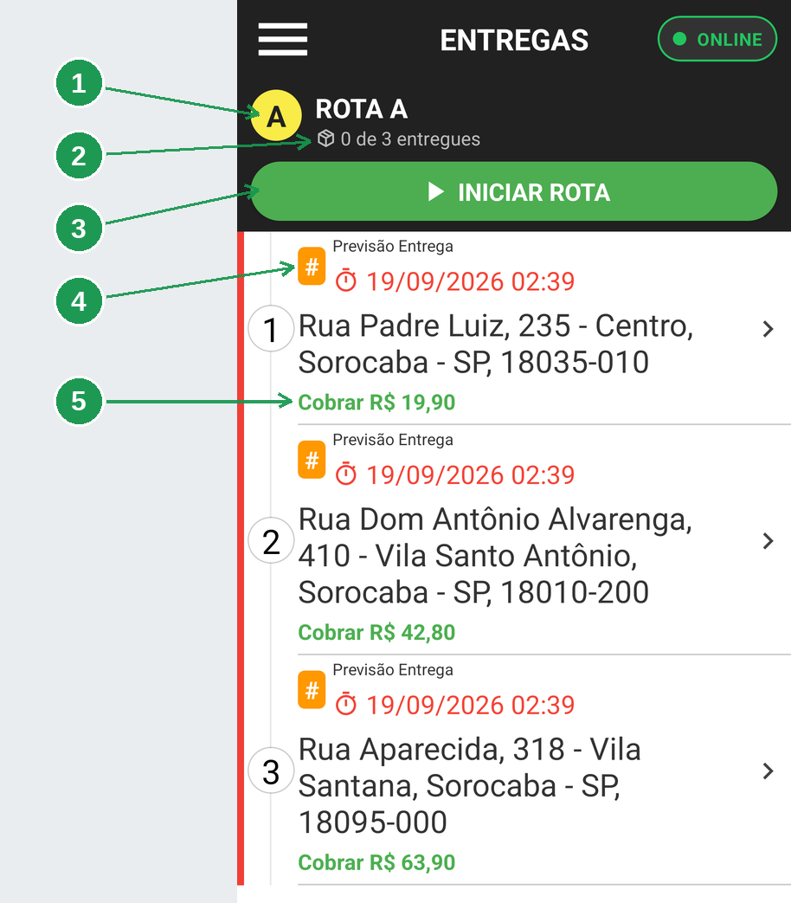

| Nº | Onde | O que é |
|----|------|---------|
| 1. | **ROTA A** | A mesma letra do painel. |
| 2. | **0 de 3 entregues** | Nenhuma concluída ainda. |
| 3. | **INICIAR ROTA**, verde | Ele pode partir sem esperar o painel. |
| 4. | **O crachá laranja** | Marca a linha do pedido. **Ele não traz o número** — o número de pedido é vocabulário do painel. |
| 5. | **Cobrar R$ 19,90** | O mesmo valor que o painel mostra na parada 1. |

O **INICIAR ROTA** é a parte que confunde os dois lados. Ele existe para o caso comum de o
entregador já estar com os pedidos na mão, e o operador ainda não ter clicado em despachar. Se o
entregador tocar nele, o efeito é o mesmo do despacho: o cliente é avisado, o marketplace é
informado, e não há volta. O botão desaparece da tela depois disso.

Detalhe de cada tela: [Montar a rota](../gestao-entregas-montar-rota/gestao-entregas-montar-rota.md)
no painel, e
[App do entregador: chegar no endereço](../app-entregador-rota/app-entregador-rota.md) no celular.

> **A ordem das paradas é a do operador, e ela é frágil.** O botão **MELHOR ROTA** do aplicativo
> reordena tudo por distância a partir da loja, e a sequência que o painel montou desaparece. Se a
> ordem importa — item frágil, cliente que fechou mais cedo, bairro com trânsito —, diga ao
> entregador para não tocar nele.

---

## 3. O despacho: um clique que avisa o mundo

O operador clica no avião. É o clique mais importante do módulo, e o único deste manual que não tem
desfazer.

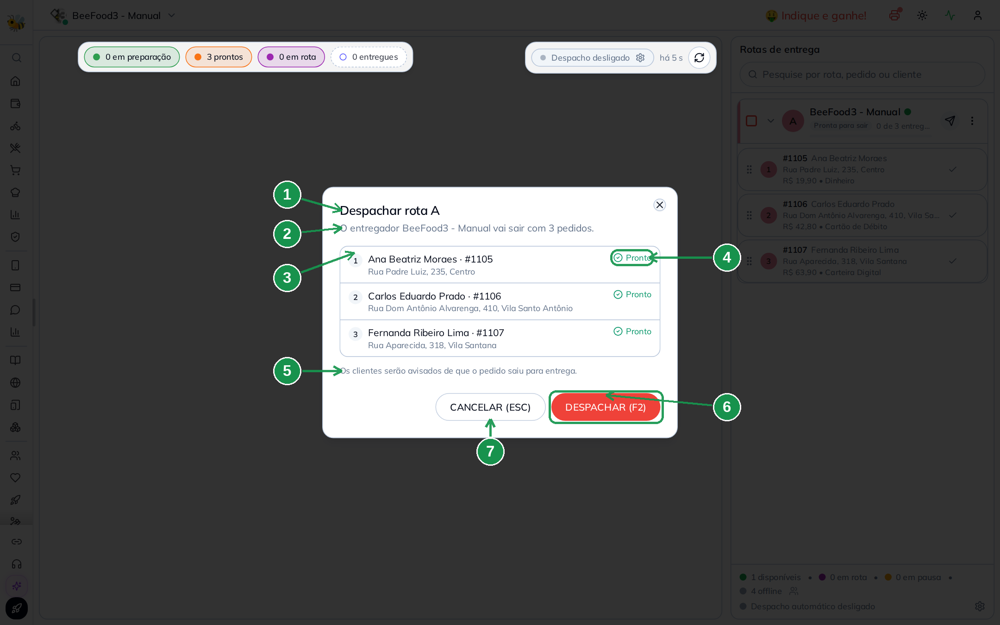

| Nº | Onde | O que é |
|----|------|---------|
| 1. | **Despachar rota A** | A letra da rota que vai sair. |
| 2. | **vai sair com 3 pedidos** | Quem leva, e quantos. Confira o nome: é a última tela em que ele aparece antes do aviso ao cliente. |
| 3. | **A lista de paradas** | Os três pedidos, na ordem da rota, com cliente e endereço. |
| 4. | **Pronto** | O estado de cada pedido **na cozinha**. Pedido em preparo aparece aqui com outro selo — e é o momento de cancelar. |
| 5. | **Os clientes serão avisados…** | O que o clique faz fora do painel. Não é um aviso decorativo. |
| 6. | **DESPACHAR (F2)** | Confirma. Daqui não volta. |
| 7. | **CANCELAR (ESC)** | A saída. |

De uma vez, para os três pedidos:

| O que acontece | Quem sente |
|---|---|
| o pedido passa para **Em entrega** | o Delivery, o caixa e o fechamento do dia |
| sai a mensagem de **pedido saiu para entrega** | o cliente, no WhatsApp |
| o marketplace é avisado | iFood, 99Food, aiqfome e os demais canais |
| a impressão de entrega dispara | a impressora da loja |

No celular, a mudança é discreta e importante: o cabeçalho da rota passa a mostrar a etiqueta **em
rota**, e o **INICIAR ROTA** verde dá lugar ao **ABRIR NO MAPS**.

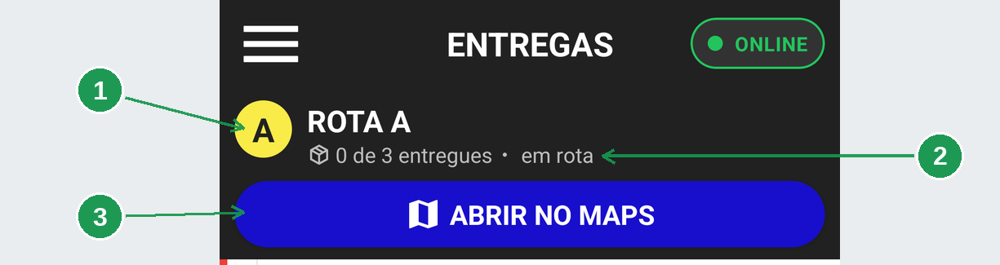

| Nº | Onde | O que é |
|----|------|---------|
| 1. | **A letra da rota** | Não mudou: é a mesma viagem. |
| 2. | **em rota** | A etiqueta que o despacho acendeu. Antes dela, a linha trazia só o contador. |
| 3. | **ABRIR NO MAPS** | Tomou o lugar do **INICIAR ROTA**, que não é mais necessário. |

Tocando na primeira parada, o entregador vê o que precisa para tocar a campainha: endereço com
complemento, telefone, os itens e — a linha que ele olha primeiro — **Cobrar R$**.

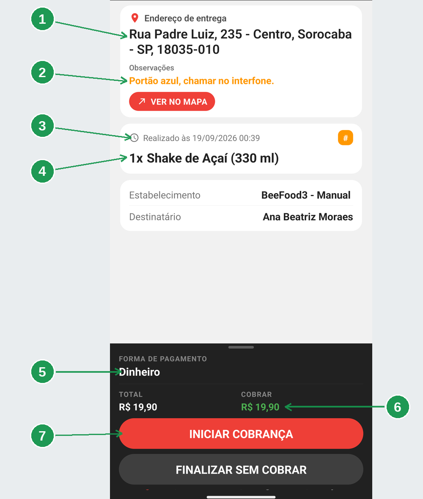

| Nº | Onde | O que é |
|----|------|---------|
| 1. | **Endereço de entrega** | O mesmo endereço do cartão do painel. |
| 2. | **Observações** | O que o cliente escreveu ao pedir. É o campo que evita a ligação na portaria. |
| 3. | **Realizado às** | A hora em que o pedido foi feito. |
| 4. | **Os itens** | O que ele está levando. Vale conferir a sacola aqui. |
| 5. | **FORMA DE PAGAMENTO** | A forma **combinada** no pedido — uma previsão, não uma decisão. |
| 6. | **COBRAR**, em verde | O que ele recebe na porta. É o número que importa. |
| 7. | **INICIAR COBRANÇA** | O caminho do momento 5. |

Detalhe de cada tela:
[Despachar a rota](../gestao-entregas-despachar/gestao-entregas-despachar.md) no painel, e
[App do entregador: as entregas do dia](../app-entregador-entregas-do-dia/app-entregador-entregas-do-dia.md)
no celular.

> **A ordem certa é cozinha pronta → entregador na porta → despachar.** O sistema deixa despachar
> pedido em preparo, e o resultado é um cliente avisado esperando por um pedido que ainda está no
> forno.

### Há um segundo caminho para chegar aqui

Em loja com balcão movimentado, quem despacha é o próprio entregador, lendo a etiqueta de código de
barras do cupom com a câmera do aplicativo. O efeito é idêntico ao do avião do painel — e é por isso
que **ler o código é despachar**, não conferir.

Está em
[Código de barras: ligar a etiqueta e ler o pedido](../app-entregador-codigo-barras/app-entregador-codigo-barras.md).

---

## 4. A rua

O entregador toca em **ABRIR NO MAPS** e o telefone assume. Do ponto de vista do sistema, é a fase
mais silenciosa do ciclo: nenhuma tela muda de estado, e a única coisa que acontece é o aplicativo
mandando a posição a cada poucos minutos.

No painel, essa posição vira o pino andando.

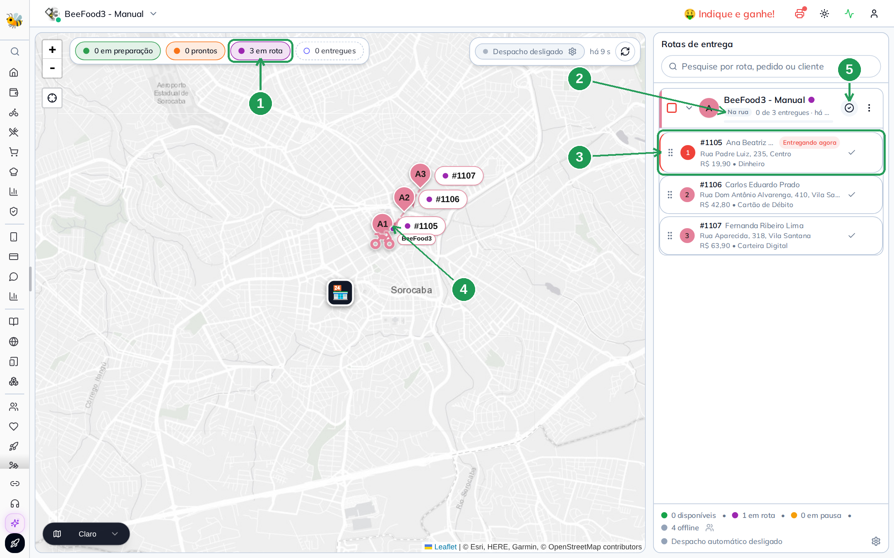

| Nº | Onde | O que é |
|----|------|---------|
| 1. | **3 em rota** | Os três pedidos saíram. O selo *prontos* zerou. |
| 2. | **Na rua** | A situação da rota. Antes era *Pronta para sair*. |
| 3. | **Entregando agora** | A parada que ele está fazendo **neste momento**. É sempre uma só. |
| 4. | **O pino, longe da loja** | A última posição que o aplicativo mandou. |
| 5. | **O botão de finalizar** | Tomou o lugar do avião: um clique baixa tudo o que estiver pendente e encerra a rota. |

É aqui que o segundo aviso de WhatsApp pode sair: o **entregador está próximo**, disparado quando a
distância até o cliente entra no raio configurado. Ele não sai sozinho — depende de uma configuração
que precisa ser **salva uma vez** por loja, e é a armadilha explicada em
[Avisos de WhatsApp da entrega](../gestao-entregas-avisos-whatsapp/gestao-entregas-avisos-whatsapp.md).

> **Pino parado não é entregador parado.** Antes de ligar para ele, olhe a bateria e a idade da
> última posição na lista de entregadores. Celular em economia de energia para de mandar
> localização, e o pino congela no último ponto.

---

## 5. A porta do cliente

O entregador chega, entrega, e cobra. No aplicativo, essas três coisas são **uma só ação**: registrar
o pagamento dá baixa na entrega. Não existe "cobrei mas não finalizei".

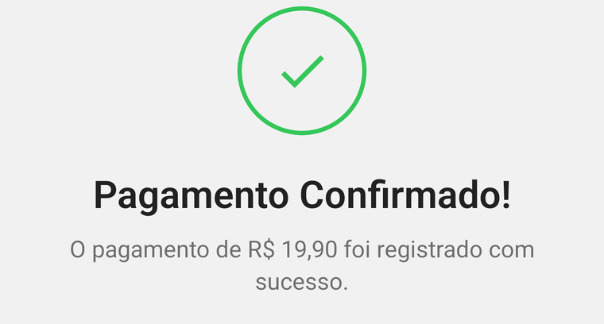

O valor da mensagem — **R$ 19,90** — é o mesmo da parada 1 no painel e do **Cobrar R$** dos detalhes.
Nenhum arredondamento no caminho.

O que ele fez, em quatro toques: **INICIAR COBRANÇA**, escolher a forma, conferir o troco, confirmar.
Se a conta for dividida entre duas pessoas, a soma das partes tem de fechar com o total — é a única
regra rígida da tela.

No painel, a parada muda de estado e o contador anda.

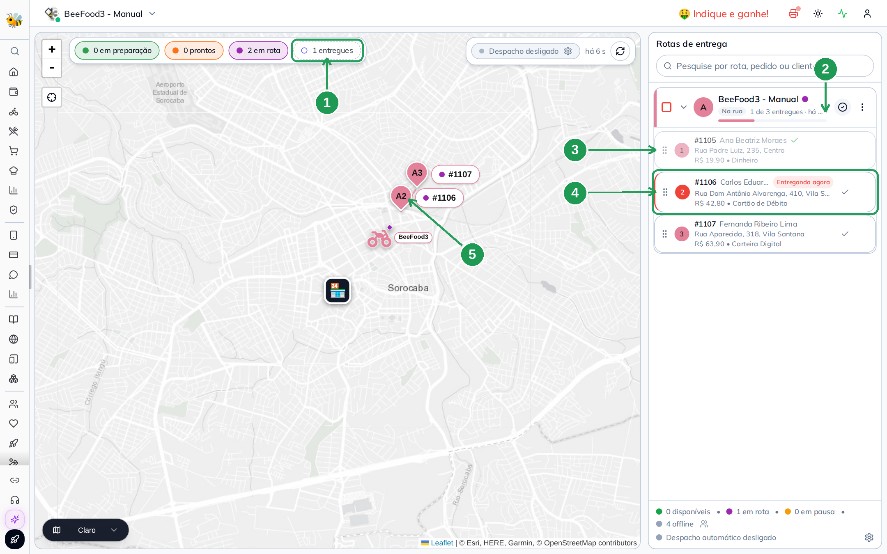

| Nº | Onde | O que mudou |
|----|------|-------------|
| 1. | **1 entregues** | O contador do dia subiu. |
| 2. | **1 de 3 entregues** | O andamento da rota. |
| 3. | **A parada 1** | Ficou apagada, com um visto verde. Ela não aceita mais baixa. |
| 4. | **Entregando agora** | Pulou para a parada 2 — e o mapa se reposicionou nela. |
| 5. | **O pino** | Andou junto: está na parada que ele está fazendo. |

Detalhe de cada tela:
[App do entregador: receber na porta](../app-entregador-cobranca/app-entregador-cobranca.md) no
celular, e
[Fechar a entrega no painel](../gestao-entregas-fechar-entrega/gestao-entregas-fechar-entrega.md) no
painel.

> **A baixa pode vir dos dois lados, e é melhor vir do celular.** O operador também consegue marcar a
> parada como entregue pelo painel — e deve, quando o entregador liga avisando que o aplicativo
> travou. Mas a baixa feita no celular é a que registra forma de pagamento e valor recebido. A do
> painel registra só que chegou.

### Quando o pedido é de plataforma

Pedido de iFood ou 99Food chega **já pago**: o **Cobrar R$** vem zerado e, no lugar do botão de
cobrança, aparece o botão de confirmação da plataforma. O entregador confirma ali, dentro do
aplicativo, e a entrega é dada por concluída no mesmo gesto.

Está em
[App do entregador: pedido de iFood e de 99Food](../app-entregador-marketplace/app-entregador-marketplace.md).

---

## 6. O fim da viagem

Concluída a terceira parada, o grupo da rota desaparece da lista do celular.

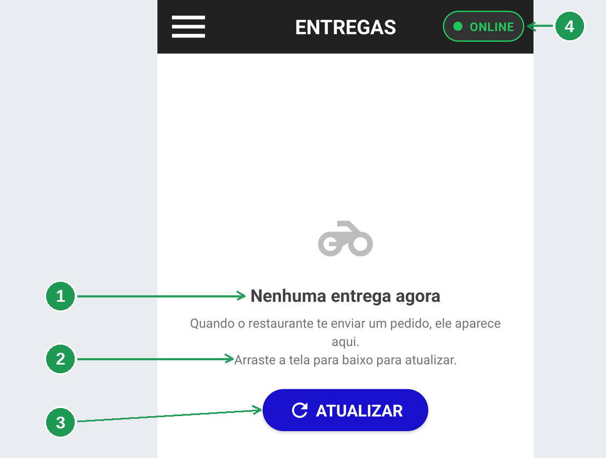

| Nº | Onde | O que é |
|----|------|---------|
| 1. | **Nenhuma entrega agora** | A lista vazia. O grupo da rota saiu com a última baixa. |
| 2. | **Arraste a tela para baixo para atualizar** | Como forçar uma releitura, se ele achar que falta algo. |
| 3. | **ATUALIZAR** | O mesmo, num botão. |
| 4. | **ONLINE** | Ele continua conectado. **Lista vazia com ONLINE aceso é fim de viagem**, não queda de internet. |

E no painel a rota **se encerra sozinha**. Não há um estado intermediário para o operador clicar: a
última baixa conclui a viagem na mesma operação, libera o entregador e tira a rota da lateral.

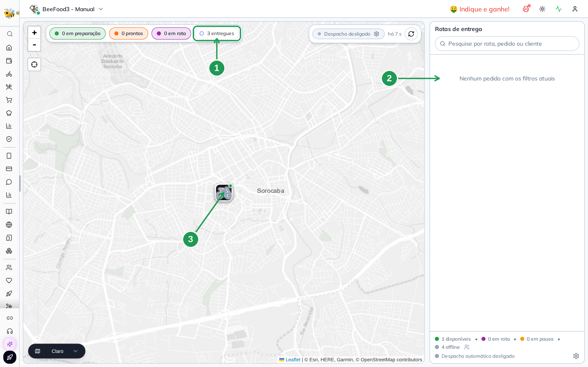

| Nº | Onde | O que é |
|----|------|---------|
| 1. | **3 entregues** | O contador do dia, com as três. |
| 2. | **Nenhum pedido com os filtros atuais** | A lateral vazia: nenhuma rota aberta, nenhum pedido esperando. |
| 3. | **O pino, de volta à loja** | O entregador voltou a contar como disponível. |

> **O botão de finalizar existe para o outro caso.** Quando o entregador volta e diz de boca que
> entregou tudo, o botão do cabeçalho **confirma todas as paradas pendentes de uma vez**, sem janela
> de confirmação e sem volta. Se houver uma parada duvidosa, dê baixa nas outras uma por uma e
> resolva a duvidosa por último.

A rota encerrada sai da tela, e é normal o operador achar que ela se perdeu. Ela não se perdeu — está
atrás do selo **entregues**, que nasce desligado.
[Fechar a entrega no painel](../gestao-entregas-fechar-entrega/gestao-entregas-fechar-entrega.md)
mostra onde achar o que já foi entregue.

---

## 7. O que sobra do dia

O ciclo acabou nas duas telas, e o que sobra é número.

No painel, o relatório **Desempenho › Delivery › Operação de Entrega** conta as três entregas do dia.

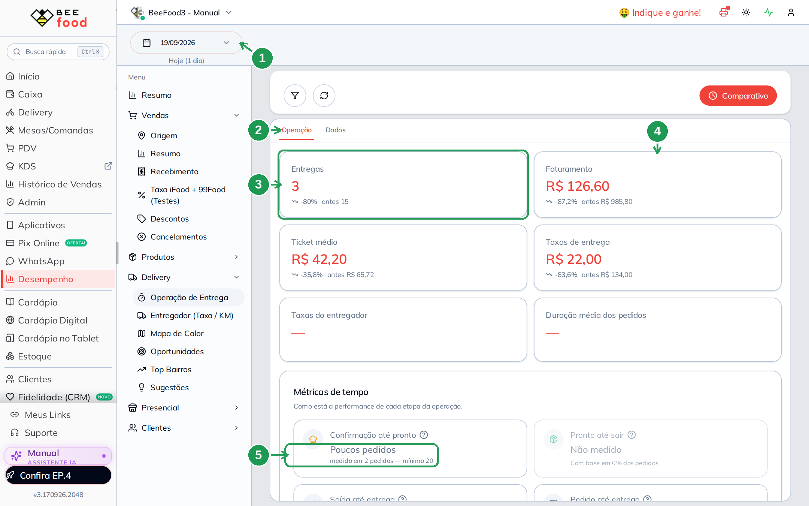

| Nº | Onde | O que é |
|----|------|---------|
| 1. | **O período** | O relatório é sempre de um intervalo. Aqui, *Hoje (1 dia)*. |
| 2. | **Operação** | A aba dos números do dia. A aba **Dados**, ao lado, tem uma linha por pedido. |
| 3. | **Entregas: 3** | As três da viagem. |
| 4. | **Faturamento: R$ 126,60** | A soma dos três pedidos — R$ 19,90 + R$ 42,80 + R$ 63,90. |
| 5. | **Poucos pedidos — mínimo 20** | As médias de tempo **não são calculadas** com três pedidos. Não é defeito: é o relatório se recusando a chamar de média o que é anedota. |

Duas leituras que economizam uma ligação para o suporte:

- **Taxas do entregador em branco** não é erro do relatório: é entregador sem valor por entrega
  configurado. Quem resolve é
  [Entregador (Taxa / KM)](../entregador-quanto-recebe/entregador-quanto-recebe.md).
- **Métricas de tempo pedem volume.** Um turno inteiro enche; três pedidos, não.

No celular, o **Histórico** guarda as mesmas três, agrupadas por dia, com a hora de cada baixa.

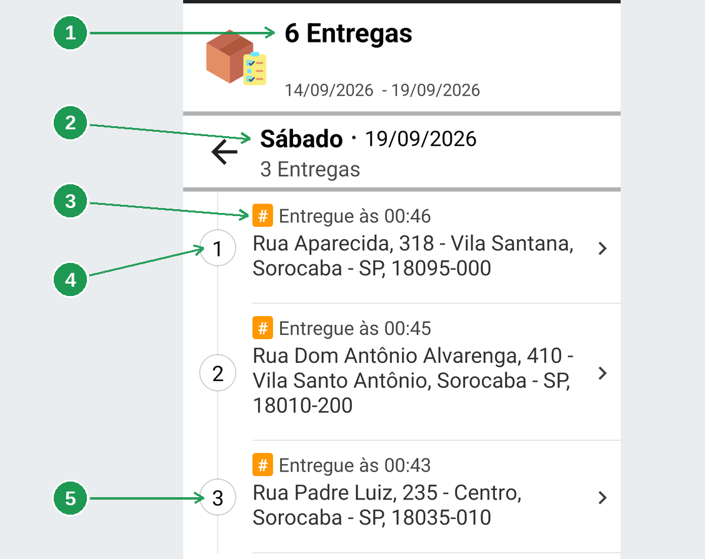

| Nº | Onde | O que é |
|----|------|---------|
| 1. | **6 Entregas** | O total do **período** mostrado no topo, não do dia. |
| 2. | **Sábado · 19/09/2026 · 3 Entregas** | O dia da viagem, aberto. |
| 3. | **Entregue às 00:46** | A hora da baixa. É a mesma hora que o relatório do painel usa para contar o dia. |
| 4. | **A entrega nº 1 do histórico** | É a **última** parada da rota. O histórico lista da mais recente para a mais antiga. |
| 5. | **A entrega nº 3 do histórico** | É a **primeira** parada da rota — a que abriu a viagem. |

As duas telas leem a **mesma data de entrega**, e é por isso que elas concordam. Se um dia elas
discordarem, é sinal de entrega que foi dada baixa depois da virada da meia-noite.

Os dois relatórios do módulo:
[Operação de Entrega](../relatorio-operacao-entrega/relatorio-operacao-entrega.md), que mede a
operação, e [Entregador (Taxa / KM)](../entregador-quanto-recebe/entregador-quanto-recebe.md), que
mede o quanto o entregador tem a receber.

---

## Como as duas telas se encontram

Vale saber disso antes da primeira ligação de suporte: **o número do pedido não aparece em tela
nenhuma do aplicativo**. O crachá laranja dos cartões e dos detalhes traz só o `#`. Número de pedido
é vocabulário do painel.

Então, quando o operador está com o painel aberto e o entregador com o celular na mão, o que os dois
usam para falar do mesmo pedido é:

| Os dois veem | Onde, no painel | Onde, no celular |
|---|---|---|
| **A letra da rota** | a bolinha no cabeçalho da rota | o círculo amarelo do grupo **ROTA** |
| **O endereço** | a segunda linha do cartão | a linha grande de cada parada |
| **O valor a receber** | a terceira linha do cartão | **Cobrar R$**, em verde |
| **A forma de pagamento** | ao lado do valor | **FORMA DE PAGAMENTO**, no rodapé |
| **A posição na rota** | o número da parada | o número do círculo na lista |
| **A hora da baixa** | a coluna de entrega do relatório | **Entregue às**, no Histórico |

A pergunta que funciona ao telefone não é *"você está com o 1107?"* — é **"você está na Rua
Aparecida, 318, cobrando R$ 63,90?"**.

---

## O mesmo ciclo, sem operador

Vale saber que existe um caminho em que os momentos 1 e 2 acontecem sozinhos: o **despacho
automático** agrupa os pedidos prontos e associa um entregador disponível, por conta própria, a cada
poucos minutos.

Ele **não despacha** — o clique do momento 3 continua sendo do operador — e ele só age em filial onde
alguém está com a tela de Gestão de Entregas aberta. As sete regras que ele usa estão em
[Despacho automático](../gestao-entregas-despacho-automatico/gestao-entregas-despacho-automatico.md).

---

## As cinco coisas que a operação de verdade ensina

1. **Pedido pronto não é pedido atribuído.** Se o entregador diz que não chegou nada, olhe a coluna
   de entregador antes de olhar o celular dele.
2. **Despachar avisa o cliente.** Não é um rótulo interno. Despachar cedo é mentir para o cliente.
3. **Cobrar é finalizar.** No celular não existe registrar pagamento e deixar a entrega aberta — e é
   por isso que o entregador deve cobrar **na porta**, não no carro.
4. **O botão MELHOR ROTA desfaz o trabalho do operador.** Se a ordem importa, combine antes.
5. **Pino parado quase sempre é bateria.** A lista de entregadores mostra a idade da última posição;
   ela responde a pergunta antes da ligação.

---

## Onde continuar

| Manual | O que cobre |
|--------|-------------|
| [Liberar o entregador](../gestao-entregas-liberar-entregador/gestao-entregas-liberar-entregador.md) | cadastro, acesso ao aplicativo e a etiqueta de código de barras |
| [Ler o mapa e o painel de entregas](../gestao-entregas-mapa-painel/gestao-entregas-mapa-painel.md) | o vocabulário da tela do operador |
| [Montar a rota](../gestao-entregas-montar-rota/gestao-entregas-montar-rota.md) | agrupar pedidos e escolher quem leva |
| [Despachar a rota](../gestao-entregas-despachar/gestao-entregas-despachar.md) | o clique que avisa o mundo, e o mapa ao vivo |
| [Fechar a entrega no painel](../gestao-entregas-fechar-entrega/gestao-entregas-fechar-entrega.md) | baixa por parada e encerramento da rota |
| [Despacho automático](../gestao-entregas-despacho-automatico/gestao-entregas-despacho-automatico.md) | as sete regras, e por que ele não despacha |
| [Avisos de WhatsApp da entrega](../gestao-entregas-avisos-whatsapp/gestao-entregas-avisos-whatsapp.md) | os quatro avisos, e o que liga o de proximidade |
| [App do entregador: instalar, entrar e ficar disponível](../app-entregador-entrar/app-entregador-entrar.md) | permissões, login e a pílula de disponibilidade |
| [App do entregador: as entregas do dia](../app-entregador-entregas-do-dia/app-entregador-entregas-do-dia.md) | a lista, os detalhes e o histórico |
| [App do entregador: chegar no endereço](../app-entregador-rota/app-entregador-rota.md) | ver no mapa, iniciar rota e melhor rota |
| [App do entregador: receber na porta](../app-entregador-cobranca/app-entregador-cobranca.md) | cobrança, divisão de conta e finalizar sem cobrar |
| [App do entregador: pedido de iFood e de 99Food](../app-entregador-marketplace/app-entregador-marketplace.md) | pedido de plataforma, já pago |
| [Código de barras](../app-entregador-codigo-barras/app-entregador-codigo-barras.md) | ligar a etiqueta no cupom e ler o pedido |
| [Operação de Entrega](../relatorio-operacao-entrega/relatorio-operacao-entrega.md) | o relatório que mede a operação do dia |
| [Entregador (Taxa / KM)](../entregador-quanto-recebe/entregador-quanto-recebe.md) | quanto o entregador tem a receber |

*Última atualização: setembro/2026 — BeeFood · Gestão de Entregas 2.0*
