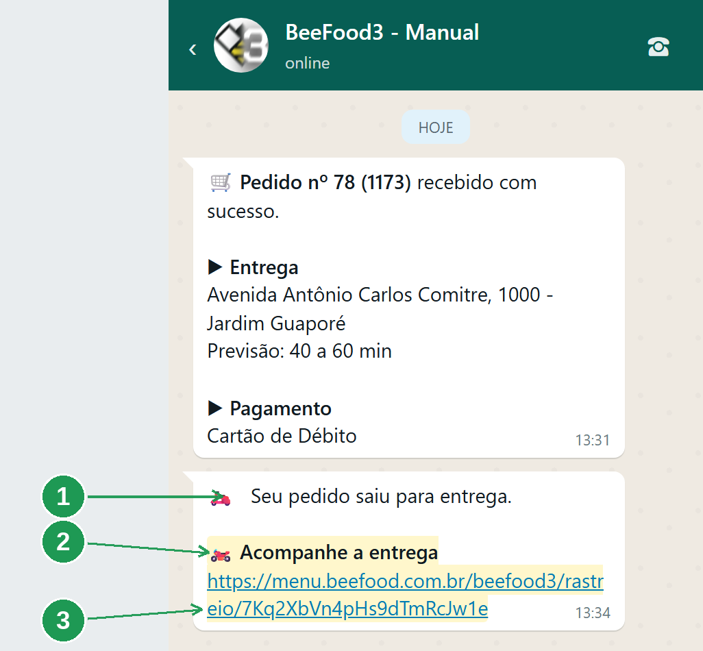
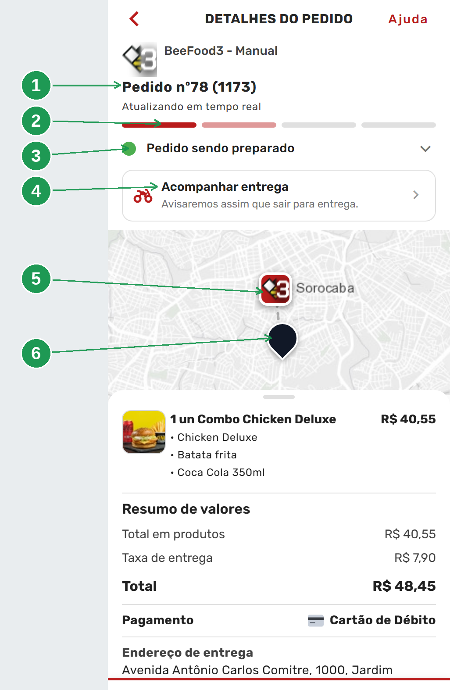
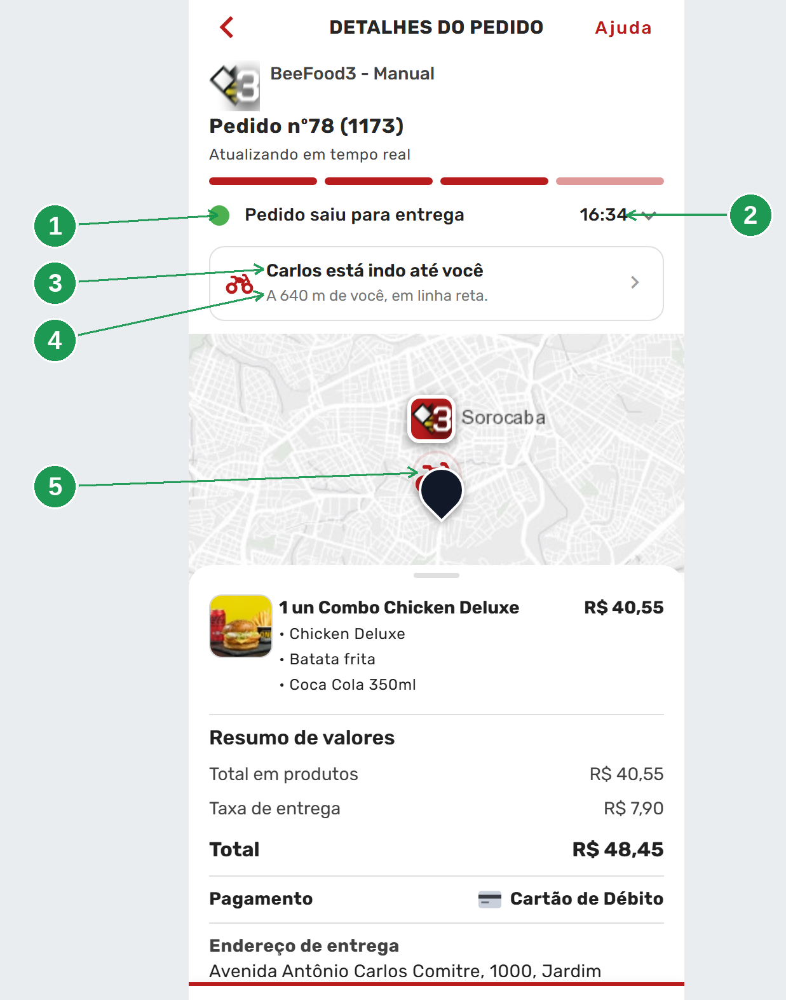
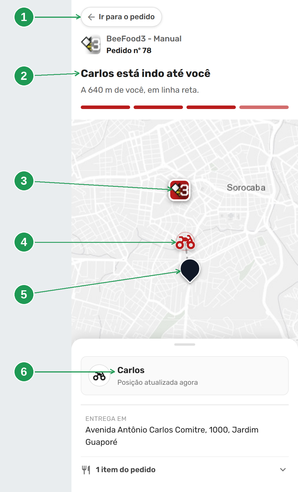
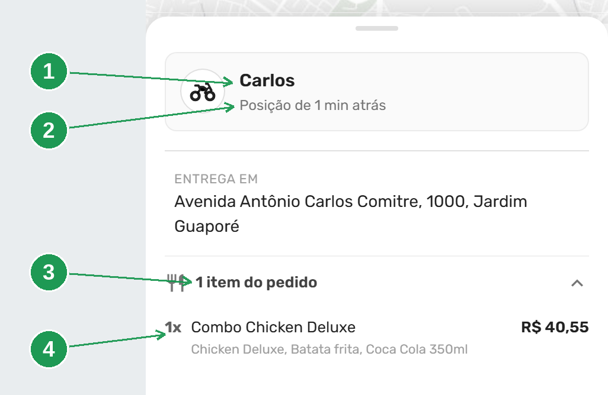
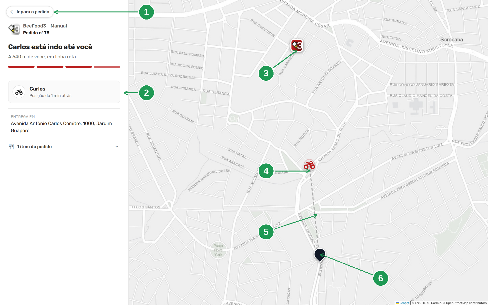
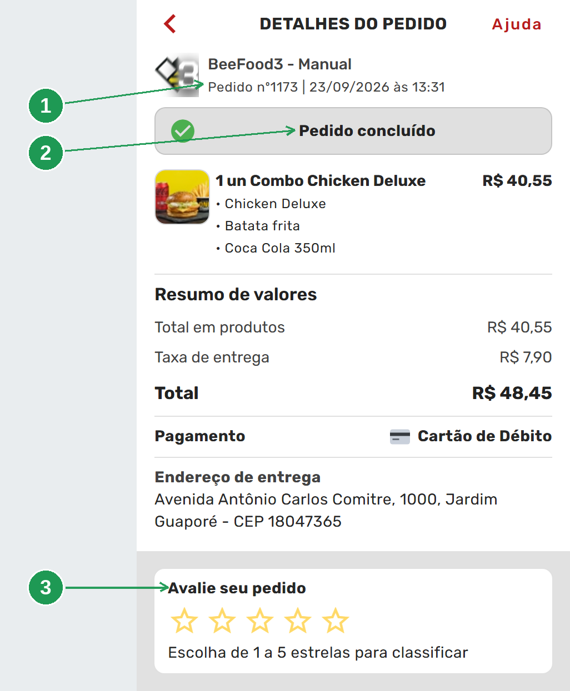

# O cliente acompanha a entrega no mapa

Quando o pedido sai com um motoboy de GPS ligado, o cliente recebe no WhatsApp um link que abre
um **mapa ao vivo**: o nome de quem está levando, a moto andando na rua e a distância até a casa
dele. É o *"onde está meu pedido?"* respondido sem ninguém atender telefone.

Este manual é para você, lojista. Ele mostra, tela por tela, **o que o seu cliente vê** enquanto
espera. Não é sobre montar rota, despachar ou dar baixa — isso tem manual próprio. O assunto aqui
é só um: o que chega do outro lado.

> As imagens têm **setas numeradas** (1, 2, 3…). Cada número indica o elemento correspondente na
> tela. Elas são de um pedido real, feito e entregue no cardápio de demonstração, com um
> entregador percorrendo o trajeto da loja até o endereço.

## Para que serve

A ligação *"quanto tempo falta?"* é a mais cara do delivery. Ela chega na hora do pico, ocupa
quem deveria estar montando pedido e quase sempre termina com um "já está saindo" que ninguém
consegue confirmar. O acompanhamento troca essa conversa por uma tela: **o cliente se serve da
informação sozinho**, e ela é verdadeira.

Três coisas que isso muda na sua loja:

- **Menos ligação e menos mensagem.** O cliente que vê a moto se mexendo não pergunta.
- **Reclamação no lugar certo.** Quando a entrega atrasa de verdade, o cliente vê *por quê* —
  outra parada antes da dele, ou a moto ainda parada na loja.
- **Percepção de loja grande.** Rastreio de pedido no mapa é o que ele conhece dos aplicativos
  gigantes. Aqui ele vê isso com a **sua** marca e a **sua** logo no mapa.

**Você não precisa configurar nada.** Nenhum campo novo, nenhuma tela nova, nenhuma cobrança por
mensagem. O link vai junto do aviso de *saiu para entrega* que a sua loja já mandava.

## Antes de começar

O recurso é automático, mas ele depende de quatro coisas que já existem na sua operação:

1. **Aplicativo do entregador aberto e com GPS liberado.** É a condição que liga o recurso: sem
   posição recente do celular dele, não há link. As outras três só melhoram o que o cliente vê.
2. **Nome do entregador cadastrado como nome de gente.** É o que o cliente lê na tela.
3. **Endereço do cliente com localização no mapa.** Sem isso o mapa ainda abre (mostra a loja e a
   moto), mas somem o pino de destino e a distância.
4. **A notificação "Pedido saiu para entrega" ligada** no WhatsApp. O link é anexado a ela; com o
   aviso desligado não há mensagem para carregar o link.

---

## 1. O link que o cliente recebe no WhatsApp

O cliente já recebia a mensagem de *saiu para entrega* (1). O que mudou é o bloco no fim dela:
o título **Acompanhe a entrega** (2) e o endereço do acompanhamento, terminado num código só
daquele pedido (3).

| Nº | Onde | O que é |
|----|------|---------|
| 1. | **Seu pedido saiu para entrega.** | Este texto é **seu**: sai da sua configuração em WhatsApp → Notificações. Se você reescreveu essa mensagem, é a sua versão que aparece |
| 2. | **🏍️ Acompanhe a entrega** | Acrescentado pelo sistema, automaticamente. Você não digita nem configura |
| 3. | O endereço, terminado em `.../rastreio/` + código | O código tem **22 caracteres** e vale só para este pedido. Ninguém adivinha o link de outro cliente |

Três coisas que valem o seu conhecimento:

- **O link é secreto por ser sorteado, não por ter senha.** O cliente abre sem fazer login, e é de
  propósito: pedir cadastro para ver onde está a moto faria metade deles desistir. A proteção é o
  código imprevisível — e a página é marcada para **não** ser indexada por buscador, então ela não
  aparece no Google.
- **O link expira.** Ele vale até **duas horas depois da entrega** — tempo de sobra para o cliente
  conferir, e curto o bastante para o endereço dele não ficar exposto para sempre.
- **O link não substitui o cardápio.** Se o cliente apagou a mensagem, trocou de celular ou está
  no computador, ele chega na mesma tela por outro caminho — é a próxima seção.

### Quando o link aparece, e quando não aparece

O link **só entra na mensagem se o celular do entregador tiver enviado posição nos últimos 15
minutos**. Não basta a rota existir: aparelho sem sinal, sem bateria ou com o aplicativo fechado
não gera link, e o cliente recebe a mensagem de sempre.

Isso é proposital. Um link que abre um mapa parado é **pior** do que não mandar link nenhum: sua
loja sai de *"não oferece acompanhamento"* para *"oferece acompanhamento quebrado"*, e o cliente
liga para reclamar exatamente do recurso que deveria evitar a ligação.

Se o entregador perder o sinal **depois** de o cliente já ter aberto a tela, o mapa não finge:
ele tira a moto e escreve *"Localização indisponível no momento."*

---

## 2. O cliente não depende do WhatsApp

O link é o caminho mais curto, mas não é o único. **Todo pedido de entrega em andamento mostra o
acompanhamento dentro do próprio cardápio digital**, em *Pedidos* → o pedido dele.

É o mesmo mapa e a mesma informação, sem precisar da mensagem. Vale para quem apagou a conversa,
trocou de aparelho ou está no computador.

Duas fronteiras, que evitam pergunta no suporte:

- **Só pedido de entrega.** Pedido de retirada no balcão e pedido de mesa não têm acompanhamento —
  não há para onde ir no mapa.
- **Só enquanto o pedido está em andamento.** Depois da baixa, a linha de acompanhamento sai da
  tela do pedido (o link do WhatsApp ainda funciona pelas duas horas).

As telas das próximas seções são exatamente essa segunda porta.

---

## 3. Pedido aceito, comida ainda na cozinha

Assim que você aceita o pedido, o cliente já vê o mapa — e a tela **não finge** que existe
entregador. De cima para baixo: o número do pedido (1), a barra das quatro etapas (2), o estado
atual (3), a linha de acompanhamento com o aviso honesto (4) e o mapa já com dois pontos, a sua
loja (5) e o endereço dele (6).

| Nº | Onde | O que é |
|----|------|---------|
| 1. | **Pedido nº78 (1173)** | O número que ele ouve de você ao telefone. O primeiro é o número do dia; o entre parênteses é o interno |
| 2. | A barra de progresso | Quatro etapas: enviado ao restaurante, em preparo, pronto aguardando o entregador, saiu para entrega. As já cumpridas ficam cheias, **a atual pisca** e as futuras ficam cinzas. Aqui: a primeira cheia e a segunda piscando |
| 3. | **Pedido sendo preparado** | O estado, escrito. A seta para baixo abre a linha do tempo: as etapas **já cumpridas**, com a hora de cada uma |
| 4. | **Acompanhar entrega** | Ainda não é um botão: é o aviso *"Avisaremos assim que sair para entrega."* |
| 5. | O pino com a sua logo | A loja. Se a logo não carregar, aparece um ícone genérico de loja |
| 6. | O pino escuro | O endereço do cliente |

Embaixo do mapa fica a folha branca com o resumo: itens, total, forma de pagamento e endereço.

> **Por que já mostrar o mapa antes de ter motoboy?** Porque o cliente que abre o pedido quer ver
> onde a comida está, e tela sem mapa nessa hora parece defeito. Mostrando a loja desde o começo,
> o entregador só **aparece** nela depois — a tela nunca muda de formato na cara dele.

**A tela se atualiza sozinha.** A frase *Atualizando em tempo real*, embaixo do número do pedido,
não é enfeite: o estado, a barra e o mapa mudam juntos, sem o cliente puxar nem recarregar. Não
existe botão de atualizar, e não precisa ter.

---

## 4. Saiu para entrega: o motoboy aparece

Quando você despacha a rota e o entregador está com o GPS ativo, três coisas mudam na tela do
cliente sem ele fazer nada: o estado vira **Pedido saiu para entrega** (1) com a hora ao lado (2),
a linha de acompanhamento passa a dizer o **primeiro nome** de quem está levando (3) com a
distância embaixo (4), e no mapa surge a **moto** (5) — que anda.

| Nº | Onde | O que é |
|----|------|---------|
| 1. | **Pedido saiu para entrega** | A **quarta e última** etapa é a que está piscando agora — as três anteriores já ficaram cheias. A partir daqui a linha de acompanhamento vira clicável |
| 2. | **16:34** | A hora do despacho, ao lado do estado |
| 3. | **Carlos está indo até você** | Só o **primeiro nome** do entregador, como está no cadastro de funcionário. É o bastante para o cliente saber quem vai bater na porta, sem expor o funcionário |
| 4. | **A 640 m de você, em linha reta.** | A distância, arredondada de dez em dez metros. Acima de um quilômetro ela vira *"A 1,2 km de você, em linha reta."* |
| 5. | O ícone da moto | Entre a loja e o destino, com um anel pulsando. Ele se move algumas vezes por minuto |

> **Cadastre o nome do entregador direito.** O que estiver no cadastro do funcionário é o que o
> cliente lê. *"Funcionário 1"* aparece como **Funcionário 1 está indo até você**. Quando o
> pedido sai por integradora e não há entregador, a frase cai para *"Seu pedido está a caminho"* —
> a tela nunca fica sem texto.

### Por que a tela não diz "chega em 8 minutos"

Porque não saberíamos. A distância mostrada é **em linha reta**, e é verdadeira; um tempo estimado
exigiria rotear por ruas, trânsito e paradas. Um "8 minutos" que vira 25 transforma o
acompanhamento numa promessa quebrada — e gera exatamente a ligação que o recurso deveria evitar.
O cliente que vê a moto se mexendo já tem a informação que importa, e essa informação está certa.

**Quando o entregador tem outra parada antes**, a tela diz isso em vez de inventar: *"Você é a 2ª
de 3 paradas desta viagem."* É a resposta pronta para o cliente que reclama que a moto está indo
para o lado contrário.

---

## 5. A tela cheia do acompanhamento

Tocando na linha *"Carlos está indo até você"*, o cliente abre o mapa em tela cheia. **É a mesma
tela que o link do WhatsApp abre direto** — não existem duas páginas para você conhecer. Ela tem
três faixas: em cima o botão de volta (1) e o cabeçalho (2), no meio o mapa com a loja (3), a moto
(4) e o endereço do cliente (5), e embaixo a folha deslizante (6).

| Nº | Onde | O que é |
|----|------|---------|
| 1. | **Ir para o pedido** | Leva ao pedido completo. O **voltar do navegador** (e o botão do Android) faz o mesmo: fecha o mapa e devolve o cliente ao pedido, em vez de tirá-lo do site |
| 2. | O cabeçalho | Sua logo, o nome da loja, o número do pedido, o estado, a distância e a barra de etapas |
| 3. | O pino com a sua logo | A loja |
| 4. | O ícone da moto | O entregador, na posição mais recente |
| 5. | O pino escuro | O endereço do cliente |
| 6. | A folha deslizante | Nome do entregador, há quanto tempo a posição foi capturada, endereço de entrega e itens |

No celular o mapa fica no meio e a folha sobe de baixo. No lugar de estimar chegada, a tela sempre
diz **quando** aquela posição foi capturada: *Posição atualizada agora* quando ela tem menos de um
minuto, e *Posição de 3 min atrás* quando o sinal atrasou. Assim o cliente vê o atraso do sinal,
em vez de acreditar num ponto velho.

### Com que frequência isso atualiza

Quem manda no ritmo é o servidor: ele diz à tela quando voltar a consultar, e a tela **nunca**
consulta em intervalo menor que 5 segundos. Na prática, enquanto o entregador está na rua, isso dá
uma leitura a cada dez ou vinte segundos — o cliente vê a moto se mexer algumas vezes por minuto.

Quando o cliente troca de aba ou bloqueia o celular, a tela **para de consultar**, e volta a
atualizar no instante em que ele retorna. Poupa bateria do aparelho dele sem tirar nada da
experiência.

### O pedido dentro do acompanhamento

A linha **1 item do pedido** (3) abre a lista completa, com complementos e valor (4). Acima dela, o
cartão do entregador (1) com o horário da última posição (2).

| Nº | Onde | O que é |
|----|------|---------|
| 1. | **Carlos** | O primeiro nome do entregador, o mesmo do título |
| 2. | **Posição de 1 min atrás** | Quando aquela posição foi capturada. Com menos de um minuto, a frase é *Posição atualizada agora* |
| 3. | **1 item do pedido** | Abre e fecha a lista. Com mais de um item, o texto vira *3 itens do pedido* |
| 4. | O item | Quantidade, nome, os complementos escolhidos e o valor |

É para o cliente conferir se está tudo certo **antes** de o motoboy chegar — não depois, na porta.

### No computador

No computador a mesma tela vira duas colunas: à esquerda o botão de volta (1), as informações e o
cartão do entregador (2); à direita o mapa ocupando o resto. Aqui dá para ver o trajeto inteiro —
a loja no alto (3), a moto descendo (4) e o destino mais abaixo (6), ligados pelo traço pontilhado
(5).

| Nº | Onde | O que é |
|----|------|---------|
| 1. | **Ir para o pedido** | O mesmo botão do celular |
| 2. | O cartão do entregador | Nome e horário da última posição — aqui, *Posição de 1 min atrás* |
| 3. | O pino da loja | Com a sua logo |
| 4. | O ícone da moto | A posição mais recente do entregador |
| 5. | O traço pontilhado | Só a **referência de distância** entre a moto e o destino. Não é o caminho que ela vai fazer |
| 6. | O pino escuro | O endereço do cliente |

**É a mesma página, o mesmo link.** Não há "versão para PC" para você manter nem divulgar.

---

## 6. Pedido entregue

Na baixa da entrega a tela fecha o ciclo: o cabeçalho troca a barra de etapas pela data e hora do
pedido (1), o estado vira **Pedido concluído** (2) e a avaliação aparece logo abaixo (3).

| Nº | Onde | O que é |
|----|------|---------|
| 1. | **Pedido nº1173 \| 23/09/2026 às 13:31** | Sai a barra de progresso, entra a data e a hora do pedido. Aqui o número é o **interno** (o 1173 que antes vinha entre parênteses), sem o número do dia |
| 2. | **Pedido concluído** | A faixa cinza com o certo verde. Em pedido cancelado, ela fica vermelha e diz *Pedido cancelado* |
| 3. | **Avalie seu pedido** | As cinco estrelas. Depois de avaliado, o texto vira *Pedido avaliado* |

**O que some é o entregador.** Nada de pino parado na porta do cliente por horas. O resumo do
pedido permanece, o link do WhatsApp continua funcionando por mais duas horas e depois expira.

---

## 7. O que a tela escreve em cada situação

Esta é a tabela para consultar quando um cliente ligar lendo uma frase para você. Tudo que a tela
mostra sai daqui — ela nunca fica sem texto.

| Situação | A frase de cima | A linha de baixo |
|----------|-----------------|------------------|
| Em preparo | *Seu pedido está sendo preparado* | *Avisaremos assim que sair para entrega.* |
| Pronto, esperando o entregador | *Pedido pronto, aguardando o entregador* | — |
| Saiu, mas tem outra parada antes | *Carlos saiu para entrega* | *Você é a 2ª de 3 paradas desta viagem.* |
| Vindo para o cliente | *Carlos está indo até você* | *A 640 m de você, em linha reta.* |
| Celular do entregador sem enviar posição | *Seu pedido está a caminho* | *Localização indisponível no momento.* |
| Entregue | *Pedido entregue às 16:47* | — |
| Link expirado | *Este link expirou* | — |
| Link que o sistema não reconhece mais | *Esse pedido não tem rastreio* | *O link pode ter expirado, ou esta entrega não está sendo acompanhada.* |

Onde o nome aparece, é o **primeiro nome** do cadastro do funcionário. Sem entregador vinculado,
as frases caem para *Seu pedido saiu para entrega* e *Seu pedido está a caminho*.

Quando o mapa não pode ser desenhado, o lugar dele mostra o motivo em uma linha: *O mapa aparece
quando o pedido sair para entrega.*, *Entrega concluída.* ou *Este link expirou.*

---

## Perguntas frequentes

**O cliente diz que não recebeu o link.**
O entregador não estava enviando GPS na hora em que a mensagem saiu — aplicativo fechado, sem
sinal ou sem bateria. O link só é anexado com posição dos últimos 15 minutos. O cliente ainda
acompanha entrando em *Pedidos* no cardápio.

**A tela dele diz que a localização está indisponível.**
O celular do entregador parou de mandar posição. Preferimos avisar a mostrar um ponto
desatualizado — o cliente confia mais numa tela que admite o que não sabe.

**O cliente reclama que a moto está indo para o lado contrário.**
O entregador tem outra parada antes. Quando é isso, a própria tela escreve *"Você é a 2ª de 3
paradas desta viagem."*

**Quanto tempo falta?**
A tela não estima horário, de propósito (seção 4). Ela mostra distância em linha reta, que é um
número verdadeiro.

**O link parou de abrir.**
Ele expira duas horas depois da entrega. Depois disso a tela diz *Este link expirou* ou *Esse
pedido não tem rastreio*, e não mostra mais nada.

**Apareceu "Funcionário" no lugar do nome.**
O cadastro do funcionário está sem nome de pessoa. Corrija em Cadastros → Funcionários e os
próximos pedidos já saem certos.

**Pedido de retirada tem acompanhamento?**
Não. Só pedido de entrega — e só enquanto ele está em andamento.

**O cliente pode mandar esse link para outra pessoa?**
Pode, e vale lembrar dele: o link mostra o endereço de entrega. Ele é secreto por ser sorteado,
não por ter senha.

**Isso consome pacote de dados do cliente?**
Pouco: a tela consulta o servidor a cada dez ou vinte segundos e para de consultar quando ele
troca de aba ou bloqueia o celular.

**Preciso ligar isso em algum lugar?**
Não. Não há campo novo. Só garanta os quatro itens da seção *Antes de começar*.

---

## Onde continuar

| Manual | O que cobre |
|--------|-------------|
| [Avisos de WhatsApp da entrega](../gestao-entregas-avisos-whatsapp/gestao-entregas-avisos-whatsapp.md) | A mensagem de *saiu para entrega* que carrega o link, e o aviso de *entregador próximo* |
| [Despachar a rota e acompanhar no mapa](../gestao-entregas-despachar/gestao-entregas-despachar.md) | O clique que faz o link ser enviado |
| [Liberar o entregador](../gestao-entregas-liberar-entregador/gestao-entregas-liberar-entregador.md) | O cadastro de onde sai o nome que o cliente lê |
| [App: instalar, entrar e ficar disponível](../app-entregador-entrar/app-entregador-entrar.md) | O aplicativo e a permissão de GPS, sem os quais não há link |
| [Fechar a entrega no painel](../gestao-entregas-fechar-entrega/gestao-entregas-fechar-entrega.md) | A baixa que fecha o ciclo e tira o entregador do mapa |

*Última atualização: setembro/2026 — BeeFood · Gestão de Entregas 2.0*
