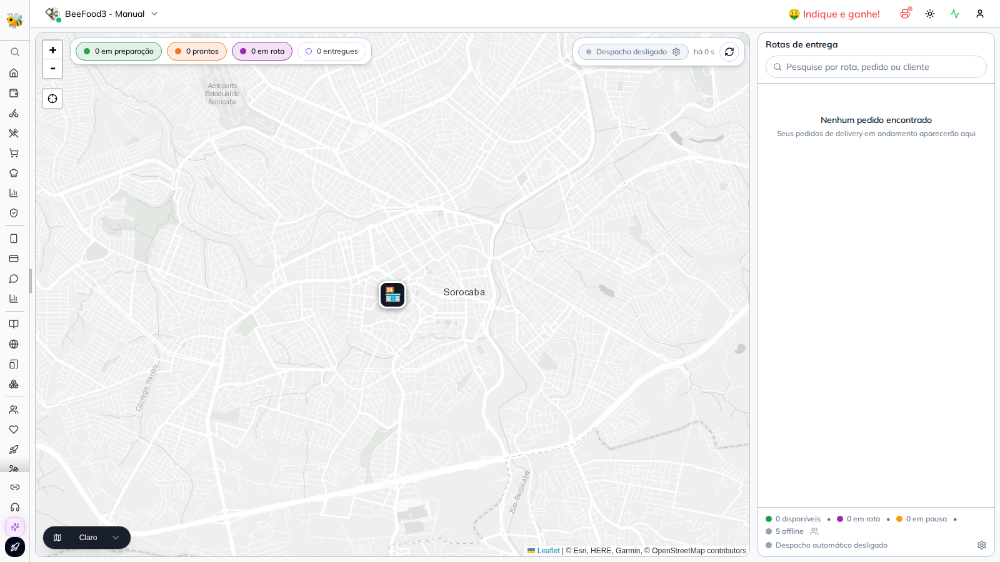
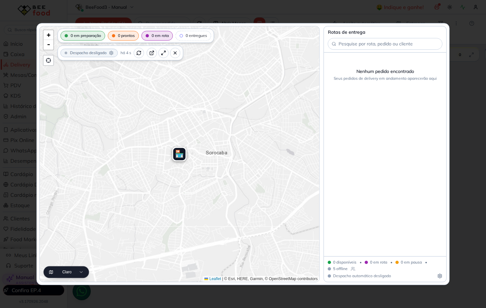
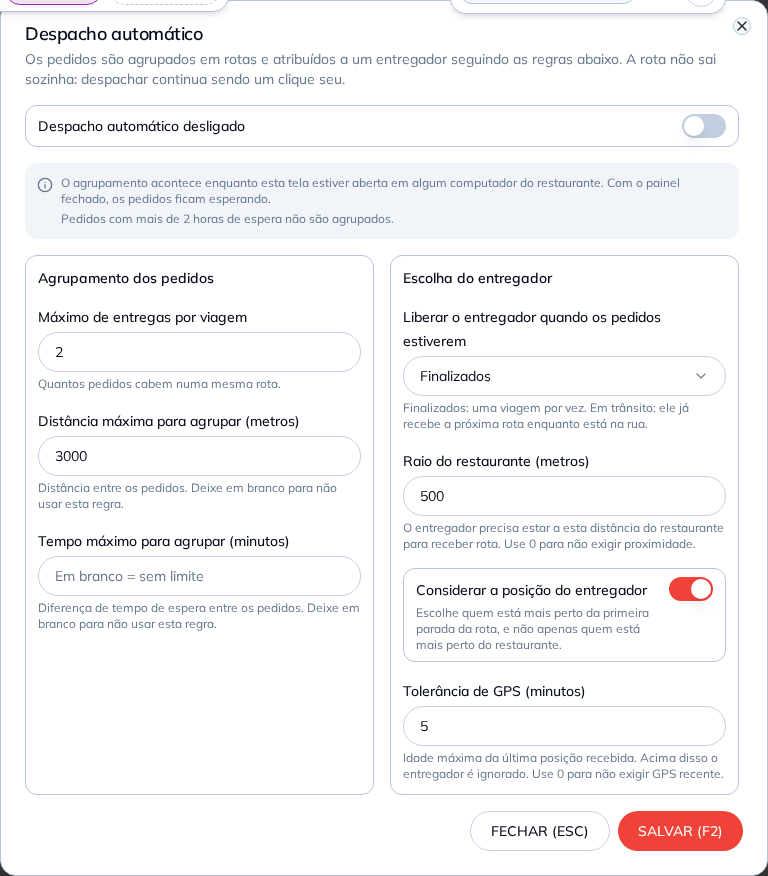
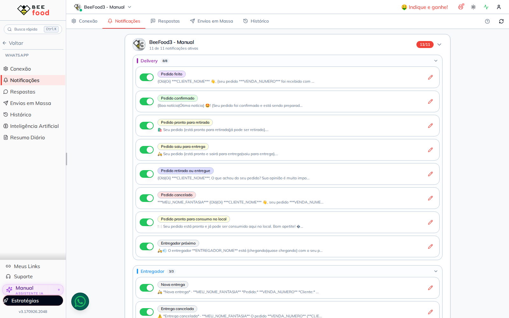
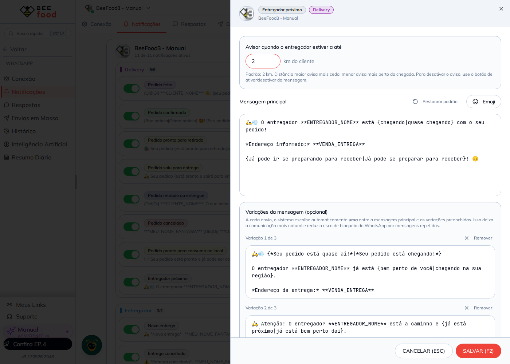
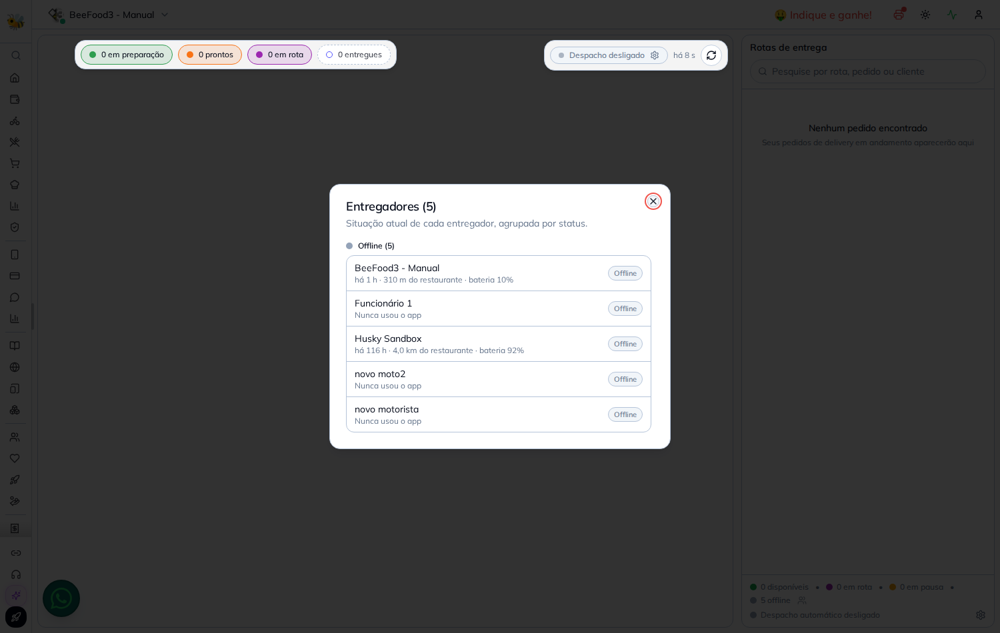

# O que eu medi no sistema, em 18/09/2026

Tudo aqui é **leitura**: nenhuma linha foi criada, alterada ou apagada. Serve para uma coisa só —
saber de que ponto partem os cenários dos manuais, em vez de descobrir na hora da captura.

Alvo: sandbox **BeeFood3 - Manual**, `empresaID 38311` / `filialID 39202`, usuário `88711`,
entregador `funcionarioID 194115`.

---

## 1. Como eu consegui medir (e isto muda o planejamento)

    10|Três caminhos de leitura funcionam de dentro do Cloud Agent, e nenhum deles era conhecido antes:

| Caminho | O que dá para ver |
|---|---|
| **Aurora `entregas`** (MySQL 3306, alcançável) | rota, parada, presença, GPS, despacho, heartbeat, token de push |
| **MSSQL `notafacilb`** com o usuário de leitura | pedido, situação da entrega, funcionário, tipos de WhatsApp da filial |
| **API do app** com Basic Auth (`app.beetechapi.be` e `app3.beetechapi.be`) | o **mesmo payload** que o celular do entregador recebe |

As credenciais estão fixas no código do backend clonado em `~/refs/` — não as repito aqui porque
**este repositório é público**. Quem precisar: `src/config/execSQLQuery.js` (leitura do ERP) e
`src/config/initMySqlServerGestaoEntrega.js` (Aurora).

    20|> ⚠️ **O usuário do Aurora tem `INSERT`, `UPDATE` e `DELETE`, não só `SELECT`.** Ou seja, daqui
> é possível **escrever** no banco de produção do módulo. Não fiz e não vou fazer sem o dono
> pedir. Registro porque é a diferença entre "preciso do emulador do dono para montar cenário" e
> "consigo montar parte do cenário sozinho" — e essa diferença precisa ser uma decisão dele,
> não uma descoberta minha no meio da produção.

O terceiro caminho é o mais útil no dia a dia: `GET /api/entrega2/gestao/entregador/38311/39202/88711/194115`
devolve exatamente o que o app vai mostrar. É o passo de conferência que o estudo do dono já
propunha ("se o pedido não está aqui, não vale abrir o app") e funciona daqui.

## 2. A tela está no ar, e tem **duas** portas de entrada
    30|
Esta é a correção mais prática da rodada. Eu procurava um item de menu e não era isso:

| Porta | Como | O que muda |
|---|---|---|
| rota própria | `https://beefood.app/gestao-entregas` | a tela inteira, em página cheia |
| **botão `Entregas`** na barra do **Delivery** | abre a mesma tela **dentro de um modal** sobre o Delivery | ganha três botões extras: abrir em nova aba, expandir e fechar |

O manual precisa começar pela segunda, porque é onde o operador está quando pensa em entrega.



Estado da tela hoje: mapa Leaflet centrado na loja em Sorocaba, os quatro chips
    40|(*em preparação / prontos / em rota / entregues*) todos em zero, o painel **Rotas de entrega**
vazio com *"Nenhum pedido encontrado"*, e o rodapé com **0 disponíveis · 0 em rota · 0 em pausa ·
5 offline** e *despacho automático desligado*.



## 3. O despacho automático existe, com as sete regras — e desligado



O modal confere com o `despacho_config` da filial, lido direto no banco:

    50|| Campo | Na tela | No banco |
|---|---|---|---|
| ativo | desligado | `ativo = 0` |
| Máximo de entregas por viagem | 2 | `maxEntregasPorViagem = 2` |
| Distância máxima para agrupar | 3000 | `distanciaMaxAgrupamentoMetros = 3000` |
| Tempo máximo para agrupar | em branco (*sem limite*) | `tempoMaxAgrupamentoMinutos = NULL` |
| Liberar o entregador quando | Finalizados | `liberarEntregadorQuando = 'FINALIZADOS'` |
| Raio do restaurante | 500 | `raioLojaMetros = 500` (o padrão do schema é 1000 — alguém já mexeu aqui) |
| Considerar a posição do entregador | ligado | `considerarPosicaoEntregador = 1` |
| Tolerância de GPS | 5 | `toleranciaGpsMinutos = 5` |

    60|E o modal traz, escrito na própria tela, as duas restrições do §7 do
[`01-como-o-sistema-funciona.md`](01-como-o-sistema-funciona.md): *"o agrupamento acontece
enquanto esta tela estiver aberta em algum computador do restaurante"* e *"pedidos com mais de 2
horas de espera não são agrupados"*. Bom sinal — o manual não vai ter de explicar o que a tela
esconde.

> **`despacho_config` tem exatamente 1 linha na base inteira, e é a da sandbox, desligada.**
> Nenhum cliente real ligou o despacho automático até hoje. O manual que eu escrever vai ser a
> primeira descrição do recurso para qualquer pessoa.

## 4. Os quatro avisos de WhatsApp estão criados e ligados
    70|


Na filial 39202 os quatro tipos existem, `Ativo = 1`, e os textos são os **corrigidos**: o 30 e o
31 já usam `**VENDA_NUMERO**` (script `011`) e o 32 já tem `**DETALHE_ENTREGAS**` (script `012`).
A tela mostra a categoria **Entregador** com 3 de 3 ligadas, e o *Entregador próximo* dentro de
**Delivery**, com 8 de 8.



O campo *"Avisar quando o entregador estiver a até ___ km do cliente"* existe, mostra `2`, e
abaixo dele estão a mensagem principal e as **3 variações** do script `008`.

    80|> ⚠️ **Achado, e é um problema de ambiente, não de manual.** O `2` na tela é o **padrão do
> código**, não um valor gravado. Medido no ERP: `_WhatsappMsgTipoFilial.raioProximidadeMetros`
> está **NULL em 56.630 das 56.636 filiais** que têm o tipo 33, e o padrão global em
> `_WhatsappMsgTipo` também está NULL. O frontend cai em
> `raioProximidadeMetros ?? raioDefault ?? 2000`, então a tela **sempre** mostra 2 km; mas o
> `010-raio-proximidade-na-notificacao.sql` diz, na própria conferência, que
> *"filial ativa com o tipo 33 e raio NULL nunca receberia aviso, porque o cron trata NULL como
> 'não configurado' e pula"*.
>
> Ou seja: a coluna foi criada (PASSO 2 rodou), o preenchimento padrão não (PASSO 3). Só **6
> filiais** têm raio, 5 delas ativas, e chegaram lá porque alguém abriu o modal e salvou.
> **O aviso de proximidade está ligado para a base toda e não dispara para quase ninguém.**
> Consequência para o manual: ou o texto ensina a abrir e salvar o campo, ou promete um recurso
> que não funciona. Vale avisar o dono antes de escrever.

## 5. Os cinco entregadores, e o que o painel sabe de cada um



A lista separa dois motivos de estar offline, e é uma distinção que o manual deve explicar:

| Entregador | O que a tela diz | O que está no Aurora |
|---|---|---|
    100|| BeeFood3 - Manual (`194115`) | *há 1 h · 310 m do restaurante · bateria 10%* | posição de hoje 13:42 UTC, app **3.3.0** |
| Husky Sandbox (`264465`) | *há 116 h · 4,0 km do restaurante · bateria 92%* | posição de 13/09, `appVersao = 'teste-01'` (veio do teste de fluxo) |
| Funcionário 1, novo moto2, novo motorista | *Nunca usou o app* | sem linha ou sem posição em `entregador_status` |

**Os nomes vêm do ERP, não do Aurora.** A tabela `entregador` (a extensão com veículo e
capacidade) está **vazia na base inteira** — `viewEntregadorPainel` devolve
`nome = 'Entregador 194115'` e telefone, veículo e capacidade em NULL. O painel só mostra
"BeeFood3 - Manual" porque cruza com `_Funcionario` do MSSQL.

## 6. O entregador `194115` está ativo de verdade — e isso destrava a parte 1 do manual

   110|A constatação mais importante da rodada, e ela contradiz o que eu tinha escrito antes ("o pin do
entregador no mapa exige o app rodando, e ninguém roda"):

| Medida | Valor |
|---|---|
| pings de GPS da filial | **2.459**, de 30/08 até **hoje 13:42 UTC** |
| pings só de hoje (18/09) | 104 em primeiro plano + 163 em segundo plano |
| sessões de jornada | 32, várias de 8 a 23 horas, encerradas por `MANUAL` e por `LOGOUT` |
| token de push | **ativo**, ANDROID, app `3.3.0`, último envio 17/09 13:11 UTC |
| versão do app | `3.3.0` |

   120|O dono está com o app rodando e com push registrado. Logo, os três pacotes de "janela combinada"
do [`pedidos/capturas-app.md`](../pedidos/capturas-app.md) são viáveis: basta combinar o horário.

## 7. O módulo tem um cliente piloto, e nada mais

O Aurora `entregas` inteiro tem dados de **duas filiais**:

| Filial | Pings | Período | Rotas |
|---|---|---|---|
| sandbox `38311/39202` | 2.459 | 30/08 → 18/09 | 4 (2 concluídas, 2 abertas de 13/09) |
| um cliente real `107/122` | 4.749 | 09/09 → 17/09 | 2, ambas `EM_ROTA` desde 10–11/09 |

   130|Quatro entregadores no banco todo, **nenhum online agora**. O `posicao` tem 7.208 linhas e não
sofreu expurgo — a janela começa em 30/08, quando a Lambda de rastreamento entrou.

Isso reforça o §3: o manual não vai documentar um recurso rodado; vai documentar um recurso que
acabou de subir.

## 8. Três sujeiras na sandbox que o cenário precisa resolver antes

1. **A rota fantasma existe, e é aqui.** `entregador_status.rotaIDAtual = 120` para o `194115`,
   e a **rota 120 não existe mais**. É o único caso na base toda. Enquanto estiver assim, o
   entregador está ocupado aos olhos do despacho automático e **nunca receberá rota** — o que
   estragaria silenciosamente qualquer captura de despacho automático.
   140|2. **Duas rotas abertas de 13/09 continuam na `viewRotaAberta`**: a `B` (117) e a `C` (118),
   `CRIADA`, uma parada cada, criadas pelo **despacho automático**, sem entregador, com ~4,9 dias
   de idade. Elas não aparecem no painel porque os pedidos delas saíram da janela de ±6 h da view
   do ERP. São invisíveis na tela e vivas no banco.
3. **Não há caixa aberto na filial.** Confirma o que o estudo do dono já dizia: o capítulo de
   cobrança na rua depende de abrir caixa, e o lançamento entra no caixa real.

## 9. Os scripts SQL: o que está aplicado em produção

Conferido lendo o banco, não a documentação:

| Script | Como eu conferi | Situação |
   150|| `003` parada `EM_ROTA` | o ENUM de `rota_parada.status` tem os seis valores | ✅ aplicado |
| `004` `PRONTO` na fila | `sys.sql_modules` da view: tem `PRONTO`, não tem `TRANSPORTE` | ✅ aplicado |
| `005` heartbeat | a tabela existe **e foi escrita pela minha própria visita** (15:27 UTC, usuário 88711, 0 pedidos sem rota) | ✅ aplicado e funcionando |
| `006` dispositivo de push | 2 linhas; a do `194115` ativa | ✅ aplicado |
| `007` descontinuar `valorEntregador` | a coluna **não existe** mais em `rota_parada` | ✅ aplicado |
| `008` tipos 30–33 | os quatro existem e estão ligados na filial | ✅ aplicado |
| `009` aviso de proximidade | `rota_parada.dataHoraAvisoProximidade` existe | ✅ aplicado |
| `010` raio configurável | colunas existem; **valores NULL em 56.630 filiais** | ⚠️ **PASSO 2 sim, PASSO 3 não** — ver §4 |
| `011` placeholders canônicos | o texto do 30/31 usa `**VENDA_NUMERO**` | ✅ aplicado |
| `012` relatório detalhado | o texto do 32 tem `**DETALHE_ENTREGAS**` | ✅ aplicado |

   160|## 10. O que sigo sem conseguir fazer daqui

1. **Nenhuma captura do app.** Sem emulador Android no Cloud Agent, e iOS está fora de qualquer
   hipótese. Print novo do app continua dependendo da máquina do dono —
   [`pedidos/capturas-app.md`](../pedidos/capturas-app.md).
2. **Pin de entregador se movendo no mapa** exige alguém online no momento da captura. É janela
   combinada, não algo que eu resolva sozinho.
3. **Cobrança na rua** exige caixa aberto, e isso é dinheiro em caixa real.
4. **Criar rota pela API** exige JWT; o painel resolve, mas por script só chamando o model do
   servidor — que é escrita em produção e depende de decisão do dono.

   170|## Nota sobre captura: modal por cima de mapa Leaflet

Detalhe técnico que custou oito tentativas e vale para qualquer manual desta tela: no Chromium
headless, o `.leaflet-container` **compõe por cima do modal** e o screenshot sai com o modal
apagado ou pela metade. Forçar `opacity`, `visibility` ou desligar animação não resolve, e mexer
no `transform` quebra a centralização do modal.

O que resolve é esconder o mapa imediatamente antes do screenshot:

```python
page.evaluate("document.querySelectorAll('.leaflet-container').forEach(e=>e.style.visibility='hidden')")
```

   180|Registrado também na `MEMORIA-GERAL.md`, porque não é específico deste manual.
