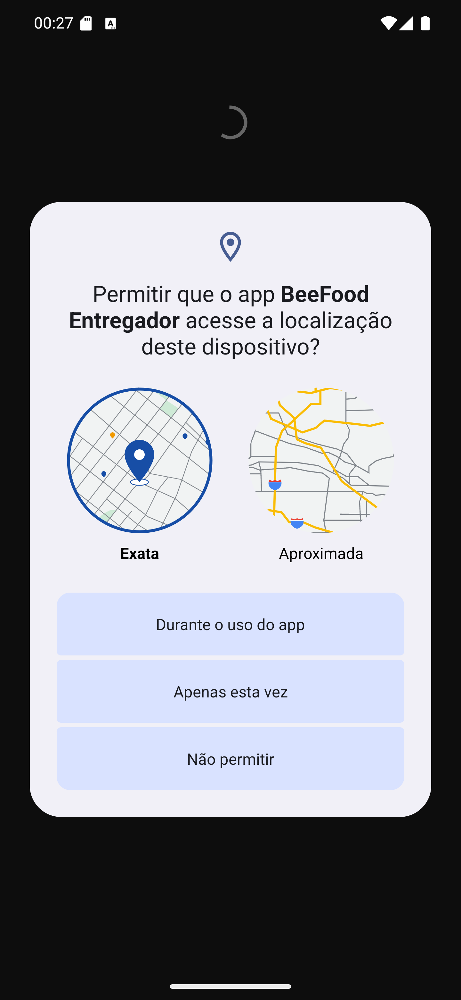

# 01 — Permissão de localização

**O que é esta tela.** O primeiro pedido do app, ainda antes do login. É uma janela do **Android**,
não do BeeFood — por isso o desenho cinza e azul, diferente do resto do app.

**Na tela**

1. **Permitir que o app BeeFood Entregador acesse a localização deste dispositivo?**
2. **Exata** e **Aproximada** — dois mapinhas, um de cada lado. O **Exata** vem marcado.
3. **Durante o uso do app** — concede enquanto o app está aberto.
4. **Apenas esta vez** — concede só agora; vai perguntar de novo amanhã.
5. **Não permitir** — recusa.

**O que fazer.** Deixe **Exata** marcada e toque em **Durante o uso do app**.

**Por que Exata e não Aproximada.** A aproximada erra por centenas de metros. Serve para saber a
cidade, não para o restaurante acompanhar a entrega nem para o app montar rota. Com ela, o mapa
do painel mostra você a quadras de onde você está.

**Não escolha "Apenas esta vez".** Funciona hoje e volta a perguntar no próximo turno — e enquanto
você não responder, o restaurante não te vê.

**Detalhe útil.** Esta tela aparece antes do login de propósito: o app precisa da localização já
na primeira comunicação com o restaurante, não depois.
