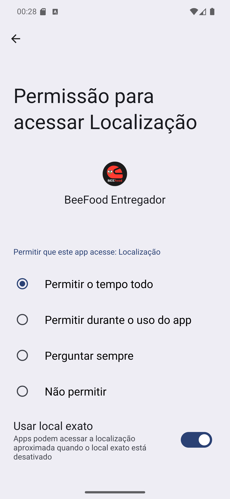

# 02 — Permitir o tempo todo

**O que é esta tela.** As **configurações do Android**, abertas pelo próprio app para pedir a
localização em segundo plano. O Android não deixa um app pedir isso numa janelinha — tem que ser
aqui.

**Na tela**

1. **Permissão para acessar Localização**, com o logo do BeeFood Entregador.
2. Quatro opções: **Permitir o tempo todo** (marcada na captura), **Permitir durante o uso do
   app**, **Perguntar sempre** e **Não permitir**.
3. **Usar local exato** — a chave azul, ligada.

**O que fazer.** Marque **Permitir o tempo todo**, confirme que **Usar local exato** está ligado e
volte com a flecha `<` do canto superior esquerdo.

**Por que isso importa tanto.** "Durante o uso do app" vale só com o app aberto na tela. Na rua
você guarda o celular no bolso, usa o mapa, atende o telefone — e nesses momentos o restaurante
deixaria de receber sua posição. Com "o tempo todo", o envio continua.

**Detalhe útil.** O app manda sua posição a cada dez segundos aproximadamente, e só quando você
se move. Celular parado não fica enviando a mesma coordenada, o que poupa bateria e dados.

**Se você recusar.** O app funciona: você recebe, entrega e cobra normalmente. O que se perde é o
acompanhamento em tempo real — e o restaurante passa a te ligar para saber onde você está.
