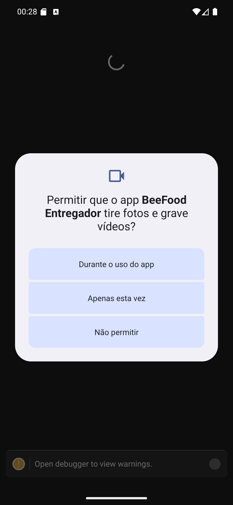

# 03 — Permissão de câmera

**O que é esta tela.** Outra janela do Android, pedindo acesso à câmera: *Permitir que o app
BeeFood Entregador tire fotos e grave vídeos?*

**Na tela**

1. **Durante o uso do app** — o que você quer.
2. **Apenas esta vez**.
3. **Não permitir**.

**O que fazer.** Toque em **Durante o uso do app**.

**Para que serve a câmera.** Uma coisa só: ler o **código de barras** dos pedidos, na aba *Código
barras* ([manual 08](../08-codigo-de-barras/manual.md)). O app não tira foto de entrega nem grava
vídeo.

**Se você recusar.** Todo o resto continua funcionando. Só a leitura de código de barras fica
indisponível — e, ao abrir aquela aba, o app vai pedir a permissão de novo.

**Detalhe útil.** Se recusar duas vezes, o Android para de perguntar. Aí a liberação é pela tela
de **Permissões** do menu lateral ([manual 15](../15-ajustes-e-sair/02-permissoes.md)).
