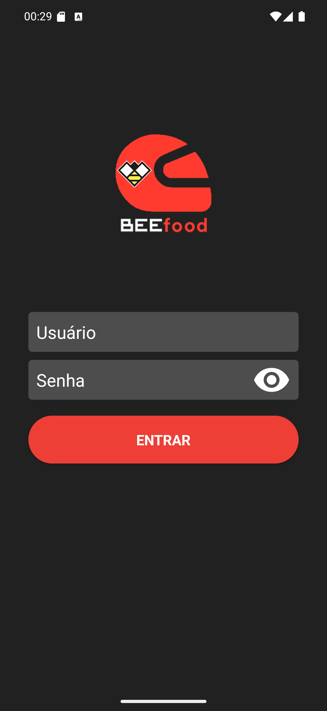

# 04 — A tela de login

**O que é esta tela.** A primeira tela do app, já com as permissões respondidas.

**Na tela**

1. **O capacete do BeeFood**, vermelho, e o nome **BEEfood**.
2. **Usuário** — campo vazio.
3. **Senha** — campo vazio, com o ícone do olho à direita.
4. **ENTRAR** — o botão vermelho arredondado.

**O que fazer.** Toque em **Usuário**, digite o e-mail que o restaurante cadastrou, toque em
**Senha**, digite a sua, e toque em **ENTRAR**.

**Detalhe útil.** Não há "esqueci minha senha" nem cadastro aqui. Quem cria e reseta o seu acesso
é o restaurante — se a senha não funciona, é com ele que você fala.

**Fundo escuro.** As telas de entrada do app são escuras e as de trabalho são claras. É assim de
propósito: ajuda a saber, de relance, se você está logado ou não.
