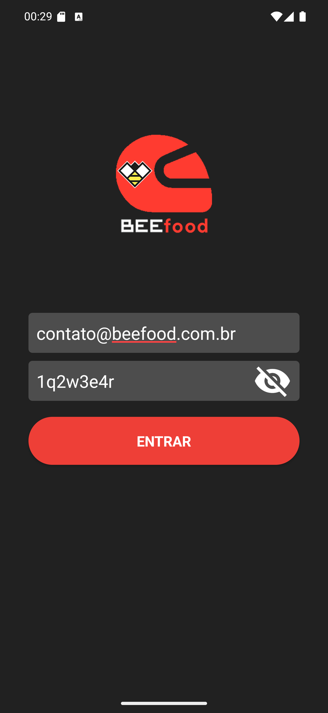

# 06 — Senha visível

**O que é esta tela.** O mesmo login, depois de tocar no olho: a senha aparece em texto e o ícone
muda para um **olho cortado**.

**Na tela**

1. **Senha** legível, no lugar das bolinhas.
2. **Olho cortado** — toque nele para esconder de novo.

**O que fazer.** Use antes de tocar em ENTRAR, especialmente na primeira vez ou depois de uma
troca de senha. Conferir leva um segundo; errar custa uma nova tentativa.

**Cuidado óbvio, mas vale.** A senha fica visível na tela para quem estiver ao lado. Esconda antes
de entregar o celular a alguém.

**Detalhe útil.** O botão não é um interruptor permanente: ao sair da tela, a senha volta a ficar
oculta.
