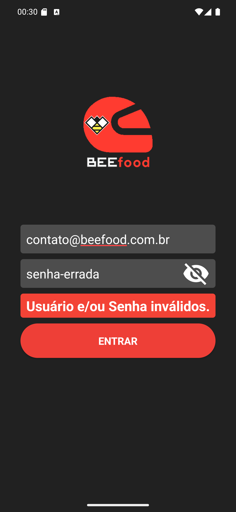

# 07 — Usuário e/ou senha inválidos

**O que é esta tela.** O login recusado. Aqui a senha está visível de propósito, mostrando o que
foi digitado de errado.

**Na tela**

1. **A faixa vermelha** *Usuário e/ou Senha inválidos.*, entre a senha e o botão ENTRAR.
2. Os campos **continuam preenchidos** — você corrige só o que errou.

**O que fazer.** Toque no olho, confira o que está escrito, corrija e entre de novo.

**A faixa desaparece sozinha** depois de cerca de dois segundos. Não é preciso fechá-la, e ela
volta a aparecer em cada tentativa recusada.

**A mensagem é a mesma para vários casos**, de propósito — senha errada, e-mail que não existe e
acesso desativado mostram exatamente este texto. É uma proteção: ninguém descobre, por tentativa,
quais e-mails estão cadastrados.

**Quando não é erro de digitação.** Se você tem certeza do usuário e da senha e a faixa insiste,
o seu acesso pode ter sido desativado ou a senha trocada no painel. Só o restaurante resolve.

**Detalhe útil.** Sem internet a mensagem é outra, falando de conexão. Se veio *Usuário e/ou
Senha inválidos.*, o app **falou** com o servidor e foi ele quem recusou.
