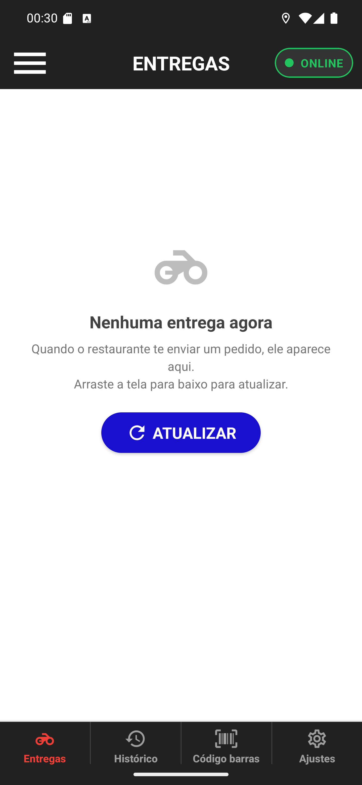

# 09 — Nenhuma entrega agora

**O que é esta tela.** A tela de trabalho, sem nada para entregar. É assim que ela fica no começo
do turno — e é sinal de que tudo deu certo, não de problema.

**Na tela**

1. **Cabeçalho escuro** com os três riscos do menu, o título **ENTREGAS** e a pílula
   **● ONLINE** em verde.
2. **A moto cinza** e o texto **Nenhuma entrega agora**.
3. *Quando o restaurante te enviar um pedido, ele aparece aqui. Arraste a tela para baixo para
   atualizar.*
4. **ATUALIZAR**, o botão azul.
5. **As quatro abas** de baixo: Entregas (em vermelho, onde você está), Histórico, Código barras
   e Ajustes.

**O que fazer.** Nada — é só esperar. Quando o restaurante te enviar um pedido, ele cai aqui e
você recebe a notificação.

**Duas formas de atualizar.** Arrastar a tela para baixo ou tocar em **ATUALIZAR**. Dão no mesmo.
E você raramente precisa: o app recarrega a lista sozinho toda vez que você volta para esta aba.

**A pílula ONLINE verde** é o restaurante te vendo disponível. Como mudar isso está no
[manual 02](../02-disponibilidade/manual.md).

**Se você acha que deveria ter entrega aqui.** O app mostra **apenas** os pedidos no seu nome.
Pedido que o restaurante despachou para outro entregador, ou que ainda não foi atribuído a
ninguém, não aparece — nem atualizando.
