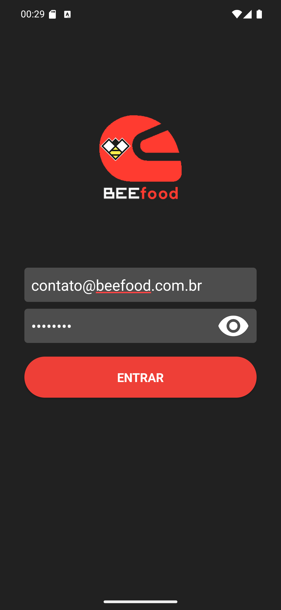
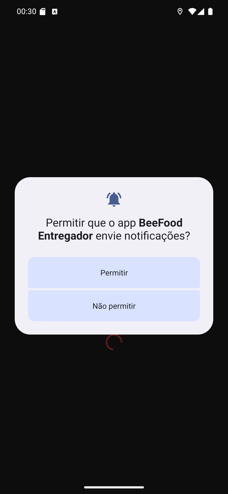

# Manual 01 — Primeiros passos

Este capítulo cobre a primeira vez que você abre o **BeeFood Entregador**: as permissões que o
celular pede, o login e a tela onde você vai trabalhar.

Da instalação até estar pronto para receber entrega são poucos minutos, e quase tudo é responder
"permitir".

---

## O que o app pede antes de qualquer coisa

Assim que abre, o app pede **localização** — antes mesmo da tela de login.

[Entender o pedido de localização](01-permissao-localizacao.md)

Escolha **Exata** e toque em **Durante o uso do app**.

Em seguida o app te leva às configurações do Android para pedir a localização **em segundo
plano**:

[Entender o "permitir o tempo todo"](02-permitir-o-tempo-todo.md)

Marque **Permitir o tempo todo** e deixe **Usar local exato** ligado. Depois volte com a flecha.

Por último, a **câmera**:

[Entender o pedido de câmera](03-permissao-camera.md)

### Por que cada uma é pedida

| Permissão | Para que o app usa |
|---|---|
| **Localização exata** | mostrar sua posição ao restaurante e traçar as rotas |
| **Localização o tempo todo** | continuar enviando posição com o app minimizado ou a tela apagada |
| **Câmera** | ler o código de barras dos pedidos |
| **Notificações** | avisar quando um pedido ou uma rota é atribuída a você |

**Nenhuma delas é opcional na prática.** Recusar localização em segundo plano faz o restaurante
te perder de vista quando você guarda o celular no bolso — e é exatamente quando você está
rodando.

## Entrar

[Entender a tela de login](04-login-vazio.md)

Dois campos e um botão. O usuário é o e-mail que o restaurante cadastrou para você.

| | |
|---|---|
| [Preenchido, senha oculta](05-login-preenchido.md) |  |
| [Senha visível](06-senha-visivel.md) |  |

O olho à direita do campo mostra a senha. Use antes de tocar em ENTRAR — é mais rápido que
errar e tentar de novo.

### Quando o login é recusado

[Entender o aviso de erro](07-erro-credencial.md)

A faixa vermelha **Usuário e/ou Senha inválidos.** aparece por cerca de dois segundos e
desaparece sozinha. Ela é a mesma para senha errada, usuário que não existe e acesso desativado.

## Depois de entrar

O app pede a última permissão, a de **notificações**:

[Entender o pedido de notificações](08-permissao-notificacoes.md)

Toque em **Permitir**. Sem ela, pedido novo não toca no seu celular.

E aí você chega na tela de trabalho:

[Entender a tela vazia](09-entregas-vazia.md)

## A tela de trabalho, de relance

| Onde | O que é |
|---|---|
| **Três riscos**, canto superior esquerdo | abre o menu lateral ([manual 15](../15-ajustes-e-sair/manual.md)) |
| **ENTREGAS**, no meio | o nome da tela |
| **Pílula ONLINE**, à direita | sua disponibilidade ([manual 02](../02-disponibilidade/manual.md)) |
| **Abas, embaixo** | Entregas, Histórico, Código barras e Ajustes |

## Você não precisa entrar de novo amanhã

O app guarda a sessão no aparelho. Fechar o app, reiniciar o celular ou ficar dias sem usar não
derruba o login — a tela de login só volta se **você** sair pelo menu.

## Se algo não funcionar

**O app abre e volta para o login sozinho.** Sessão encerrada no servidor. Entre de novo; se
repetir, fale com o restaurante.

**A pílula não fica ONLINE.** Falta internet. O app mostra um aviso de nuvem cortada e tenta de
novo sozinho.

**Nenhuma entrega aparece, mas o restaurante diz que enviou.** Puxe a tela para baixo ou toque
em ATUALIZAR. Persistindo, confirme com o restaurante se o pedido foi atribuído ao **seu** nome —
o app só mostra o que está no seu nome.
