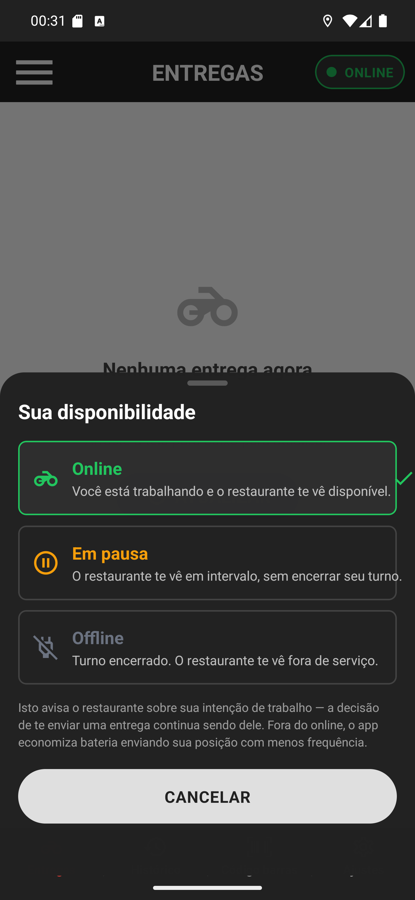

# 01 — A folha de disponibilidade

**O que é esta tela.** A folha que sobe de baixo quando você toca na pílula. A tela de Entregas
continua atrás, escurecida.

**Na tela**

1. **Sua disponibilidade** — o título.
2. **Online**, com o ícone de moto, em verde: *Você está trabalhando e o restaurante te vê
   disponível.* É a opção atual, por isso a borda verde e o tique à direita.
3. **Em pausa**, com o ícone de pausa, em laranja: *O restaurante te vê em intervalo, sem
   encerrar seu turno.*
4. **Offline**, com o ícone de moto cortada, em cinza: *Turno encerrado. O restaurante te vê fora
   de serviço.*
5. **O aviso em cinza**: *Isto avisa o restaurante sobre sua intenção de trabalho — a decisão de
   te enviar uma entrega continua sendo dele. Fora do online, o app economiza bateria enviando sua
   posição com menos frequência.*
6. **CANCELAR**.

**O que fazer.** Toque na opção que você quer. A folha fecha e a pílula muda na hora — não existe
botão de confirmar.

**Leia o aviso em cinza.** Ele diz a coisa mais importante desta tela: você está **informando**,
não bloqueando. Entrega pode chegar mesmo em pausa ou offline.

**Para fechar sem mudar nada:** **CANCELAR**, arrastar a folha para baixo ou tocar na área
escurecida acima dela.

**Detalhe útil.** Os ícones acompanham as cores das pílulas — moto/verde, pausa/laranja,
moto cortada/cinza. Com o tempo você identifica o estado pela cor, sem ler.
