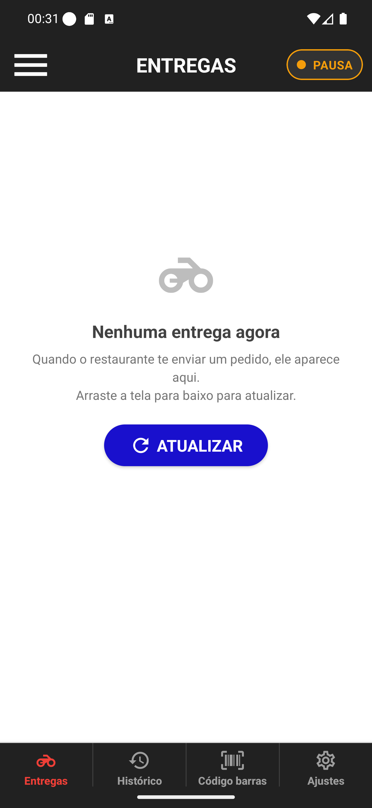

# 02 — Pílula em PAUSA

**O que é esta tela.** A tela de Entregas depois de você escolher **Em pausa**. A folha já fechou.

**Na tela**

1. **A pílula ● PAUSA**, laranja, no lugar da verde.
2. **Todo o resto igual** — título, lista, abas. Nada mais muda de aparência.

**O que fazer.** Nada. Quando voltar do intervalo, toque na pílula e escolha **Online**.

**Quando usar.** Almoço, banheiro, abastecer, uma parada rápida. O turno continua aberto: você
não está encerrando o dia, só sinalizando que agora não é um bom momento.

**No painel do restaurante** você aparece como em intervalo. Quem despacha tende a mandar o
próximo pedido para quem está online — mas pode te mandar de todo jeito se precisar.

**Detalhe útil.** Em pausa o app envia sua posição com menos frequência, o que segura a bateria.
Por isso pausa é melhor que simplesmente guardar o celular.

**Nada trava.** Entregas que já estão na sua lista continuam abertas e você pode finalizar e
cobrar em pausa, sem problema.
