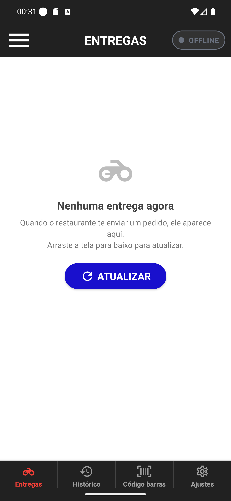

# 03 — Pílula OFFLINE

**O que é esta tela.** A tela de Entregas com o turno encerrado. Repare no ponto branco na barra
de status do celular, ao lado do relógio: é o Android indicando que um app está usando a
localização.

**Na tela**

1. **A pílula ● OFFLINE**, cinza, sem destaque.
2. **A tela de trabalho intacta** — você continua dentro do app e com acesso a tudo.

**O que fazer.** Ao começar o próximo turno, toque na pílula e escolha **Online**.

**Quando usar.** Ao terminar o dia. É o recado de "não conte comigo agora".

**Offline não é logout.** Você segue logado; o app não volta para a tela de login. Para sair de
verdade, use **SAIR** no menu lateral ([manual 15](../15-ajustes-e-sair/03-confirmar-saida.md)) — e
aí sim você deixa de receber qualquer coisa.

**Offline não recusa entrega.** Se o restaurante despachar um pedido para você, ele chega na lista
mesmo assim. Terminou o turno e ainda tem entrega na lista? Ela continua sendo sua até finalizar
ou até o restaurante passar para outro entregador.

**Detalhe útil.** É o estado que menos gasta bateria, porque o envio de posição fica mais
espaçado. Ainda assim o app não desliga a localização por completo — daí o ponto branco continuar
lá.
