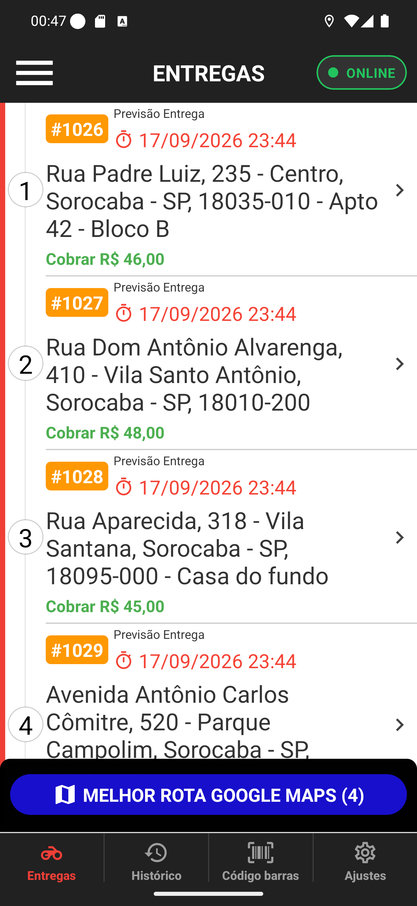

# 01 — Quatro entregas na lista

**O que é esta tela.** A aba *Entregas* com quatro pedidos abertos no seu nome. É a tela mais
usada do app.

**Na tela**

1. **Cabeçalho escuro** com menu, título **ENTREGAS** e a pílula **● ONLINE**.
2. **Quatro cartões**, numerados de 1 a 4 nos círculos da esquerda, ligados pela linha
   vertical com a faixa vermelha — a sequência sugerida.
3. **Em cada cartão**: a etiqueta laranja do pedido (**#1026**), a **Previsão Entrega** com
   relógio vermelho, o endereço completo e o valor **Cobrar R$ 46,00** em verde.
4. **A flecha `>`** de cada cartão, que abre os detalhes.
5. **MELHOR ROTA GOOGLE MAPS (4)**, o botão azul fixo acima das abas.

**O que fazer.** Toque no cartão (ou na flecha) da entrega que você vai levar. Para sair com
todas de uma vez, use o botão azul.

**Repare no complemento.** O cartão 1 termina com **Apto 42 - Bloco B** e o 3 com **Casa do
fundo**: o complemento vem junto do endereço, na mesma linha de texto. Quando o cliente não
informou, o endereço simplesmente acaba no CEP, como nos cartões 2 e 4.

**O valor em verde é o que você recebe**, já com a taxa de entrega somada. Os quatro pedidos
deste cenário têm a mesma composição e ainda assim mostram valores diferentes (R$ 46, R$ 48,
R$ 45 e R$ 44) — a diferença é a taxa de entrega de cada endereço.

**A previsão igual nos quatro** não é erro: é o horário prometido ao cliente, calculado pela
loja, e pedidos feitos na mesma janela costumam cair no mesmo horário.

**Detalhe útil.** O primeiro cartão aparece encostado no cabeçalho de propósito: a lista rola
por baixo dele, e o cabeçalho fica fixo.
