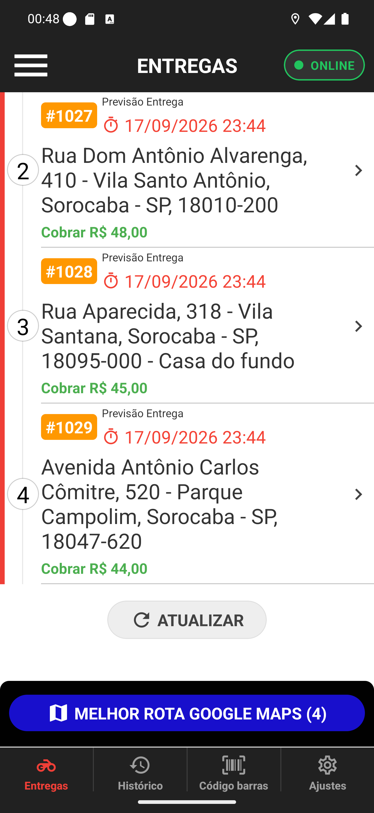

# 02 — O fim da lista

**O que é esta tela.** A mesma lista, rolada até o fim. O cartão 1 saiu de vista e apareceu o
rodapé.

**Na tela**

1. **Os cartões 2, 3 e 4**, com o 4 agora completo — *Avenida Antônio Carlos Cômitre, 520 -
   Parque Campolim*, **Cobrar R$ 44,00**.
2. **ATUALIZAR**, agora cinza e discreto, depois do último cartão.
3. **MELHOR ROTA GOOGLE MAPS (4)**, o botão azul que não sai da tela.

**O que fazer.** Nada de novo: o ATUALIZAR daqui faz o mesmo que puxar a tela para baixo.

**Por que este ATUALIZAR é cinza** e o da tela vazia é azul: na tela vazia ele é a única coisa
a fazer, então ganha destaque; aqui, com entregas na lista, o que importa é o pedido — o botão
fica disponível sem competir com os cartões.

**O botão azul é fixo.** Ele acompanha a rolagem e fica sempre acima das abas, porque é a ação
que serve para a lista inteira, não para um cartão.

**Detalhe útil.** A faixa vermelha da esquerda continua desenhada até o último cartão: é o fio
da sequência, e ele termina onde termina a lista.
