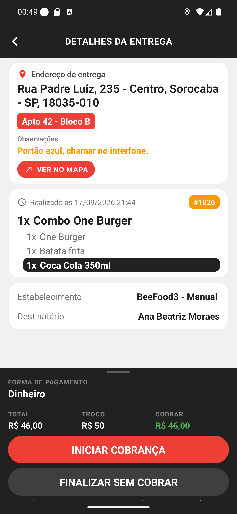
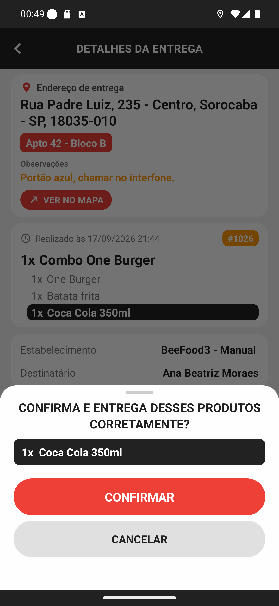
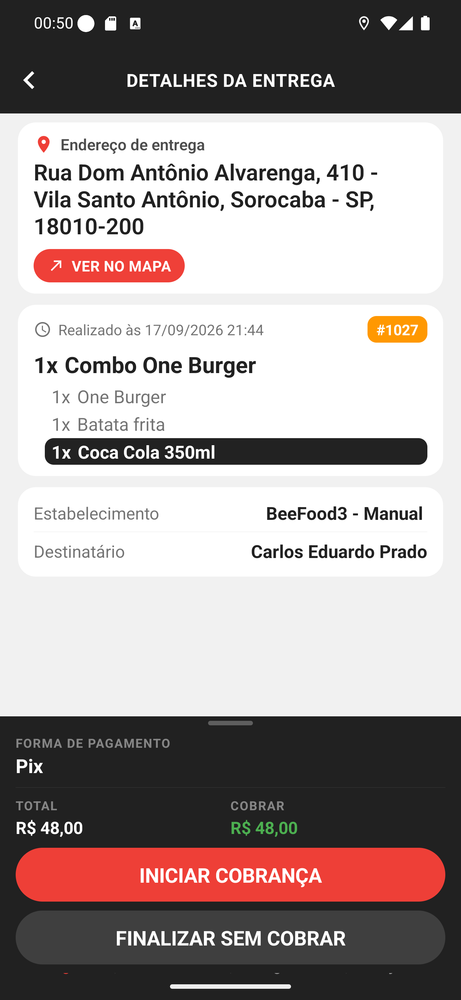

# Manual 04 — Detalhes da entrega

Tocar num cartão da lista abre esta tela. É aqui que está tudo o que você precisa na porta do
cliente: o endereço completo, o que tem dentro da sacola, quanto cobrar e os botões para
fechar a entrega.

---

## A tela por inteiro

[Entender os detalhes](01-topo-dos-detalhes.md)



A tela tem três cartões brancos e um rodapé escuro:

| Bloco | Conteúdo |
|---|---|
| **Endereço de entrega** | endereço, complemento em vermelho, observações e **VER NO MAPA** |
| **O pedido** | horário, número, itens e opções |
| **Estabelecimento / Destinatário** | a loja que enviou e o nome de quem recebe |
| **Rodapé escuro** | forma de pagamento, valores e os dois botões de ação |

## O complemento é vermelho porque é o que mais se erra

**Apto 42 - Bloco B** aparece numa tarja vermelha, não como texto comum. Número de
apartamento, bloco e "casa do fundo" são a informação que faz o entregador subir o prédio
errado — então ela é a mais gritante da tela.

As **Observações** em laranja logo abaixo são o recado que o cliente deixou no pedido
(*"Portão azul, chamar no interfone."*).

O endereço fica **fixo no alto**: ao rolar a tela para ver o pedido, ele continua visível.

## A linha preta no item é uma conferência

No cartão do pedido, **1x Coca Cola 350ml** aparece com fundo preto. Não é enfeite: são os
itens que a loja marcou para **conferir antes de entregar** — tipicamente bebida, sobremesa e
brinde, que são os que ficam para trás na sacola.

```
1x Combo One Burger
   1x One Burger
   1x Batata frita
   1x Coca Cola 350ml      <- fundo preto: confira este
```

A marcação é **linha por linha**. Se a loja marcar só uma opção, só aquela linha fica preta;
se marcar o produto e todas as opções, o cartão inteiro do item fica preto.

### E ela te para antes de fechar a entrega

[Entender a confirmação](02-conferir-destaque.md)



Quando existe item em destaque, tocar em **INICIAR COBRANÇA** ou **FINALIZAR SEM COBRAR** não
segue direto: sobe uma folha perguntando **CONFIRMA E ENTREGA DESSES PRODUTOS CORRETAMENTE?**,
listando só o que está marcado.

É a última chance de olhar a sacola antes de dar a entrega por feita.

## Quando o pedido não tem complemento nem observação

[Entender a versão enxuta](03-sem-complemento.md)



O cartão do endereço fica só com o endereço e o **VER NO MAPA** — sem tarja vermelha e sem a
linha de observações. Nada fica vazio ou com traço: o que não existe simplesmente não aparece.

Repare também no rodapé: neste pedido, pago em **Pix**, há **TOTAL** e **COBRAR**, e a coluna
**TROCO** nem existe.

## O rodapé escuro

| Campo | O que significa |
|---|---|
| **FORMA DE PAGAMENTO** | como o cliente disse que vai pagar (*Dinheiro*, *Pix*, *Cartão de Débito*…) |
| **TOTAL** | o valor do pedido |
| **TROCO** | para quanto o cliente vai pagar — só aparece quando ele informou |
| **COBRAR** | em verde, o que você recebe na porta |

E os dois botões:

- **INICIAR COBRANÇA**, vermelho — receber na porta ([manual 11](../11-cobranca-na-porta/manual.md)).
- **FINALIZAR SEM COBRAR**, cinza — baixar a entrega sem receber nada
  ([manual 13](../13-finalizar-sem-cobrar/manual.md)).

O cinza do segundo botão é deliberado: os dois estão disponíveis, mas cobrar é o caminho
normal.

> A forma de pagamento é o que o cliente **informou no pedido**, não uma decisão fechada. Se
> ele disser que vai pagar de outro jeito, você escolhe na hora da cobrança.

## Se algo não funcionar

**Os itens não aparecem.** A lista dos produtos é buscada quando você abre o detalhe. Sem
internet o cartão do pedido fica vazio — volte e abra de novo com sinal.

**O complemento está errado ou faltando.** Ele vem do cadastro do cliente. Ligue para o
restaurante; o app não edita endereço.

**A forma de pagamento não é a que o cliente diz.** Normal. Siga para a cobrança e escolha a
forma correta lá.
