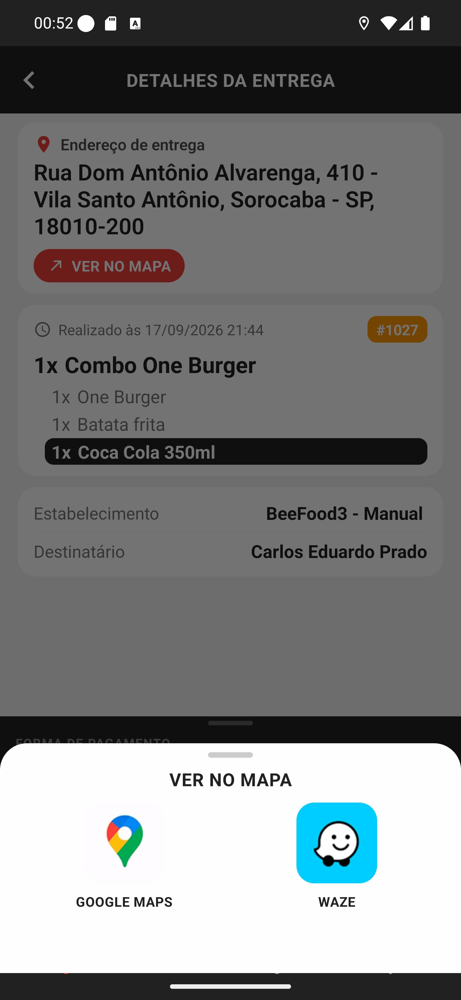

# 01 — A folha "Ver no mapa"

**O que é esta tela.** A folha que sobe ao tocar em **VER NO MAPA** nos detalhes da entrega. A
tela de detalhes continua atrás, escurecida.

**Na tela**

1. **VER NO MAPA** — o título.
2. **GOOGLE MAPS**, com o ícone colorido do app.
3. **WAZE**, com o ícone azul.

**O que fazer.** Toque no aplicativo que você usa para navegar. Não há botão de confirmar: o
toque já abre o mapa.

**Para fechar sem abrir nada:** arraste a folha para baixo ou toque na área escurecida acima
dela.

**Só duas opções, sempre as mesmas.** O app não lembra sua escolha anterior nem tem opção de
"usar sempre este" — a pergunta vem em toda entrega.

**O Waze só aparece aqui, na entrega individual.** Na tela da lista, o botão que serve para
todas as entregas de uma vez abre apenas o Google Maps, porque é o único que aceita várias
paradas num link.

**Detalhe útil.** Se você toca no Waze e o celular abre o navegador, é porque o Waze não está
instalado. O app não tem como saber disso antes de tentar.
