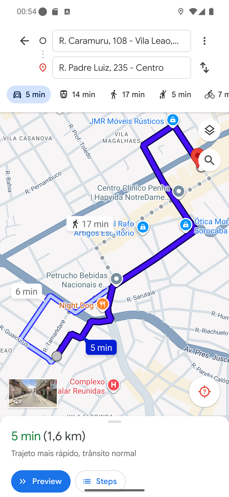

# Manual 05 — Ver no mapa

O botão **VER NO MAPA**, no cartão do endereço, abre a navegação até aquele cliente. É o
caminho para **uma** entrega; para sair com todas de uma vez, veja o
[manual 07](../07-melhor-rota/manual.md).

---

## Escolher o aplicativo

[Entender a folha de opções](01-opcoes-de-mapa.md)

Tocar em VER NO MAPA não abre o mapa direto: sobe uma folha com **GOOGLE MAPS** e **WAZE**.
Toque no que você usa.

## No Google Maps

[Entender a rota aberta](02-google-maps-endereco.md)

O app sai da sua **posição atual** e vai até o endereço do cliente, com a rota já traçada e o
tempo estimado. No exemplo: 5 min, 1,6 km até *R. Padre Luiz, 235 - Centro*.

Daí para frente é o Google Maps normal — **Preview**, **Steps**, navegação por voz. Para
voltar ao BeeFood, use o botão Voltar do celular.

## O endereço vai como texto, não como coordenada

Esta é a parte que vale saber para não se perder: o app manda para o mapa o **endereço
escrito** (rua, número, bairro, cidade e CEP), e quem procura o ponto é o próprio Google Maps
ou Waze.

Consequência prática: **endereço mal cadastrado leva o mapa para o lugar errado**. Já vi o
mapa entender "Vila Santo Antônio" como uma clínica de nome parecido e propor rota para lá.

Então: se o destino no mapa não parecer com o endereço do cartão, **confie no cartão**. E, na
dúvida, procure o endereço na mão dentro do app de mapa.

> A exceção são os pedidos de marketplace (iFood, 99Food). Neles o app manda **a coordenada**
> em vez do texto, porque o endereço vem abreviado da plataforma. Veja os
> [manuais 09](../09-pedido-ifood/manual.md) e [10](../10-pedido-99food/manual.md).

## O Waze precisa estar instalado

O botão do Waze abre um link `waze.com`. Com o Waze instalado, o celular joga o link nele e a
navegação começa. **Sem o Waze**, o mesmo link cai no navegador — e você vê uma página web, não
uma rota.

Se você navega pelo Waze, instale-o antes do turno.

## Se algo não funcionar

**O mapa abre em outro lugar.** Endereço cadastrado de forma ambígua. Leia acima; o endereço
do cartão é o que vale.

**Aparece "Permissão de localização é necessária para continuar".** O app precisa da sua
posição para traçar a rota. Libere a localização
([manual 15](../15-ajustes-e-sair/02-permissoes.md)) e tente de novo.

**O mapa não traça a rota.** Costuma ser sinal fraco. O aplicativo de mapa precisa de internet
para calcular; o BeeFood só entrega o endereço a ele.
