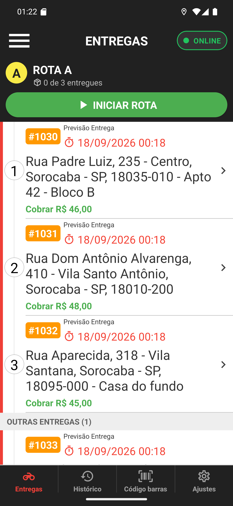

# 01 — A rota na lista de entregas

**O que é esta tela.** A aba **Entregas** de um entregador que tem uma rota montada pelo
restaurante. A diferença em relação aos capítulos anteriores está na faixa escura logo abaixo
do cabeçalho.

**Na faixa da rota**

1. **A** — a letra da rota, no círculo amarelo. É como o restaurante se refere a ela ao
   telefone: "a rota A é sua".
2. **ROTA A** — o nome.
3. **0 de 3 entregues** — quantas paradas você já fechou.
4. **INICIAR ROTA** — o botão verde.

**Os pedidos vêm numerados.** O **1**, **2** e **3** à esquerda de cada card são a ordem
definida pelo restaurante: #1030 no Centro, #1031 na Vila Santo Antônio, #1032 na Vila Santana.

**Esse número não é a posição na tela.** É a ordem da parada. Se o operador reordenar no
painel, os números mudam na próxima atualização da lista.

**A rota aparece antes de você iniciar.** Ela é planejamento: o restaurante monta, você vê, e
só sai quando toca em INICIAR ROTA.

**Os cards são os mesmos de sempre**: número do pedido, previsão, endereço com complemento e o
valor a cobrar. Toque para abrir os detalhes, como no capítulo 04.
