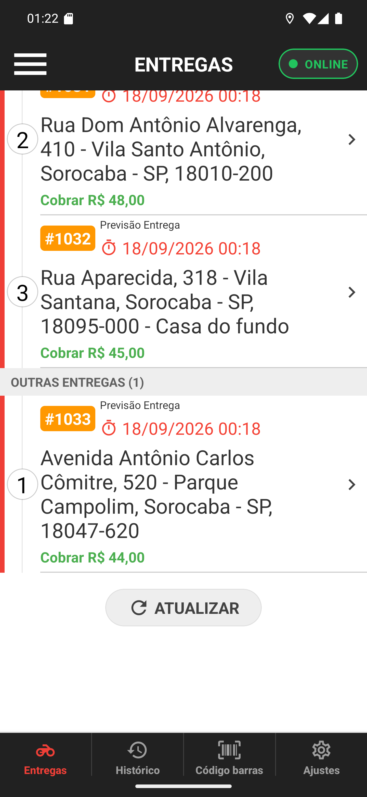

# 02 — Outras entregas

**O que é esta tela.** A mesma lista, rolada até o fim. Depois da última parada da rota (o
#1032, número 3) vem a faixa cinza **OUTRAS ENTREGAS (1)** e, abaixo dela, o #1033.

**O que é a lista solta.** Pedido que é seu mas não está em rota nenhuma — o restaurante
atribuiu direto, pela tela antiga, ou simplesmente não quis agrupar. Nada nele muda: é o card
de sempre.

**O número **1** do #1033 é da lista solta**, não da rota. As duas numerações são
independentes, e é por isso que existe a faixa cinza separando: sem ela, dois cards com o
número 1 na mesma tela não fariam sentido.

**A faixa só aparece quando há as duas coisas.** Sem rota, a lista inteira é solta e aparece
sem título nenhum — a tela de quem não usa Gestão de Entregas 2.0.

**O botão do rodapé não está aqui.** O **MELHOR ROTA GOOGLE MAPS** só aparece com **duas ou
mais** entregas soltas: com uma, não há ordem para calcular. E ele nunca inclui as paradas da
rota.

**ATUALIZAR** no fim da lista recarrega tudo, rota e soltas. Serve quando o restaurante
acabou de mexer na rota e você quer ver como ficou.
