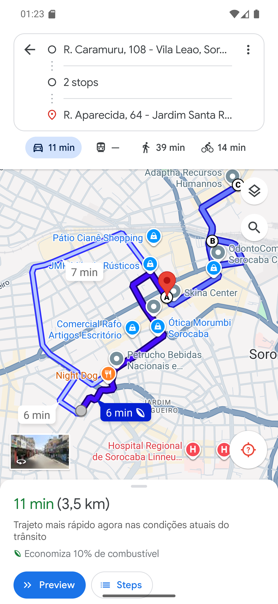

# 03 — A rota no Google Maps

**O que é esta tela.** O Google Maps, aberto pelo **INICIAR ROTA**, com as três paradas na
ordem da rota A.

**No alto**: a origem é onde você está; **2 stops** são as duas paradas do meio; o destino é a
última. O Maps resume assim quando há mais de dois pontos — toque em **2 stops** para ver o
trajeto parada por parada.

**No mapa**: os marcadores **A**, **B** e **C** seguem a ordem que o restaurante definiu. Não
é o Maps que escolhe quem vem primeiro.

**Embaixo**: o tempo e a distância do trajeto todo — aqui, 11 min e 3,5 km. **Preview** mostra
o caminho antes de sair; **Steps** lista as instruções.

**O que o botão fez antes de abrir o mapa.** Despachou a rota: os três pedidos passaram para
"em transporte" no restaurante, e o cliente recebeu a mensagem de que o pedido saiu. Foi
verificado no banco — os três estavam em *PRONTO* ou *PREPARO* e ficaram em *ENTREGA*.

> Por isso **INICIAR ROTA não é "ver o caminho"**. Para só olhar o trajeto, use o **ABRIR NO
> MAPS** depois de iniciar, ou o **VER NO MAPA** de uma entrega específica (capítulo 05).

**O endereço que o Maps escreve pode não ser idêntico ao do card.** As paradas são enviadas
por coordenada, e o Maps mostra o endereço que ele reconhece naquele ponto — aqui, "R.
Aparecida, 64" para a parada da Rua Aparecida, 318. **O endereço que vale é o do app**; o mapa
serve para chegar perto.

**Sem GPS**, a rota abre sem ponto de partida definido e o Maps usa a localização do próprio
aparelho. As paradas e a ordem continuam as mesmas.
