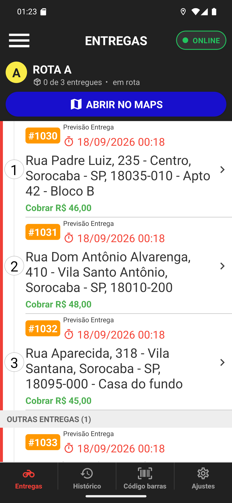

# 04 — A rota já iniciada

**O que é esta tela.** A lista depois de voltar do Google Maps. A rota é a mesma, o cabeçalho
não.

**Duas mudanças**

1. Ao lado do contador aparece **em rota** — o restaurante já sabe que você saiu.
2. O botão verde **INICIAR ROTA** virou o azul **ABRIR NO MAPS**.

**ABRIR NO MAPS é seguro de tocar.** Ele só reabre o trajeto. Ninguém é avisado de novo, o
cliente não recebe segunda mensagem.

**O contador continua 0 de 3.** Despachar não entrega nada: ele diz que você saiu. O contador
sobe quando você fecha cada entrega, uma a uma, pela tela de detalhes.

**A lista voltou sozinha ao topo e recarregada.** Toda vez que você entra na aba Entregas, o
app busca a lista de novo — então o que o restaurante mudou enquanto você estava no mapa já
aparece aqui.

**Se o operador acrescentar uma parada** depois do despacho, ela entra na rota como pendente e
o botão volta a oferecer o despacho dessa parada nova. Tocar de novo não reavisa quem já foi
avisado.
