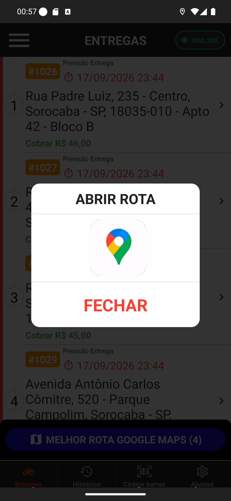
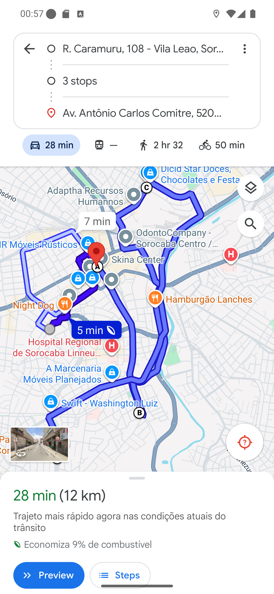

# Manual 07 — Melhor rota no Google Maps

O botão azul **MELHOR ROTA GOOGLE MAPS (4)**, fixo no pé da lista, abre **todas** as suas
entregas numa única rota, na ordem que economiza caminho. É o atalho para sair da loja com a
mochila cheia.

O número entre parênteses é a quantidade de entregas que vai entrar na rota.

---

## O que acontece ao tocar

[Entender o aviso "Abrir rota"](01-abrir-rota.md)

O app calcula a ordem das paradas e mostra uma janela **ABRIR ROTA** com o ícone do Google
Maps. Toque no ícone para abrir; **FECHAR** desiste.

## A rota pronta

[Entender a rota com várias paradas](02-rota-no-google-maps.md)

O Google Maps abre com a sua posição como origem, **3 stops** no meio e a última entrega como
destino final — as quatro paradas, na ordem calculada. No exemplo: 28 min e 12 km no total.

## A ordem é por proximidade

Quem define a ordem é o servidor do BeeFood, ordenando as entregas pela distância. Não é a
ordem em que os pedidos chegaram nem a ordem dos cartões na tela.

Na prática, saem primeiro as entregas do mesmo bairro e sobra para o fim a mais distante — no
exemplo, a do Parque Campolim, que fica como destino final.

> **Isso ignora a rota que o restaurante montou.** Se você recebeu uma rota pronta do
> restaurante, com a ordem que ele definiu arrastando as paradas no painel, use o botão da
> rota e não este — veja o [manual 06](../06-rota-do-restaurante/manual.md). Este botão
> reordena tudo por distância e desfaz a sequência dele.

## Só Google Maps

Diferente do VER NO MAPA de uma entrega, aqui não há opção de Waze: o link com várias paradas
é um recurso do Google Maps.

## Quando usar, e quando não

**Use** ao sair da loja com três ou quatro entregas na mochila, todas soltas (sem rota montada
pelo restaurante).

**Não use** se o restaurante montou a rota, se você vai fazer só uma entrega (o VER NO MAPA dos
detalhes é mais direto) ou se você já está no meio do caminho e quer ir a um endereço
específico.

## Se algo não funcionar

**"Ocorreu uma falha ao gerar a melhor rota."** O cálculo é feito no servidor; sem internet ou
com ele fora do ar, a rota não sai. Tente de novo ou abra as entregas uma a uma.

**"Permissão de localização é necessária para continuar."** A rota começa na sua posição, então
o app precisa dela. Libere a localização
([manual 15](../15-ajustes-e-sair/02-permissoes.md)).

**Uma parada aparece num lugar estranho no mapa.** Endereço mal cadastrado — a mesma situação
do [manual 05](../05-ver-no-mapa/manual.md). Confira o endereço nos detalhes daquela entrega.
