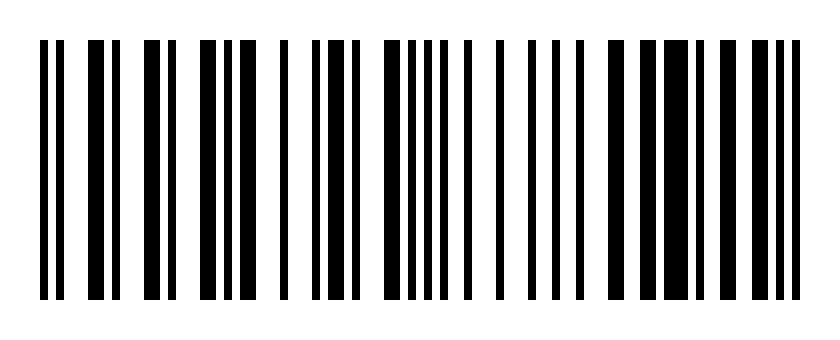

# 03 — A etiqueta do pedido

**O que é esta imagem.** O código de barras que a loja imprime na etiqueta do pedido, do jeito
que o leitor espera encontrar. Este foi gerado para o pedido #1028 do cenário de testes.

**O formato é EAN-13** — o código de barras comum, de supermercado, com 13 dígitos. É o único
formato que o app lê.

**Os 13 dígitos**: os 12 primeiros são o número interno do pedido no sistema; o 13º é o dígito
verificador, calculado a partir dos outros. Ele existe para o leitor perceber quando leu errado.

**O que não funciona**

- QR Code — o leitor não reage.
- Code 128, Code 39 e outros formatos de barras — também não.
- Etiqueta amassada, molhada ou com o código cortado na borda.

**Se a etiqueta da sua loja não é EAN-13**, o leitor nunca vai bipar. Isso é configuração da
impressão de cupom, e quem resolve é a loja — não é problema do seu celular.

**Dica prática.** Etiqueta impressa com pouca tinta ou papel térmico já apagado dificulta a
leitura. Se estiver fraca, peça uma reimpressão em vez de insistir na câmera.
