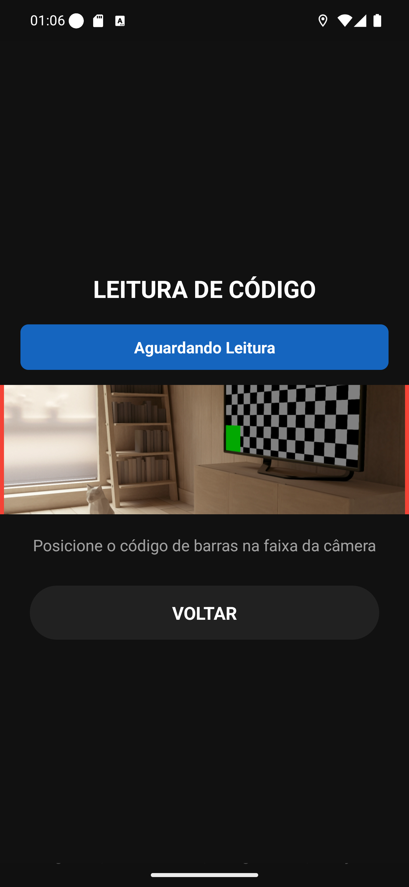
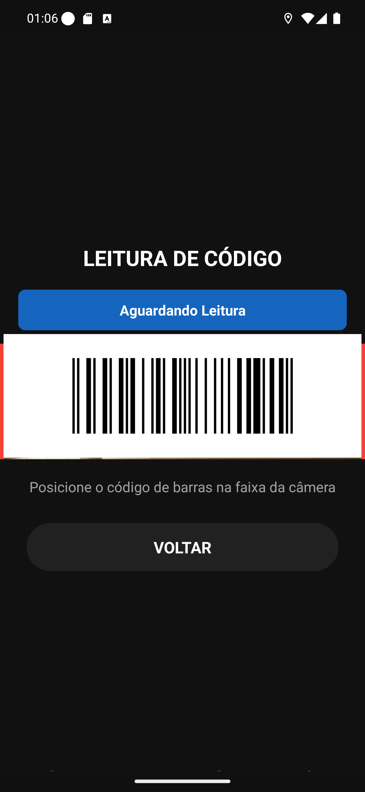

# Manual 08 — Código de barras

A aba **Código barras** abre um leitor que escaneia a etiqueta do pedido na loja. E aqui vale
avisar antes de qualquer coisa:

> **Escanear é despachar.** Não é conferência, não é "bipar para ver o que é". Ao ler a
> etiqueta, o pedido passa para **em entrega**: a loja é avisada, o marketplace é avisado, o
> cupom imprime e o cliente recebe mensagem. Não tem como desfazer pelo app.

Só leia a etiqueta do pedido que você **está pegando agora** para levar.

---

## O leitor

[Entender a tela do leitor](01-leitor-aberto.md)

A tela tem três partes: o título **LEITURA DE CÓDIGO**, a **faixa de status** azul
(*Aguardando Leitura*) e a **faixa da câmera**, marcada por duas linhas vermelhas.

## Posicionar a etiqueta

[Entender o posicionamento](02-codigo-na-faixa.md)

Encoste o celular na etiqueta até o código ficar **dentro da faixa**, entre as duas linhas
vermelhas. A faixa é estreita de propósito: é a área que a câmera realmente analisa.

Não é preciso tocar em nada — a leitura é automática.

## Os três estados da faixa de status

| Faixa | Significa |
|---|---|
| **Aguardando Leitura**, azul | pronto, procurando um código |
| **Lendo código...**, azul | achou o código e está enviando para a loja |
| **Pedido lido com sucesso!**, azul + aviso verde | deu certo, o pedido foi despachado |
| **Pedido já lido.** | você bipou a mesma etiqueta duas vezes; nada foi enviado de novo |
| **Erro...**, vermelha | não deu; leia de novo |

Você pode ler **várias etiquetas em sequência** sem sair da tela — é o caso normal de sair com
três ou quatro pedidos.

## A etiqueta

[Entender o código](03-etiqueta-ean13.md)

O app lê **apenas EAN-13**, o código de barras comum de supermercado, com 13 dígitos. Os 12
primeiros são o número interno do pedido; o último é o dígito verificador.

QR Code não funciona. Código de outro formato não funciona. Se a etiqueta da sua loja não é
EAN-13, o leitor não vai reagir.

## Quando terminar

Toque em **VOLTAR**. O app fecha o leitor, vai para a aba **Entregas** e recarrega a lista —
então os pedidos que você acabou de bipar já aparecem atualizados.

## Se algo não funcionar

**A câmera abre mas nada acontece.** Dê uns segundos: o leitor só começa a analisar depois que
a câmera termina de iniciar. Depois disso, aproxime mais e mantenha firme.

**"Permissão de câmera necessária".** O leitor precisa da câmera. A própria tela oferece
**Solicitar Permissão** e **Abrir Configurações**.

**Faixa vermelha com erro.** A leitura foi feita, mas o envio para a loja falhou — sinal ruim, na
maioria das vezes. Leia de novo; se insistir, o pedido não foi despachado.

**Bipou a etiqueta errada.** Fale com o restaurante na hora. Pelo app não há como voltar atrás.

---

## Como este capítulo foi produzido

As capturas saíram do emulador Android, onde a câmera vê apenas uma sala virtual — não há como
pôr uma etiqueta de papel na frente dela.

Então: as telas são reais e **a imagem dentro da faixa da câmera foi sobreposta**
(`smoketests/codigo-de-barras/compor-leitura.ps1`), usando um código de barras EAN-13 gerado
para um pedido de verdade do cenário (`gerar-ean13.js`). Fora da faixa da câmera, nada foi
alterado.

O despacho correspondente foi feito **de verdade**, chamando a mesma rota que o leitor chama
(`POST tentrega/lerCodigoBarras`) para o pedido #1028. O efeito foi conferido no banco: o
pedido saiu de *PREPARO* para *ENTREGA*, que é exatamente o que a leitura faz.
