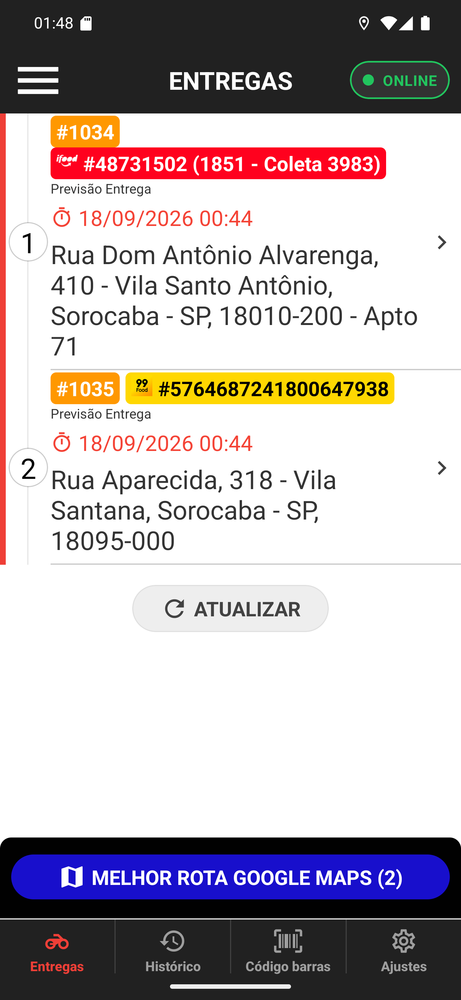

# 01 — O chip do iFood na lista

**O que é esta tela.** A aba Entregas com dois pedidos de marketplace: o **#1034** do iFood e o
**#1035** do 99Food (capítulo [10](../10-pedido-99food/manual.md)).

**No card do #1034**

1. **#1034**, laranja — o número do pedido no restaurante.
2. **Chip vermelho com o logo do iFood** e `#48731502 (1851 - Coleta 3983)` — o localizador e a
   referência curta do pedido no iFood.
3. Previsão, endereço e complemento, como em qualquer card.

**O que está faltando é informação também: não há "Cobrar R$".** Pedido de marketplace chega
pago, então o app não mostra valor a receber. Card sem valor em verde é card sem cobrança.

**Cada canal tem a sua cor.** iFood em vermelho, 99Food em amarelo. É o que permite reconhecer
de relance de onde veio o pedido.

**O localizador aparece aqui de propósito**, antes de abrir os detalhes: em muitos casos você já
precisa dele para conferir com a comanda que a loja entregou junto com a sacola.

**O rodapé mostra MELHOR ROTA GOOGLE MAPS (2)** porque há duas entregas soltas — pedido de
marketplace entra no cálculo como qualquer outro.
