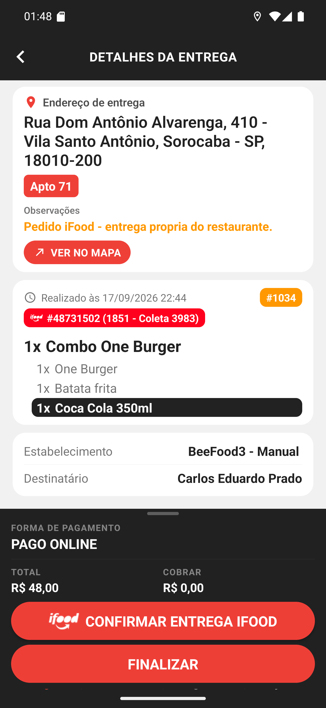

# 02 — Detalhes de um pedido iFood

**O que é esta tela.** Os detalhes do #1034. A estrutura é a de sempre — endereço, observação,
itens, estabelecimento e destinatário — com três diferenças.

1. **O chip do iFood** aparece junto aos itens, com localizador e referência.
2. **O rodapé diz PAGO ONLINE**, com **TOTAL R$ 48,00** e **COBRAR R$ 0,00**.
3. **Os botões são outros**: **CONFIRMAR ENTREGA IFOOD**, com o logo, e **FINALIZAR**.

**Não há INICIAR COBRANÇA.** Sem saldo a receber, o app não oferece cobrança — e é a mesma
regra de qualquer pedido já pago, não uma exceção do iFood.

**"FINALIZAR" e não "FINALIZAR SEM COBRAR".** O texto muda porque não há o que deixar de
cobrar: finalizar é simplesmente dar a entrega por concluída.

**A conferência dos itens em destaque continua valendo.** A Coca Cola está com a tarja preta, e
o app vai pedir a confirmação antes de finalizar.

**A observação é sua aliada** aqui: pedido de marketplace costuma trazer instruções do cliente
que não cabem no endereço.

**O botão vermelho não finaliza nada.** Ele só abre o site do iFood. Finalizar continua sendo o
segundo botão.
