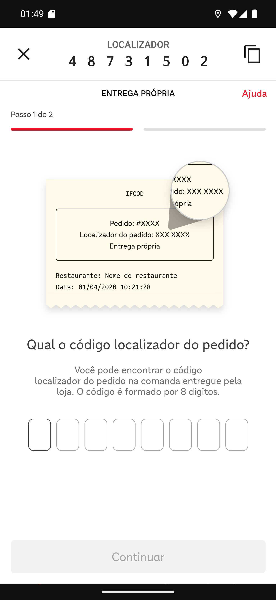

# 03 — A tela de confirmação do iFood

**O que é esta tela.** O site de confirmação de entrega do iFood, aberto **dentro do app**. A
faixa branca no alto é do app; todo o resto é página do iFood.

**A faixa do app**

1. **X**, à esquerda — fecha e volta aos detalhes.
2. **LOCALIZADOR · 4 8 7 3 1 5 0 2** — o código do pedido, espaçado dígito a dígito para você
   ler sem errar.
3. **Ícone de copiar**, à direita.

**A página do iFood**

- **ENTREGA PRÓPRIA** e **Ajuda** — você está no fluxo de quem entrega com motoboy da loja.
- **Passo 1 de 2**, com a barra de progresso.
- O desenho de uma comanda mostrando onde fica o localizador impresso.
- **Qual o código localizador do pedido?** e os oito quadradinhos.

**O código que o app mostra é o mesmo que vai nos quadradinhos.** Não precisa procurar na
comanda — a não ser que a faixa do app venha sem código.

**Por que oito dígitos.** É o formato do iFood, e o próprio site avisa: *O código é formado por
8 dígitos*.

**Nada acontece no restaurante enquanto você está aqui.** Esta tela conversa só com o iFood.

**O X é seguro.** Fechar não cancela, não confirma e não finaliza; dá para reabrir pelo mesmo
botão.
