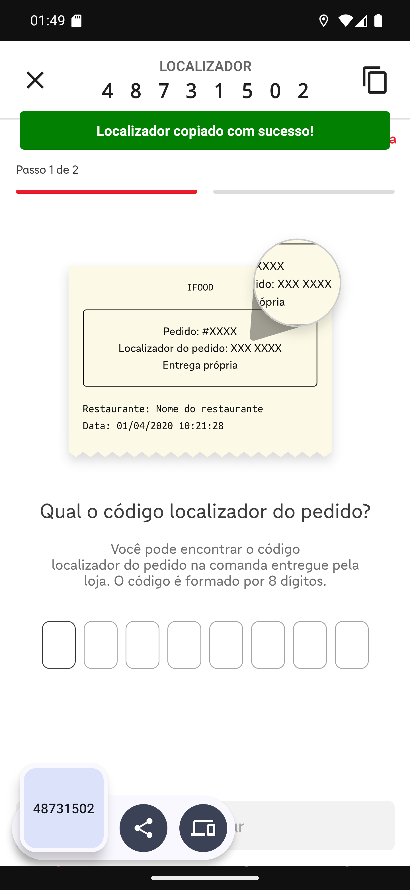

# 04 — Copiar o localizador

**O que é esta tela.** A mesma confirmação, depois de tocar no ícone de copiar. A faixa verde
**Localizador copiado com sucesso!** aparece por alguns segundos, e o Android mostra embaixo o
que foi copiado: **48731502**.

**Para que serve.** Colar o código nos campos em vez de digitar. No celular, com uma mão só e
a sacola na outra, digitar oito dígitos é onde o erro acontece.

**Como colar.** Toque e segure no primeiro quadradinho e escolha **Colar** — o site distribui
os dígitos pelos campos.

**O aviso verde é do app**, não do iFood. Ele desaparece sozinho.

**O código copiado fica na área de transferência do aparelho**, então também dá para colar num
WhatsApp, se precisar mandar para o restaurante.

**Se o ícone de copiar não aparecer**, o pedido não trouxe localizador — veja a seção de
problemas no [manual](manual.md).
