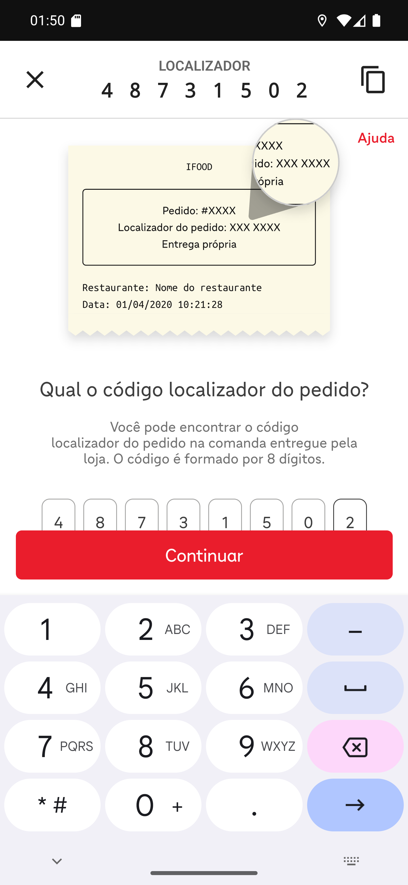

# Manual 09 — Pedido do iFood

Pedido que entra pelo iFood e o restaurante entrega com o próprio motoboy tem um passo extra:
**confirmar a entrega no iFood**, digitando o localizador de 8 dígitos no site deles. O app
carrega esse site para você, já com o código na mão.

E tem uma diferença que você nota antes de qualquer coisa: **não há nada para cobrar**. O
cliente pagou no aplicativo do iFood.

---

## Como reconhecer na lista

[Entender o chip na lista](01-chip-na-lista.md)

O card ganha um **chip vermelho com o logo do iFood** e o localizador: `#48731502 (1851 -
Coleta 3983)`. E **não aparece "Cobrar R$"**, porque não há saldo.

O `#1034` laranja continua sendo o número do pedido no restaurante. Os dois números convivem: o
laranja é para falar com a loja, o vermelho é para falar com o iFood.

## Os detalhes

[Entender a tela de detalhes](02-detalhes-ifood.md)

O chip do iFood aparece de novo junto aos itens, o rodapé diz **PAGO ONLINE** e **COBRAR R$
0,00**, e os botões mudam: **CONFIRMAR ENTREGA IFOOD**, com o logo, e **FINALIZAR**.

Não existe "INICIAR COBRANÇA" aqui, e não existe "FINALIZAR SEM COBRAR" — sem nada a receber,
finalizar é a única ação de baixa.

## A confirmação no iFood

[Entender a tela de confirmação](03-tela-de-confirmacao.md)

O botão abre o site de confirmação do iFood **dentro do app**. No alto, a faixa do app mostra o
**LOCALIZADOR** espaçado dígito a dígito (`4 8 7 3 1 5 0 2`) e um botão de copiar. Abaixo, a
página do iFood: *Entrega própria*, *Passo 1 de 2*, e os oito quadradinhos do código.

[Entender o botão de copiar](04-localizador-copiado.md)

Tocar no ícone de copiar mostra **Localizador copiado com sucesso!** e põe o código na área de
transferência — dá para colar nos campos sem digitar.

[Entender o código preenchido](05-codigo-preenchido.md)

Com os oito dígitos preenchidos, o **Continuar** do iFood fica vermelho e ativo. Daí em diante
quem conduz é o site do iFood, no passo 2 de 2.

## A ordem certa das coisas

1. **Confirme no iFood** primeiro, pelo botão vermelho.
2. **Finalize no app** depois, pelo FINALIZAR.

São dois registros diferentes: o do iFood conta para o cliente e para a plataforma; o do app
fecha a entrega no restaurante. Um não faz o outro.

**Fechar a tela de confirmação com o X não desfaz nada** e não finaliza nada — é só sair do
site. Pode reabrir quantas vezes quiser.

## Se algo não funcionar

**A tela do iFood não carrega.** É um site, e precisa de internet. Sem sinal, aparece a tela
vazia ou o carregando eterno — o app desiste do indicador depois de 10 segundos. Tente de novo
com sinal melhor.

**O localizador não aparece no alto.** Acontece quando o pedido não tem o identificador
completo do iFood. Nesse caso o código está na comanda impressa que a loja entregou — é
exatamente o que o desenho da comanda na tela do iFood mostra.

**O iFood diz que o código não existe.** Confira dígito a dígito com a comanda. Se persistir,
fale com o restaurante: pode ser outro pedido.

**Cliente pedindo para pagar na entrega.** Não é o caso aqui: o pedido está pago. Nada deve ser
recebido.

---

## Como este capítulo foi produzido

O pedido **#1034** foi criado pelo gerador de cenário com os identificadores de iFood nos mesmos
formatos de pedidos reais em produção no mesmo dia: localizador de 8 dígitos,
`correlationId` em UUID e referência curta `1851 - Coleta 3983`. Ele nasceu **pago**, com
`tipoPagStr` *PAGO ONLINE*, que é como o pedido do iFood chega.

O botão de confirmação foi tocado de verdade e o site do iFood carregou no emulador. O código
foi copiado e digitado, mas **o Continuar não foi tocado**: o pedido não existe no iFood, e
seguir só produziria um erro que não ensina nada. Por isso o capítulo termina no passo 1 de 2 —
o que vem depois é tela do iFood, não do app.
