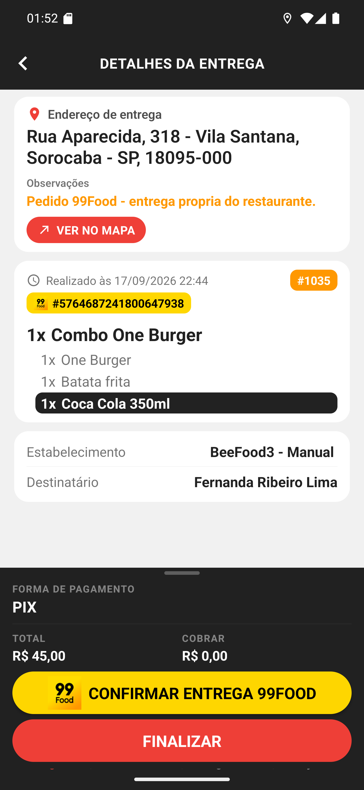

# 01 — Detalhes de um pedido 99Food

**O que é esta tela.** Os detalhes do #1035, um pedido que entrou pelo 99Food.

**O que identifica a plataforma**

1. **Chip amarelo com o logo 99Food** e `#5764687241800647938` — o id do pedido na plataforma.
   É longo porque é o identificador interno deles, não um código de conferência.
2. **CONFIRMAR ENTREGA 99FOOD**, botão amarelo com letras pretas, acima do FINALIZAR.

**No rodapé**: **FORMA DE PAGAMENTO · PIX**, **TOTAL R$ 45,00** e **COBRAR R$ 0,00**. Pedido de
marketplace chega pago — a forma que aparece é como o cliente pagou **na plataforma**, não algo
que você precise receber.

**Não há cobrança**, então não há INICIAR COBRANÇA. O botão de baixa diz apenas **FINALIZAR**.

**O resto é um pedido normal**: endereço, observação, os itens com a tarja preta na Coca Cola, o
estabelecimento e o destinatário.

**A ordem é confirmar e depois finalizar.** O botão amarelo abre o site do 99Food; o vermelho
fecha a entrega no restaurante.
