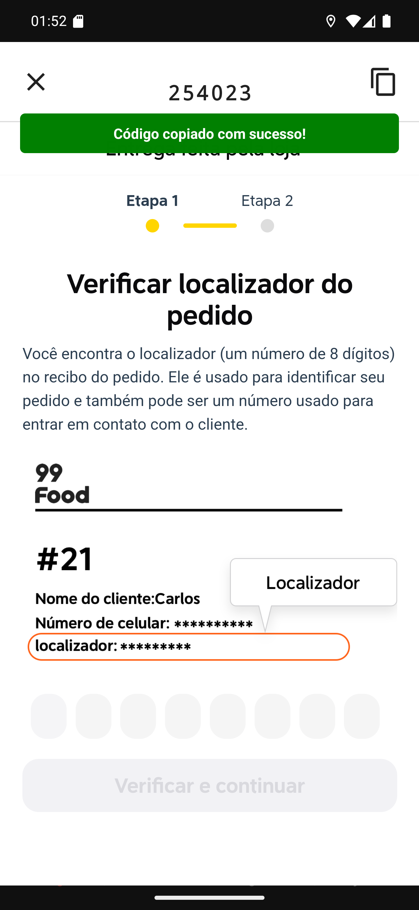

# 03 — Copiar o código

**O que é esta tela.** A confirmação do 99Food depois de tocar no ícone de copiar, com a faixa
verde **Código copiado com sucesso!**

**O aviso é diferente do iFood** — lá ele diz *Localizador copiado com sucesso!*. É o app
falando a linguagem de cada plataforma, e serve de pista de onde você está.

**O que foi copiado** é o código que aparece na faixa do app (`254023`), não o localizador de 8
dígitos do recibo. Se o site recusar, digite o do recibo.

**Para colar**, toque e segure no primeiro campo e escolha **Colar**.

**A faixa verde desaparece sozinha** em poucos segundos; ela não bloqueia a tela.

**O código fica na área de transferência do aparelho**, então dá para colar também numa
mensagem para o restaurante.
