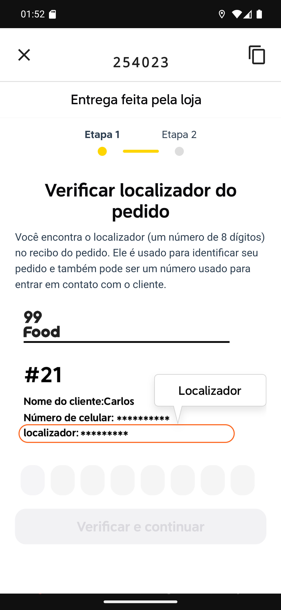

# Manual 10 — Pedido do 99Food

O 99Food funciona como o iFood: pedido que entra pela plataforma, o restaurante entrega com o
próprio motoboy, e há uma **confirmação no site deles** antes de fechar a entrega no app. O que
muda são as cores, o texto e o formato do código.

Como no iFood, **não há nada para cobrar** — o cliente pagou no aplicativo.

---

## Os detalhes

[Entender a tela de detalhes](01-detalhes-99food.md)

O chip é **amarelo, com o logo 99Food**, e traz o id longo do pedido:
`#5764687241800647938`. O rodapé mostra a forma do pagamento online (**PIX**, neste caso),
**TOTAL R$ 45,00** e **COBRAR R$ 0,00**.

Os botões: **CONFIRMAR ENTREGA 99FOOD**, amarelo com letras preta, e **FINALIZAR**.

## A confirmação no 99Food

[Entender a tela de confirmação](02-tela-de-confirmacao.md)

O botão abre o site do 99Food dentro do app. No alto, a faixa do app mostra o **código do
pedido** (`254023`) e o botão de copiar — aqui sem a palavra "LOCALIZADOR", diferente do iFood.

A página do 99Food diz **Entrega feita pela loja**, mostra **Etapa 1** e **Etapa 2**, e pede o
**localizador** do pedido, que segundo o próprio site é *um número de 8 dígitos* encontrado no
recibo.

> **Atenção ao formato.** O código que o app mostra é o que veio no pedido, e no 99Food ele
> costuma ter 6 dígitos — não necessariamente o localizador de 8 dígitos que o site pede. Se
> não casar, o número que vale é o do **recibo do pedido**, que a tela do 99Food indica.

[Entender o botão de copiar](03-codigo-copiado.md)

Tocar no ícone de copiar mostra **Código copiado com sucesso!** — o texto do aviso muda de
plataforma para plataforma, e o código vai para a área de transferência.

## A ordem certa das coisas

1. **Confirme no 99Food**, pelo botão amarelo, seguindo as duas etapas do site.
2. **Finalize no app**, pelo FINALIZAR — é o mesmo fluxo do capítulo
   [13](../13-finalizar-sem-cobrar/manual.md), com a conferência dos itens em destaque e o campo
   de observação.

Uma coisa não faz a outra: a confirmação é do 99Food, a baixa é do restaurante.

## iFood e 99Food, lado a lado

| | iFood | 99Food |
|---|---|---|
| Cor do chip | vermelho | amarelo |
| O que o chip mostra | localizador de 8 dígitos + referência | id longo do pedido |
| Rótulo na faixa do app | LOCALIZADOR | nenhum, só o código |
| Aviso ao copiar | *Localizador copiado com sucesso!* | *Código copiado com sucesso!* |
| Passos no site | Passo 1 de 2 | Etapa 1 e Etapa 2 |

O resto — pedido pago, botão de confirmação acima do FINALIZAR, ausência de cobrança — é igual
nos dois.

## Se algo não funcionar

**A tela não carrega.** É site, precisa de internet.

**O código não é aceito.** Confira com o recibo do pedido. O formato pedido pelo site é o que
manda.

**Não aparece o botão do 99Food.** O pedido não trouxe o identificador da plataforma. Trate como
pedido normal e confirme com o restaurante se há algo a fazer no painel do 99Food.

**O cliente quer pagar na entrega.** Não é o caso: o pedido está pago.

---

## Como este capítulo foi produzido

O pedido **#1035** foi criado pelo gerador de cenário com os identificadores de 99Food nos
formatos que aparecem em produção: id de 19 dígitos e código curto de 6 dígitos, com
`tipoPagStr` *PIX* e o pedido já pago.

O botão de confirmação foi tocado de verdade e o site do 99Food carregou no emulador. O código
foi copiado, mas **as etapas do site não foram concluídas**: o pedido é de teste e não existe no
99Food. A diferença entre o código de 6 dígitos do pedido e o localizador de 8 dígitos que o
site pede foi observada nessa captura, e está registrada no aviso acima em vez de escondida.
